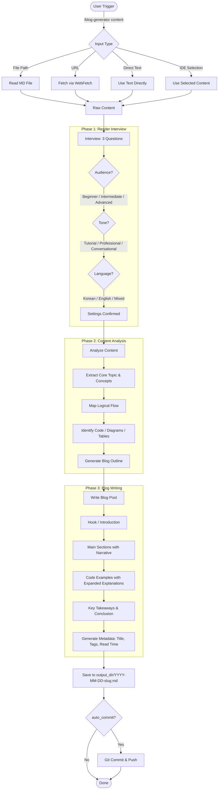

# Blog Generator Plugin

Transform technical notes and content into well-structured, publish-ready blog posts with narrative flow.

## Process Flow



## Overview

Technical notes are great for capturing knowledge quickly, but they lack the narrative flow needed for a good blog post. This plugin bridges that gap — give it your raw notes, and it produces a blog post with:

- An engaging introduction that hooks the reader
- Smooth transitions between sections
- Expanded analogies and real-world examples
- Code examples preserved verbatim with richer explanations
- A clear conclusion with key takeaways

## Features

- **Multiple Input Sources**: File paths, URLs, direct text, or IDE selections
- **Reader-Aware Writing**: Adapts depth and tone based on target audience
- **3 Audience Levels**: Beginner (explain everything), Intermediate (focus on how/why), Advanced (tradeoffs and edge cases)
- **3 Tone Options**: Tutorial (step-by-step), Professional (concise), Conversational (friendly)
- **3 Language Options**: Korean, English, or Mixed (Korean+English)
- **Code Preservation**: Original code blocks are never modified, only explanations are expanded
- **SEO Metadata**: Auto-generated title, tags, and estimated read time
- **Git Integration**: Optional auto-commit and push

## Installation

### For Users: Install via npx

```bash
# Install from repository
npx github:JayKim88/claude-ai-engineering blog-generator
```

### For Developers: Local Development

```bash
# Clone and link
cd ~/Documents/Projects
git clone https://github.com/JayKim88/claude-ai-engineering.git
cd claude-ai-engineering
npm run link
```

## Usage

### Basic Usage

```bash
# Convert a markdown file
/blog-generator ~/notes/rag-explained.md

# Convert pasted content
/blog-generator "Docker는 컨테이너 기반 가상화 기술이다. VM과 달리..."

# Convert from URL
/blog-generator https://blog.example.com/kubernetes-networking

# Select text in IDE, then:
블로그로 변환해줘
```

### Alternative Trigger Phrases

```bash
# English
"write a blog post about this"
"turn this into a blog"
"convert to blog format"

# Korean
"블로그 글 작성해줘"
"블로그로 변환해줘"
"이 내용으로 블로그 써줘"
"기술 블로그로 만들어줘"
```

## Document Structure

Generated blog posts follow this structure:

```markdown
---
title: "Engaging, SEO-Friendly Title"
date: 2026-02-19
tags: [rag, llm, vector-db]
read_time: "8 min read"
audience: "beginner"
---

# Title

> **TL;DR**: One-sentence summary

## Introduction
[Hook that draws the reader in]

## Main Sections
[Content with narrative flow, analogies, and transitions]

### Code Example
[Original code preserved + expanded explanation]

## Key Takeaways
- Point 1
- Point 2
- Point 3

## Further Reading
- [Related resources]
```

## Configuration

Located at `~/.claude/skills/blog-generator/config.yaml`:

```yaml
# Output directory for generated blog posts (absolute path)
output_dir: "~/Documents/blog/posts"

# Default language: ko (Korean), en (English), mixed (Korean+English)
default_language: "ko"

# Default audience: beginner, intermediate, advanced
default_audience: "intermediate"

# Default tone: tutorial, professional, conversational
default_tone: "tutorial"

# Auto-commit to git after saving
auto_commit: false

# Auto-push to remote (requires auto_commit: true)
auto_push: false
```

## Examples

### Example 1: RAG Notes to Blog Post

**Input**: Raw notes about RAG with code snippets and ASCII diagrams

```bash
/blog-generator ~/notes/rag-explained.md
```

**Interview**: Beginner / Tutorial / Korean

**Output**: `~/Documents/blog/posts/2026-02-19-understanding-rag-retrieval-augmented-generation.md`

A complete blog post with:
- Hook: "ChatGPT에게 우리 회사의 휴가 정책을 물어본 적 있나요?"
- Open-book exam analogy expanded into a full paragraph
- 5-stage pipeline explained with narrative transitions
- Original Python code preserved with line-by-line explanation
- Key takeaways and next steps

### Example 2: Docker Quick Notes

**Input**: Direct text about Docker basics

```bash
/blog-generator "Docker는 컨테이너 기반 가상화 기술이다. VM과 달리 OS를 공유..."
```

**Interview**: Intermediate / Professional / Mixed

**Output**: `~/Documents/blog/posts/2026-02-19-docker-container-fundamentals.md`

### Example 3: URL Article

**Input**: Technical blog post URL

```bash
/blog-generator https://blog.example.com/kubernetes-networking
```

**Interview**: Advanced / Conversational / English

**Output**: `~/Documents/blog/posts/2026-02-19-kubernetes-pod-networking-explained.md`

## Output Location

Blog posts are saved to:

```
{output_dir}/YYYY-MM-DD-{topic-slug}.md
```

**Default**:
```
~/Documents/blog/posts/
├── 2026-02-19-understanding-rag-retrieval-augmented-generation.md
├── 2026-02-19-docker-container-fundamentals.md
└── 2026-02-19-kubernetes-pod-networking-explained.md
```

## How It Differs from ai-digest

| Feature | blog-generator | ai-digest |
|---|---|---|
| **Purpose** | Create publishable blog posts | Capture article key points |
| **Output Style** | Narrative with hook/transitions | Structured reference document |
| **Audience Awareness** | Adapts to beginner/intermediate/advanced | Fixed format |
| **Tone Options** | Tutorial/Professional/Conversational | Consistent summary tone |
| **Input** | Notes, files, URLs, IDE selection | Primarily URLs and articles |
| **Code Handling** | Preserve + expand explanation | Extract and annotate |
| **Use Case** | Publishing | Personal reference |

**Together**: Use `ai-digest` to capture knowledge quickly, then `blog-generator` to turn your best notes into publishable content.

## Tips

1. **Provide rich input**: The more detail in your notes, the better the blog post
2. **Use the interview wisely**: Beginner audience + Tutorial tone produces the most detailed posts
3. **Code matters**: Include code examples in your notes — they become well-explained sections
4. **Iterate**: After generation, ask to "expand section 2" or "make the intro more engaging"
5. **Combine with ai-digest**: Digest an article first, then convert the digest to a blog post

## Troubleshooting

### Issue: Blog post feels too generic

**Solution**: Provide more specific, detailed notes as input. Short bullet points produce generic results.

### Issue: Code block formatting broken

**Solution**: Ensure your input has properly fenced code blocks with language tags (` ```python `).

### Issue: Config not found

**Solution**: The plugin uses sensible defaults. To customize, create the config file:
```bash
mkdir -p ~/.claude/skills/blog-generator
cat > ~/.claude/skills/blog-generator/config.yaml << 'EOF'
output_dir: "~/Documents/blog/posts"
default_language: "ko"
default_audience: "intermediate"
default_tone: "tutorial"
auto_commit: false
auto_push: false
EOF
```

### Issue: Output directory doesn't exist

**Solution**: The plugin creates it automatically using `mkdir -p`.

## Related Plugins

- **ai-digest**: Digest articles into structured reference documents
- **learning-summary**: Summarize conversation learnings
- **spec-interview**: Gather requirements through interactive Q&A

## Roadmap

- [ ] Series support (split long content into multi-part blog series)
- [ ] Mermaid diagram generation from ASCII art
- [ ] Image placeholder suggestions
- [ ] Blog platform export (Medium, dev.to, Tistory)
- [ ] Template customization
- [ ] Revision mode (improve existing blog posts)

## Contributing

Contributions welcome! See the main repository for guidelines.

## Support

- **Issues**: https://github.com/JayKim88/claude-ai-engineering/issues
- **Discussions**: https://github.com/JayKim88/claude-ai-engineering/discussions

## License

MIT License

## Author

**Jay Kim**
- GitHub: [@JayKim88](https://github.com/JayKim88)

---

**Turn your technical notes into stories. Make knowledge shareable.**
