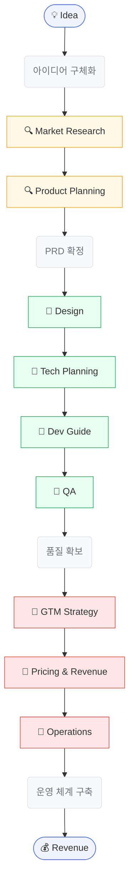
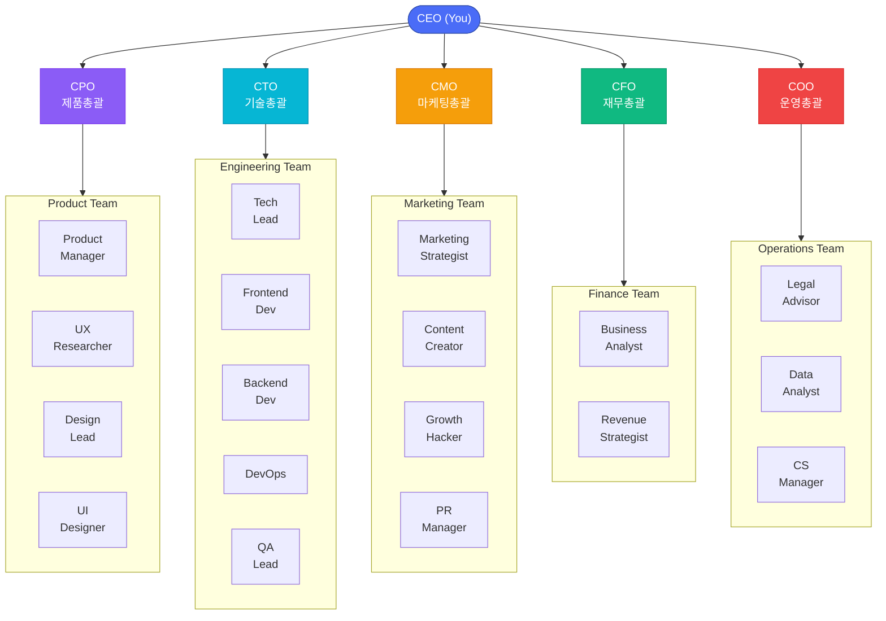
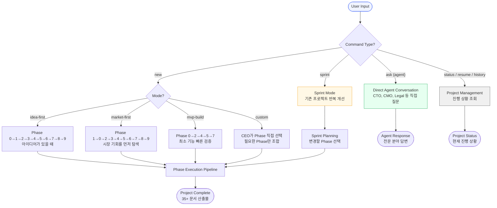
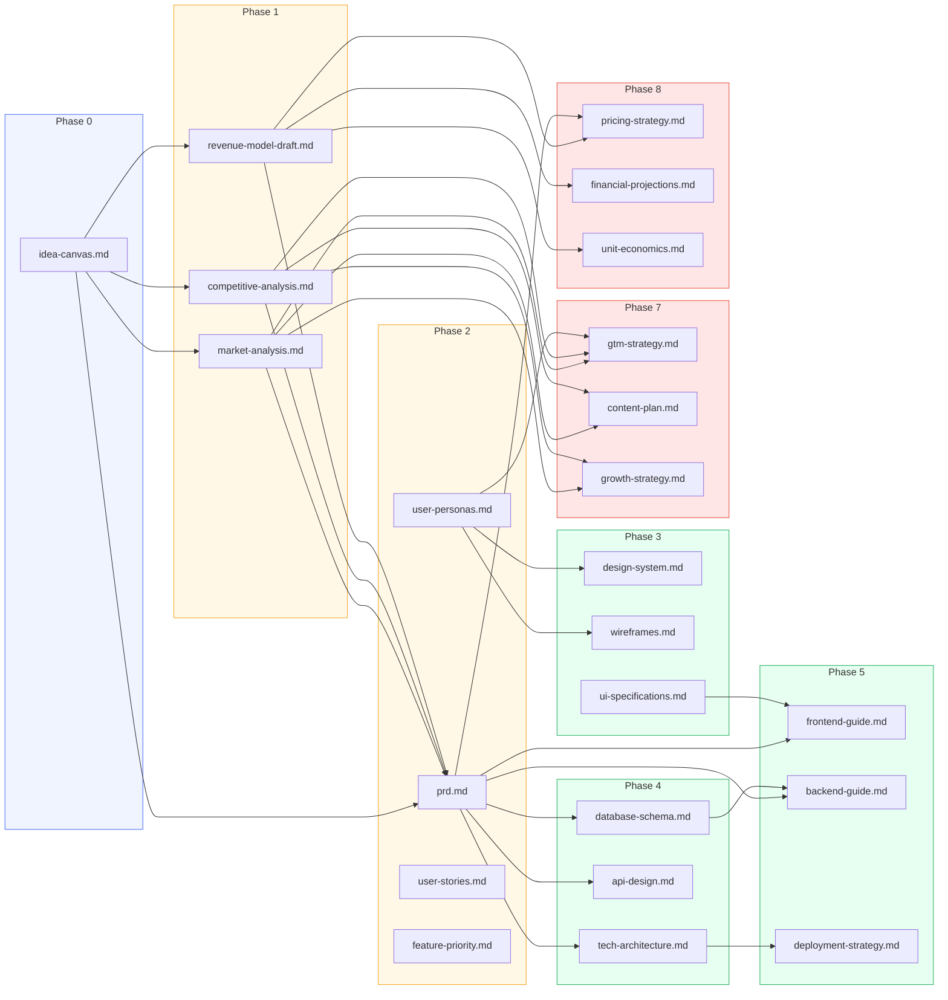
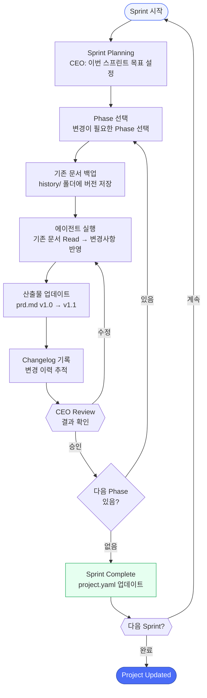

# Business Avengers

> AI Partner Organization for Solo Entrepreneurs
> 23 AI agents + You as CEO — plan, research, design, develop, market, and monetize your online service.

## What is Business Avengers?

Business Avengers is a Claude Code plugin that creates a **virtual company** to help solo entrepreneurs build and launch online services. Unlike MetaGPT or ChatDev which focus only on software development, Business Avengers covers the **entire business lifecycle** — from market research and product planning to marketing strategy and monetization.

You are the **CEO**. Your AI team handles the rest.

---

## Value Stream: Idea to Revenue



각 Phase에서 **추상적 아이디어가 구체적 수익으로** 변환됩니다. CEO는 전략적 의사결정에 집중하고, 23개 AI 에이전트가 실행을 담당합니다.

---

## Organization



**23 AI agents + CEO** across 5 departments: Product, Engineering, Marketing, Finance, Operations.

---

## Quick Start

### New Project (Full Pipeline)
```
/business-avengers new "AI-powered recipe recommendation app"
```

### Choose Your Mode
```
/business-avengers new --mode idea-first "My app idea"     # Start from idea
/business-avengers new --mode market-first "Find opportunities"  # Research first
/business-avengers new --mode mvp-build "Quick MVP"        # Fast track
```

### Talk to Specific Agents
```
/business-avengers ask cto "What tech stack for a marketplace?"
/business-avengers ask marketing "SNS strategy for Gen Z"
/business-avengers ask legal "Do I need GDPR compliance?"
/business-avengers ask revenue "Best pricing model for SaaS?"
```

### Sprint Cycle (Iterate)
```
/business-avengers sprint "Add social login feature"
/business-avengers sprint "Update pricing based on user feedback"
```

### Project Management
```
/business-avengers status    # Check progress
/business-avengers resume    # Continue from where you left off
/business-avengers history   # View sprint history
```

---

## Mode Selection Flow



---

## Phase Execution Pipeline

```mermaid
flowchart TD
    P0["Phase 0: Ideation<br/>CPO + PM, UXR"]
    G0{{"CEO<br/>Dialogue"}}
    P1["Phase 1: Market Research<br/>BA ∥ MS ∥ RS"]
    G1{{"CEO<br/>Approve?"}}
    P2["Phase 2: Product Planning<br/>PM ∥ UXR"]
    G2{{"CEO<br/>Approve?"}}
    P3["Phase 3: Design<br/>DL → UI"]
    G3{{"CEO<br/>Approve?"}}
    P4["Phase 4: Tech Planning<br/>TL"]
    G4{{"CEO<br/>Delegate"}}
    P5["Phase 5: Development Guide<br/>FE ∥ BE ∥ DvO"]
    G5{{"CEO<br/>Confirm"}}
    P6["Phase 6: QA Planning<br/>QA Lead"]
    G6{{"CEO<br/>Confirm"}}
    P7["Phase 7: Launch Strategy<br/>MS ∥ CC ∥ GH ∥ PR"]
    G7{{"CEO<br/>Approve?"}}
    P8["Phase 8: Monetization<br/>RS ∥ BA"]
    G8{{"CEO<br/>Approve?"}}
    P9["Phase 9: Operations<br/>CS ∥ LG ∥ DA"]
    G9{{"CEO<br/>Confirm"}}
    DONE(["Project Complete<br/>35+ Documents"])

    P0 --> G0
    G0 -->|"승인"| P1
    P1 --> G1
    G1 -->|"승인"| P2
    G1 -->|"피봇"| P0
    G1 -->|"중단"| STOP(["중단"])
    P2 --> G2
    G2 -->|"승인"| P3
    G2 -->|"수정"| P2
    P3 --> G3
    G3 -->|"승인"| P4
    G3 -->|"수정"| P3
    P4 --> G4
    G4 --> P5
    P5 --> G5
    G5 --> P6
    P6 --> G6
    G6 --> P7
    P7 --> G7
    G7 -->|"승인"| P8
    G7 -->|"수정"| P7
    P8 --> G8
    G8 -->|"승인"| P9
    G8 -->|"수정"| P8
    P9 --> G9
    G9 --> DONE

    style P0 fill:#f0f4ff,stroke:#4a6cf7
    style P1 fill:#fff8e6,stroke:#f5a623
    style P2 fill:#fff8e6,stroke:#f5a623
    style P3 fill:#e6fff0,stroke:#27ae60
    style P4 fill:#e6fff0,stroke:#27ae60
    style P5 fill:#e6fff0,stroke:#27ae60
    style P6 fill:#e6fff0,stroke:#27ae60
    style P7 fill:#ffe6e6,stroke:#e74c3c
    style P8 fill:#ffe6e6,stroke:#e74c3c
    style P9 fill:#ffe6e6,stroke:#e74c3c
    style DONE fill:#4a6cf7,color:#fff,stroke:#3451b2
    style STOP fill:#999,color:#fff,stroke:#666
```



**`∥` = 병렬 실행** (같은 Phase 내 에이전트가 동시에 작업)

**CEO 개입 수준:**
- **Dialogue**: CEO와 에이전트가 Q&A로 함께 작업
- **Approve**: 산출물 리뷰 후 승인/수정/피봇/중단 선택
- **Delegate**: C-Level이 자율 판단, CEO에게 결과 보고
- **Confirm**: CEO가 결과 확인 후 자동 진행

---

## Document Dependency Graph



각 Phase의 산출물이 다음 Phase의 **입력**으로 흘러갑니다. 에이전트는 직접 통신하지 않고, **구조화된 문서**를 통해 협업합니다 (MetaGPT 패턴).

---

## Sprint Cycle



```
phase-2-product-planning/
├── prd.md                          # 항상 최신 버전
├── history/
│   ├── prd-v1.0-2026-02-21.md     # Sprint 1: 최초
│   └── prd-v1.1-2026-03-01.md     # Sprint 2: 온보딩 개선
└── changelog.md                    # 변경 이력
```

---

## Workflow Phases

| # | Phase | What Happens | Agents | CEO Role |
|---|-------|-------------|--------|----------|
| 0 | **Ideation** | Interactive Q&A to shape your idea | CPO, PM, UXR | Dialogue |
| 1 | **Market Research** | Real-time web research on market, competitors, revenue models | BA, MS, RS | Approve |
| 2 | **Product Planning** | PRD, user personas, user stories, feature priority | PM, UXR | Approve |
| 3 | **Design** | Design system, wireframes, UI specifications | DL, UI | Approve |
| 4 | **Technical Planning** | Architecture, API design, database schema | TL | Delegate |
| 5 | **Development Guide** | Frontend/backend guides, deployment strategy | FE, BE, DvO | Confirm |
| 6 | **QA Planning** | Test plan, QA checklist | QA | Confirm |
| 7 | **Launch Strategy** | GTM, content plan, growth strategy, PR | MS, CC, GH, PR | Approve |
| 8 | **Monetization** | Pricing strategy, financial projections, unit economics | RS, BA | Approve |
| 9 | **Operations** | CS playbook, legal docs, metrics dashboard | CS, LG, DA | Confirm |

## Key Features

- **Flexible Phase Order**: Run phases in any order (idea-first, market-first, MVP, custom)
- **Sprint Cycles**: Iterate on your product with version-controlled documents
- **Real-Time Research**: Agents use WebSearch/WebFetch for live market data
- **CEO Approval Gates**: You control strategy, agents handle execution
- **Knowledge Base**: 8 domain-specific guides power agent expertise
- **Document Versioning**: Every change is tracked with history and changelogs

## Output Structure

All deliverables are saved to `~/.business-avengers/projects/{your-project}/`:

```
your-project/
├── project.yaml              # Project state & sprint history
├── phase-0-ideation/
│   └── idea-canvas.md
├── phase-1-market-research/
│   ├── market-analysis.md
│   ├── competitive-analysis.md
│   └── revenue-model-draft.md
├── phase-2-product-planning/
│   ├── prd.md
│   ├── user-personas.md
│   └── ...
└── ... (10 phase directories, 35+ documents)
```

## Cost

**Claude Max subscribers: No additional cost.** All agent calls are included in your subscription.

| Mode | Agents | Time |
|------|--------|------|
| Full E2E | ~24 calls | 30-50 min |
| MVP Build | ~10 calls | 15-25 min |
| Single Phase | 1-4 calls | 3-10 min |
| Sprint | 5-10 calls | 15-25 min |
| Ask (direct) | 1 call | 1-3 min |

## Installation

```bash
# From the claude-ai-engineering repo
npm run link

# Or install directly
npx github:JayKim88/claude-ai-engineering business-avengers
```

## Tips

1. **Start with "ask" mode** to explore before committing to a full pipeline
2. **Use market-first mode** if you're not sure what to build yet
3. **Sprint frequently** — real products evolve, your documents should too
4. **Review outputs critically** — AI is your team, but you're still the CEO
5. **Combine with other plugins** — use `project-insight` to analyze the generated code later
