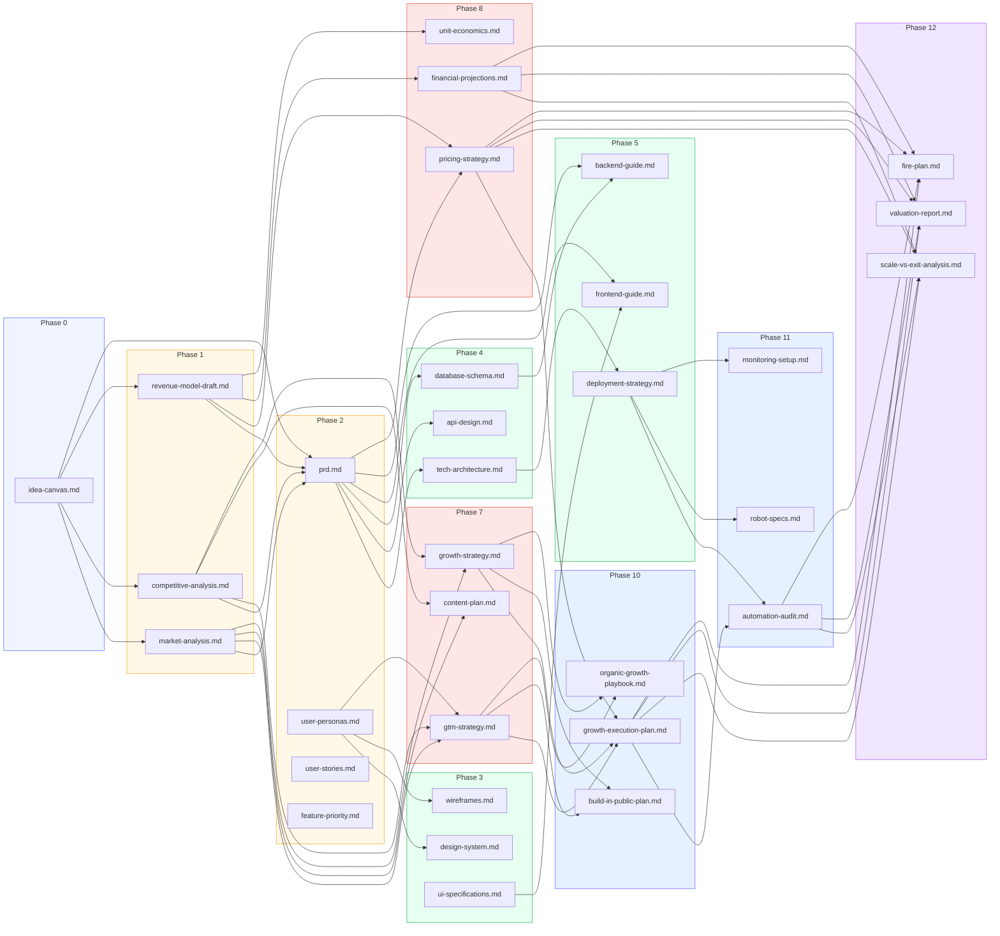

# Business Avengers

> AI Partner Organization for Solo Entrepreneurs
> 23 AI agents + You as CEO — plan, research, design, develop, market, monetize, grow, automate, and exit your online service.

## What is Business Avengers?

Business Avengers is a Claude Code plugin that creates a **virtual company** to help solo entrepreneurs build, launch, and scale online services. Unlike MetaGPT or ChatDev which focus only on software development, Business Avengers covers the **complete business lifecycle** — from ideation to acquisition — including market research, product planning, marketing strategy, monetization, growth optimization, automation, and exit strategy.

Powered by the **MAKE methodology** (Indie Maker Handbook by @levelsio), it's designed for solo entrepreneurs who want to build profitable products with lean, automated operations.

You are the **CEO**. Your AI team handles the rest.

---

## Value Stream: Idea to Acquisition

```mermaid
graph TD
    A(["💡 Idea"]):::inputNode
    L1("아이디어 구체화"):::step
    B["🔍 Market Research"]:::validateNode
    C["🔍 Product Planning"]:::validateNode
    L2("PRD 확정"):::step
    D["🔨 Design"]:::buildNode
    E["🔨 Tech Planning"]:::buildNode
    F["🔨 Dev Guide"]:::buildNode
    G["🔨 QA"]:::buildNode
    L3("품질 확보"):::step
    H["🚀 GTM Strategy"]:::launchNode
    I["🚀 Pricing & Revenue"]:::launchNode
    J["🚀 Operations"]:::launchNode
    L4("운영 체계 구축"):::step
    K(["💰 Revenue"]):::revenueNode
    L5("수익 달성"):::step
    M["📈 Growth"]:::growNode
    N["🤖 Automation"]:::growNode
    L6("자율 운영 달성"):::step
    O["🏦 Scale & Exit"]:::exitNode
    P(["🎯 Acquisition / FIRE"]):::outputNode

    A --> L1 --> B --> C
    C --> L2 --> D --> E --> F --> G
    G --> L3 --> H --> I --> J
    J --> L4 --> K
    K --> L5 --> M --> N
    N --> L6 --> O --> P

    classDef inputNode fill:#f0f4ff,stroke:#4a6cf7
    classDef validateNode fill:#fff8e6,stroke:#f5a623
    classDef buildNode fill:#e6fff0,stroke:#27ae60
    classDef launchNode fill:#ffe6e6,stroke:#e74c3c
    classDef revenueNode fill:#fff0e6,stroke:#f59e0b
    classDef growNode fill:#e6f0ff,stroke:#6366f1
    classDef exitNode fill:#f0e6ff,stroke:#a855f7
    classDef outputNode fill:#f0f4ff,stroke:#4a6cf7
    classDef step fill:#f8f9fa,stroke:#dee2e6,color:#6c757d
```



13개 Phase에서 **추상적 아이디어가 매각 가능한 자산으로** 변환됩니다. CEO는 전략적 의사결정에 집중하고, 23개 AI 에이전트가 실행을 담당합니다.

---

## Organization

```mermaid
graph TD
    CEO(["CEO (You)"])

    CEO --> CPO["CPO<br/>제품총괄"]
    CEO --> CTO["CTO<br/>기술총괄"]
    CEO --> CMO["CMO<br/>마케팅총괄"]
    CEO --> CFO["CFO<br/>재무총괄"]
    CEO --> COO["COO<br/>운영총괄"]

    subgraph Product["Product Team"]
        direction LR
        PM["Product<br/>Manager"]
        UXR["UX<br/>Researcher"]
        DL["Design<br/>Lead"]
        UI["UI<br/>Designer"]
    end

    subgraph Engineering["Engineering Team"]
        direction LR
        TL["Tech<br/>Lead"]
        FE["Frontend<br/>Dev"]
        BE["Backend<br/>Dev"]
        DvO["DevOps"]
        QA["QA<br/>Lead"]
    end

    subgraph Marketing["Marketing Team"]
        direction LR
        MS["Marketing<br/>Strategist"]
        CC["Content<br/>Creator"]
        GH["Growth<br/>Hacker"]
        PR["PR<br/>Manager"]
    end

    subgraph Finance["Finance Team"]
        direction LR
        BA["Business<br/>Analyst"]
        RS["Revenue<br/>Strategist"]
    end

    subgraph Operations["Operations Team"]
        direction LR
        LG["Legal<br/>Advisor"]
        DA["Data<br/>Analyst"]
        CS["CS<br/>Manager"]
    end

    CPO --> Product
    CTO --> Engineering
    CMO --> Marketing
    CFO --> Finance
    COO --> Operations

    style CEO fill:#4a6cf7,color:#fff,stroke:#3451b2
    style CPO fill:#8b5cf6,color:#fff,stroke:#7c3aed
    style CTO fill:#06b6d4,color:#fff,stroke:#0891b2
    style CMO fill:#f59e0b,color:#fff,stroke:#d97706
    style CFO fill:#10b981,color:#fff,stroke:#059669
    style COO fill:#ef4444,color:#fff,stroke:#dc2626
```



**23 AI agents + CEO** across 5 departments: Product, Engineering, Marketing, Finance, Operations.

---

## Quick Start

### New Project (Full Pipeline)
```
/business-avengers new "AI-powered recipe recommendation app"
```

### Choose Your Mode
```
/business-avengers new --mode idea-first "My app idea"        # Start from idea
/business-avengers new --mode market-first "Find opportunities"   # Research first
/business-avengers new --mode mvp-build "Quick MVP"           # Fast track
/business-avengers new --mode make "Indie product"            # MAKE: Lean indie maker path
/business-avengers new --mode full-lifecycle "Complete journey"  # Full: Idea to Exit
/business-avengers new --mode post-launch "Scale existing"     # Growth → Automation → Exit
```

### Talk to Specific Agents
```
/business-avengers ask cto "What tech stack for a marketplace?"
/business-avengers ask marketing "SNS strategy for Gen Z"
/business-avengers ask legal "Do I need GDPR compliance?"
/business-avengers ask revenue "Best pricing model for SaaS?"
```

### Sprint Cycle (Iterate)
```
/business-avengers sprint "Add social login feature"
/business-avengers sprint "Update pricing based on user feedback"
/business-avengers sprint --phase 10 "Quarterly growth review"   # Growth sprint
/business-avengers sprint --phase 8 "Test new pricing model"     # Revenue sprint
```

### Project Management
```
/business-avengers status    # Check progress
/business-avengers resume    # Continue from where you left off
/business-avengers history   # View sprint history
```

---

## Mode Selection Flow

```mermaid
flowchart TD
    A([User Input]) --> B{Command Type?}

    B -->|"new"| C{Mode?}
    B -->|"ask {agent}"| D["Direct Agent Conversation<br/>CTO, CMO, Legal 등 직접 질문"]
    B -->|"sprint"| E["Sprint Mode<br/>기존 프로젝트 반복 개선"]
    B -->|"status / resume / history"| F["Project Management<br/>진행 상황 조회"]

    C -->|idea-first| G["Phase 0→1→2→3→4→5→6→7→8→9<br/>아이디어가 있을 때"]
    C -->|market-first| H["Phase 1→0→2→3→4→5→6→7→8→9<br/>시장 기회를 먼저 탐색"]
    C -->|mvp-build| I["Phase 0→2→4→5→7<br/>최소 기능 빠른 검증"]
    C -->|make| M2["Phase 0→1→7→8→10→11<br/>린 인디메이커 경로"]
    C -->|full-lifecycle| FL["Phase 0→12 전체<br/>아이디어부터 매각까지"]
    C -->|post-launch| PL["Phase 10→11→12<br/>런칭 후 성장/최적화"]
    C -->|custom| J["CEO가 Phase 직접 선택<br/>필요한 Phase만 조합"]

    G & H & I & M2 & FL & PL & J --> K["Phase Execution Pipeline"]
    E --> L["Sprint Planning<br/>변경할 Phase 선택"] --> K

    D --> M(["Agent Response<br/>전문 분야 답변"])
    F --> N(["Project Status<br/>현재 진행 상황"])
    K --> O(["Project Complete<br/>50+ 문서 산출물"])

    style A fill:#f0f4ff,stroke:#4a6cf7
    style D fill:#e6fff0,stroke:#27ae60
    style E fill:#fff8e6,stroke:#f5a623
    style F fill:#f0f0f0,stroke:#666
```



---

## Phase Execution Pipeline

```mermaid
flowchart TD
    P0["Phase 0: Ideation<br/>CPO + PM, UXR"]
    G0{{"CEO<br/>Dialogue"}}
    P1["Phase 1: Market Research<br/>BA ∥ MS ∥ RS"]
    G1{{"CEO<br/>Approve?"}}
    P2["Phase 2: Product Planning<br/>PM ∥ UXR"]
    G2{{"CEO<br/>Approve?"}}
    P3["Phase 3: Design<br/>DL → UI"]
    G3{{"CEO<br/>Approve?"}}
    P4["Phase 4: Tech Planning<br/>TL"]
    G4{{"CEO<br/>Delegate"}}
    P5["Phase 5: Development Guide<br/>FE ∥ BE ∥ DvO"]
    G5{{"CEO<br/>Confirm"}}
    P6["Phase 6: QA Planning<br/>QA Lead"]
    G6{{"CEO<br/>Confirm"}}
    P7["Phase 7: Launch Strategy<br/>MS ∥ CC ∥ GH ∥ PR"]
    G7{{"CEO<br/>Approve?"}}
    P8["Phase 8: Monetization<br/>RS ∥ BA"]
    G8{{"CEO<br/>Approve?"}}
    P9["Phase 9: Operations<br/>CS ∥ LG ∥ DA"]
    G9{{"CEO<br/>Confirm"}}
    P10["Phase 10: Growth<br/>GH ∥ CC ∥ DA"]
    G10{{"CEO<br/>Approve?"}}
    P11["Phase 11: Automation<br/>DvO ∥ BA"]
    G11{{"CEO<br/>Approve?"}}
    P12["Phase 12: Scale & Exit<br/>RS ∥ BA ∥ LG"]
    G12{{"CEO<br/>Deep Dialogue"}}
    DONE(["Project Complete<br/>50+ Documents"])

    P0 --> G0
    G0 -->|"승인"| P1
    P1 --> G1
    G1 -->|"승인"| P2
    G1 -->|"피봇"| P0
    G1 -->|"중단"| STOP(["중단"])
    P2 --> G2
    G2 -->|"승인"| P3
    G2 -->|"수정"| P2
    P3 --> G3
    G3 -->|"승인"| P4
    G3 -->|"수정"| P3
    P4 --> G4
    G4 --> P5
    P5 --> G5
    G5 --> P6
    P6 --> G6
    G6 --> P7
    P7 --> G7
    G7 -->|"승인"| P8
    G7 -->|"수정"| P7
    P8 --> G8
    G8 -->|"승인"| P9
    G8 -->|"수정"| P8
    P9 --> G9
    G9 --> P10
    P10 --> G10
    G10 -->|"승인"| P11
    G10 -->|"수정"| P10
    P11 --> G11
    G11 -->|"승인"| P12
    G11 -->|"수정"| P11
    P12 --> G12
    G12 -->|"완료"| DONE

    style P0 fill:#f0f4ff,stroke:#4a6cf7
    style P1 fill:#fff8e6,stroke:#f5a623
    style P2 fill:#fff8e6,stroke:#f5a623
    style P3 fill:#e6fff0,stroke:#27ae60
    style P4 fill:#e6fff0,stroke:#27ae60
    style P5 fill:#e6fff0,stroke:#27ae60
    style P6 fill:#e6fff0,stroke:#27ae60
    style P7 fill:#ffe6e6,stroke:#e74c3c
    style P8 fill:#ffe6e6,stroke:#e74c3c
    style P9 fill:#ffe6e6,stroke:#e74c3c
    style P10 fill:#e6f0ff,stroke:#6366f1
    style P11 fill:#e6f0ff,stroke:#6366f1
    style P12 fill:#f0e6ff,stroke:#a855f7
    style DONE fill:#4a6cf7,color:#fff,stroke:#3451b2
    style STOP fill:#999,color:#fff,stroke:#666
```



**`∥` = 병렬 실행** (같은 Phase 내 에이전트가 동시에 작업)

**CEO 개입 수준:**
- **Dialogue**: CEO와 에이전트가 Q&A로 함께 작업
- **Approve**: 산출물 리뷰 후 승인/수정/피봇/중단 선택
- **Delegate**: C-Level이 자율 판단, CEO에게 결과 보고
- **Confirm**: CEO가 결과 확인 후 자동 진행
- **Deep Dialogue**: CEO와 전략적 대화 (장기 목표, 매각 의사 등 심층 논의)

---

## Document Dependency Graph



각 Phase의 산출물이 다음 Phase의 **입력**으로 흘러갑니다. 에이전트는 직접 통신하지 않고, **구조화된 문서**를 통해 협업합니다 (MetaGPT 패턴).

---

## Sprint Cycle

```mermaid
flowchart TD
    A([Sprint 시작]) --> B["Sprint Planning<br/>CEO: 이번 스프린트 목표 설정"]
    B --> C["Phase 선택<br/>변경이 필요한 Phase 선택"]
    C --> D["기존 문서 백업<br/>history/ 폴더에 버전 저장"]
    D --> E["에이전트 실행<br/>기존 문서 Read → 변경사항 반영"]
    E --> F["산출물 업데이트<br/>prd.md v1.0 → v1.1"]
    F --> G["Changelog 기록<br/>변경 이력 추적"]
    G --> H{{"CEO Review<br/>결과 확인"}}

    H -->|"승인"| I{"다음 Phase<br/>있음?"}
    H -->|"수정"| E

    I -->|"있음"| C
    I -->|"없음"| J["Sprint Complete<br/>project.yaml 업데이트"]

    J --> K{{"다음 Sprint?"}}
    K -->|"계속"| A
    K -->|"완료"| L(["Project Updated"])

    style A fill:#f0f4ff,stroke:#4a6cf7
    style J fill:#e6fff0,stroke:#27ae60
    style L fill:#4a6cf7,color:#fff,stroke:#3451b2
```



```
phase-2-product-planning/
├── prd.md                          # 항상 최신 버전
├── history/
│   ├── prd-v1.0-2026-02-21.md     # Sprint 1: 최초
│   └── prd-v1.1-2026-03-01.md     # Sprint 2: 온보딩 개선
└── changelog.md                    # 변경 이력
```

---

## Workflow Phases

| # | Phase | What Happens | Agents | CEO Role |
|---|-------|-------------|--------|----------|
| 0 | **Ideation** | Interactive Q&A to shape your idea | CPO, PM, UXR | Dialogue |
| 1 | **Market Research** | Real-time web research on market, competitors, revenue models | BA, MS, RS | Approve |
| 2 | **Product Planning** | PRD, user personas, user stories, feature priority | PM, UXR | Approve |
| 3 | **Design** | Design system, wireframes, UI specifications | DL, UI | Approve |
| 4 | **Technical Planning** | Architecture, API design, database schema | TL | Delegate |
| 5 | **Development Guide** | Frontend/backend guides, deployment strategy | FE, BE, DvO | Confirm |
| 6 | **QA Planning** | Test plan, QA checklist | QA | Confirm |
| 7 | **Launch Strategy** | GTM, content plan, growth strategy, PR | MS, CC, GH, PR | Approve |
| 8 | **Monetization** | Pricing strategy, financial projections, unit economics | RS, BA | Approve |
| 9 | **Operations** | CS playbook, legal docs, metrics dashboard | CS, LG, DA | Confirm |
| 10 | **Growth** | Organic growth, Build in Public, retention, metrics | GH, CC, DA | Approve |
| 11 | **Automation** | Task automation, monitoring, contractor playbook, Bus Test | DvO, BA | Approve |
| 12 | **Scale & Exit** | Valuation, exit readiness, acquisition strategy, FIRE plan | RS, BA, LG | Deep Dialogue |

## Key Features

- **Full Lifecycle**: 13 phases covering idea to acquisition (powered by MAKE methodology)
- **6 Execution Modes**: idea-first, market-first, mvp-build, make, full-lifecycle, post-launch
- **Sprint Cycles**: Iterate on your product with version-controlled documents
- **Real-Time Research**: Agents use WebSearch/WebFetch for live market data
- **CEO Approval Gates**: You control strategy, agents handle execution
- **Knowledge Base**: 11 domain-specific guides power agent expertise
- **50+ Output Templates**: Structured documents for every business function
- **Document Versioning**: Every change is tracked with history and changelogs

## Output Structure

All deliverables are saved to `~/.business-avengers/projects/{your-project}/`:

```
your-project/
├── project.yaml              # Project state & sprint history
├── phase-0-ideation/
│   └── idea-canvas.md
├── phase-1-market-research/
│   ├── market-analysis.md
│   ├── competitive-analysis.md
│   └── revenue-model-draft.md
├── phase-2-product-planning/
│   ├── prd.md
│   ├── user-personas.md
│   └── ...
├── ...
├── phase-10-growth/
│   ├── growth-execution-plan.md
│   ├── build-in-public-plan.md
│   ├── organic-growth-playbook.md
│   ├── user-retention-plan.md
│   └── growth-metrics-report.md
├── phase-11-automation/
│   ├── automation-audit.md
│   ├── robot-specs.md
│   ├── contractor-playbook.md
│   ├── autonomous-org-design.md
│   └── monitoring-setup.md
├── phase-12-scale-exit/
│   ├── scale-vs-exit-analysis.md
│   ├── valuation-report.md
│   ├── exit-readiness-checklist.md
│   ├── acquisition-playbook.md
│   └── fire-plan.md
└── ... (13 phase directories, 50+ documents)
```

## Cost

**Claude Max subscribers: No additional cost.** All agent calls are included in your subscription.

| Mode | Agents | Time |
|------|--------|------|
| Full Lifecycle (0-12) | ~33 calls | 45-70 min |
| Full E2E (0-9) | ~24 calls | 30-50 min |
| MAKE Mode | ~16 calls | 20-35 min |
| Post-Launch (10-12) | ~9 calls | 15-25 min |
| MVP Build | ~10 calls | 15-25 min |
| Single Phase | 1-4 calls | 3-10 min |
| Sprint | 5-10 calls | 15-25 min |
| Ask (direct) | 1 call | 1-3 min |

## Installation

```bash
# From the claude-ai-engineering repo
npm run link

# Or install directly
npx github:JayKim88/claude-ai-engineering business-avengers
```

## Tips

1. **Start with "ask" mode** to explore before committing to a full pipeline
2. **Use market-first mode** if you're not sure what to build yet
3. **Use MAKE mode** for lean indie maker approach (skip heavy phases, focus on launch + growth)
4. **Sprint frequently** — real products evolve, your documents should too
5. **Use post-launch mode** after you've shipped to focus on growth, automation, and exit strategy
6. **Review outputs critically** — AI is your team, but you're still the CEO
7. **Combine with other plugins** — use `project-insight` to analyze the generated code later
