# Career Compass

**AI-powered career guidance with multi-agent analysis pipeline**

Analyze your career background, explore transition paths, and receive personalized learning roadmaps powered by an 8-agent AI system.

## Overview

Career Compass helps you navigate career transitions with data-driven insights:

- **Resume Analysis**: Deep analysis of your skills, experience, and career patterns
- **Market Intelligence**: Real-time job market trends, skill demand, and salary data
- **Career Path Generation**: 3-5 distinct transition paths tailored to your constraints
- **Learning Roadmap**: Month-by-month plan with specific courses, projects, and milestones
- **Strategic Advice**: Risk mitigation, networking strategy, and competitive positioning

## Installation

```bash
cd ~/Documents/Projects/claude-ai-engineering
npm run link
```

This creates symlinks for the career-compass plugin.

## Usage

### Trigger Phrases

```
"analyze my career"
"career path recommendation"
"how do I transition to AI Engineer"
"/career-compass"
```

### Recommended Setup

**Step 1: Create your profile**
```
/jd-analyzer
```
This collects job descriptions and creates `~/.jd-analyzer/profile.yaml`.

**Step 2: Run career analysis**
```
/career-compass
```

### What You Get

After ~5-7 minutes, you'll receive:
- Career analysis summary
- Recommended transition path (choice of 3-5 paths)
- Top 3 skills to learn (with rationale)
- Detailed roadmap file: `~/.career-compass/roadmap-{date}.md`
- Strategy file: `~/.career-compass/strategy-{date}.md`

## Architecture

```mermaid
flowchart TD
    A([User Trigger]) -->|"/career-compass"| B["Load Profile<br/>~/.jd-analyzer/profile.yaml"]
    B --> C{Profile Found?}
    C -->|No| D["Web Search Fallback<br/>slower, less personalized"]
    C -->|Yes| E[Phase 1: Parallel Analysis]
    D --> E

    subgraph Phase1["Phase 1: Analysis"]
        direction LR
        P1A["resume-analyzer<br/>Skills, experience<br/>career patterns"]
        P1B["jd-market-analyzer<br/>100+ job descriptions<br/>market trends & demand"]
        P1C["career-trend-researcher<br/>Success stories<br/>learning resources"]
    end

    E --> P1A & P1B & P1C

    P1A & P1B & P1C --> F[Phase 2: Path Generation]

    subgraph Phase2["Phase 2: Generation"]
        direction LR
        P2A["skill-gap-analyzer<br/>ROI prioritization<br/>market demand ÷ difficulty"]
        P2B["career-path-generator<br/>3-5 distinct paths<br/>Direct/Gradual/Bootcamp/Hybrid"]
        P2C["salary-projector<br/>Salary increase<br/>ROI & breakeven calc"]
    end

    F --> P2A & P2B & P2C

    P2A & P2B & P2C --> G[User Selects Career Path]
    G --> H[Phase 3: Detailed Planning]

    subgraph Phase3["Phase 3: Synthesis"]
        P3A["roadmap-generator<br/>Month-by-month plan<br/>50-100 pages"]
        P3B["strategy-advisor<br/>Risk mitigation<br/>Networking & positioning"]
        P3A --> P3B
    end

    H --> Phase3
    Phase3 --> I(["Output Files<br/>roadmap-path1-DATE.md<br/>strategy-DATE.md"])
```



**8-Agent Pipeline:**
- Phase 1 (Analysis): resume-analyzer + jd-market-analyzer + career-trend-researcher
- Phase 2 (Generation): skill-gap-analyzer + career-path-generator + salary-projector
- Phase 3 (Synthesis): roadmap-generator + strategy-advisor

**Execution Time:** 5-7 minutes total

## Features

### Phase 1: Analysis
- Parse career history from `~/.jd-analyzer/profile.yaml`
- Analyze 100+ job descriptions for market trends
- Research successful career transition cases

### Phase 2: Path Generation
- Generate 3-5 distinct career paths (Direct, Gradual, Bootcamp, Hybrid)
- Calculate ROI for each path (salary increase, costs, breakeven)
- Prioritize skills by ROI (market demand / learning difficulty)

### Phase 3: Detailed Planning
- Month-by-month learning roadmap (50-100 pages)
- Comprehensive strategy report (30-50 pages)
- Portfolio projects, networking plan, interview prep

## Example Output

```
## Your Career Transition Plan

**From:** Frontend Developer (4 years)
**To:** AI Engineer
**Path:** Direct Transition (15 months)

### Key Insights

- **Critical Skills:** Python, ML Fundamentals, PyTorch
- **Success Probability:** 70%
- **Salary Increase:** +$50k (+52%)
- **ROI:** Excellent (breakeven in 1 month)

### Generated Files

📄 Detailed Learning Roadmap
   File: ~/.career-compass/roadmaps/roadmap-path1-2026-02-14.md

📄 Strategic Career Advice
   File: ~/.career-compass/strategy/strategy-2026-02-14.md
```

## Configuration

Edit `config/agent-config.yaml` to customize:

```yaml
# Timeouts
timeouts:
  career_trend_researcher: 180  # Increase if web search is slow

# Resources (if on budget)
resources:
  prioritize_free_resources: true
  max_course_cost: 0

# Features
features:
  enable_web_research: true
  enable_salary_projection: true
```

## Requirements

- **jd-analyzer plugin** (highly recommended): Provides job market data
- **Profile**: `~/.jd-analyzer/profile.yaml` with your skills/experience

### Without jd-analyzer

Plugin will use web search fallback (slower, less personalized).

## Troubleshooting

### "jd-analyzer data not found"
```bash
# Run jd-analyzer first (recommended)
/jd-analyzer
```

### "Agent timeout"
- Increase timeout in `config/agent-config.yaml`
- Check internet connection
- Verify `~/.jd-analyzer/` data is recent

### "Cannot write files"
```bash
# Create directories manually
mkdir -p ~/.career-compass/{roadmaps,strategy,sessions}
chmod 755 ~/.career-compass
```

## Performance

- Phase 1: 90-120s (3 agents in parallel)
- Phase 2: 90-120s (3 agents in parallel)
- Phase 3: 120-180s (2 agents sequential)
- **Total:** 5-7 minutes

## License

MIT License

## Author

Jay Kim (https://github.com/JayKim88)

---

**Ready to navigate your career transition?**

```bash
> /career-compass
```

Your personalized roadmap awaits! 🚀
