# Competitive Agents

Two AI agents with different philosophies compete to generate a Claude Code plugin. Through cross-review and improvement rounds, the quality of both implementations rises. A judge evaluates the final results and the user picks the winner.

## How It Works

```mermaid
flowchart TD
    A([User Trigger]) -->|"compete / competitive agents"| B[Define Mission]
    B --> C[Parallel Generation]

    subgraph Generation["Phase 1: Parallel Generation"]
        direction LR
        GA["Agent Alpha<br/>🔧 Pragmatist<br/>Simplicity, minimal files<br/>works immediately"]
        GB["Agent Beta<br/>🏗️ Architect<br/>Completeness, extensibility<br/>comprehensive docs"]
    end

    C --> GA & GB

    GA & GB --> D[Cross-Review]

    subgraph Review["Phase 2: Cross-Review"]
        direction LR
        RA["Reviewer A<br/>reviews Beta's impl"]
        RB["Reviewer B<br/>reviews Alpha's impl"]
    end

    D --> RA & RB

    RA & RB --> E[Improvement Round]

    subgraph Improve["Phase 3: Improvement"]
        direction LR
        IA["Improver A<br/>refines Alpha v2"]
        IB["Improver B<br/>refines Beta v2"]
    end

    E --> IA & IB

    IA & IB --> F["Judge<br/>🧑‍⚖️ Opus<br/>100-point evaluation"]
    F --> G{User Decision}
    G -->|Pick A or B| H[Use as Final]
    G -->|Fuse both| I["Fuser<br/>Merge best of A+B"]
    H & I --> J([Final Plugin in tempo/])
```



**Agent Alpha (Pragmatist)**: Simplicity, minimal files, works immediately.
**Agent Beta (Architect)**: Completeness, extensibility, comprehensive docs.

## Installation

```bash
# From the monorepo root
npm run link
```

## Usage

```
"compete"
"competitive agents"
"/compete"
"에이전트 경쟁"
```

### Example

```
User: compete
       → "Build a plugin that summarizes YouTube video transcripts"
       → 1 round

[~4 min later]

Agent Alpha: 4 files, single-skill, 78/100
Agent Beta: 11 files, multi-agent, 82/100
Winner: Beta by 4 points

User: Fuse A + B → Final plugin with best of both
```

## Pipeline

| Phase | Agents | Model | Parallel |
|-------|--------|-------|----------|
| Generation | Alpha + Beta | sonnet x2 | Yes |
| Cross-Review | Reviewer x2 | sonnet x2 | Yes |
| Improvement | Improver x2 | sonnet x2 | Yes |
| Judge | Judge x1 | opus | No |
| Fuse (optional) | Fuser x1 | sonnet | No |

## Output

All files saved to `tempo/competitive-agents/{mission-slug}/`:

```
{mission-slug}/
├── mission.md          # Original mission
├── agent-a/v1/, v2/    # Alpha's versions
├── agent-b/v1/, v2/    # Beta's versions
├── judge-report.md     # Scores and analysis
└── final/              # Chosen version
```

## Evaluation Criteria (100 points)

| Criterion | Weight |
|-----------|--------|
| Functional Completeness | 20 |
| SKILL.md Quality | 20 |
| Convention Compliance | 15 |
| Error Handling | 10 |
| Documentation | 10 |
| Agent Design | 10 |
| User Experience | 10 |
| Maintainability | 5 |

## Duration

- 1 round: ~3-5 min
- 2 rounds: ~5-8 min
- 2 rounds + fuse: ~7-10 min
