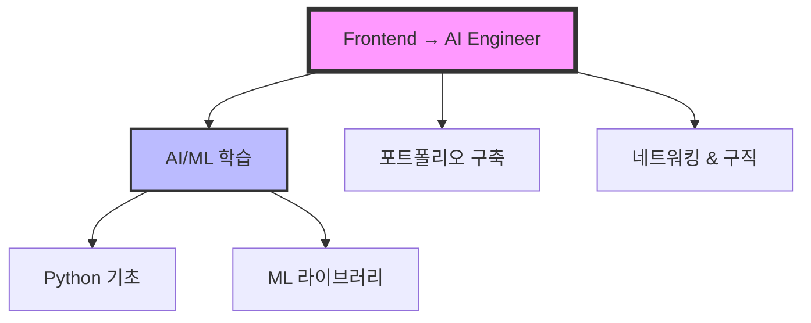

# Future Architect

> Transform complex, multi-topic thoughts into structured plans with visual diagrams and actionable TODOs

## Overview

Future Architect is a Claude Code skill that helps you:
- **Handle multiple goals simultaneously** - Organize 2-4 topics at once (career, life, projects)
- **Develop each topic individually** through 2-6 rounds of focused conversation
- **Visualize relationships** between topics with auto-generated Mermaid diagrams
- **Prioritize actions** across all topics with integrated 3-tier TODO system
- **Track progress** topic-by-topic with visual indicators (1/4, 2/4, 3/4, 4/4)

Perfect for complex life planning, multi-goal management, career transitions with multiple dimensions, and interconnected projects.

Perfect for career planning, project management, learning roadmaps, and personal goals.

## Features

✨ **Interactive Interview**: 2-3 rounds of questions to deeply understand your goals
📊 **Mermaid Diagrams**: Automatic visual concept maps (first in this project!)
🎯 **3-Tier Priorities**: Critical (now) → Important (next) → Beneficial (later)
⏱️ **Time Estimates**: Realistic time estimates for each action
📁 **Auto-Save**: Organized markdown files with timestamps
🔄 **Customizable**: Configure save location, diagram style, priority system

## Installation

### Via npm run link (Local Development)

```bash
# From repository root
npm run link

# Or manually
./scripts/link-local.sh
```

### Manual Installation

```bash
# Copy to Claude Code skills directory
cp -r plugins/future-architect/skills/future-architect ~/.claude/skills/
```

## Usage

### Trigger Phrases

**Korean**:
- "생각 정리"
- "계획 수립"
- "아이디어 정리"
- "목표 정리"

**English**:
- "organize my thoughts"
- "plan clarification"
- "organize ideas"
- "structure my plan"

### Example Workflow

```
You: "생각 정리해줘"

Claude:
- Round 1: Asks about your goal, current status, timeline
- Round 2: Asks about constraints and available resources
- Round 3: Asks about approach and priorities

→ Generates comprehensive plan with:
  - Mermaid diagram showing goal hierarchy
  - Prioritized TODO list (15-20 items)
  - Time estimates for each action
  - Next steps and review schedule

→ Saves to: ~/Documents/plans/2026-02-11-[your-goal].md
```

## Configuration

Edit `~/.claude/skills/future-architect/config.yaml`:

```yaml
# Save location (default: ~/Documents/plans)
output_dir: "~/Documents/plans"

# Auto-open file after creation (macOS: open, Linux: xdg-open)
auto_open: true

# Mermaid diagram direction: TD (Top-Down), LR (Left-Right)
diagram_direction: "TD"

# Priority system: 3-tier or 4-tier
priority_system: "3-tier"

# Filename format: {date}-{goal}.md
filename_format: "{date}-{goal}.md"
```

## Output Example

````markdown
# 생각 정리: Frontend → AI Engineer 커리어 전환

> **생성일**: 2026-02-11 | **타임라인**: 6개월 | **상태**: 계획 수립 단계

## 📋 목표 요약
- Frontend Developer → AI Engineer 전환 (6개월 내)
- Python + ML/AI 역량으로 경쟁력 구축
- 실전 프로젝트 포트폴리오 3개 완성

## 🧠 개념 관계도


## ✅ 우선순위별 TODO

### 🔥 Critical (지금 당장)
- [ ] Python 기초 문법 복습 — ML 필수 선행 조건 (예상: 10h)
- [ ] AI Engineer JD 10개 분석 — 요구 스킬 파악 (예상: 3h)

### ⚡ Important (1-3개월)
- [ ] Coursera ML 강의 완료 — 이론 기초 (예상: 40h)
- [ ] Kaggle 대회 참여 — 실전 경험 (예상: 20h)

### 💡 Beneficial (6개월+)
- [ ] AI 컨퍼런스 참석 — 트렌드 파악
````

## Use Cases

### 1. Career Planning
Plan career transitions, skill development, job search strategies

### 2. Project Management
Structure project ideas, define milestones, identify dependencies

### 3. Learning Roadmaps
Create structured learning plans with clear progression paths

### 4. Personal Goals
Organize life goals (fitness, travel, hobbies) with actionable steps

## Architecture

```
future-architect/
├── .claude-plugin/
│   └── plugin.json          # Plugin metadata
├── skills/
│   └── future-architect/
│       ├── SKILL.md          # Execution algorithm (7 steps)
│       └── config.yaml       # User settings
├── templates/
│   └── output-template.md    # Reference template
└── README.md                 # This file
```

## Comparison with Existing Tools

| Feature | Future Architect | Notion | Obsidian | Todoist |
|---------|------------------|--------|----------|---------|
| Interactive interview | ✅ | ❌ | ❌ | ❌ |
| Auto Mermaid diagrams | ✅ | ❌ | Manual | ❌ |
| 3-tier prioritization | ✅ | Manual | Manual | ✅ |
| Time estimation | ✅ Auto | Manual | Manual | Manual |
| Claude Code integration | ✅ | ❌ | ❌ | ❌ |
| Markdown-based | ✅ | Proprietary | ✅ | Proprietary |

## Future Enhancements

### Phase 1 (Immediate)
- [ ] Update mode: Edit existing plans
- [ ] Progress tracking: Completion %, time invested
- [ ] Dependency visualization: Show blockers in diagrams
- [ ] Daily focus: Today's top 3 tasks

### Phase 2 (2-3 months)
- [ ] Gantt charts: Time-based visualization
- [ ] Smart recommendations: AI suggests next actions
- [ ] Weekly reviews: Auto-generate progress summaries
- [ ] Cross-plan linking: Connect related plans

### Phase 3 (6-12 months)
- [ ] Web application: Interactive dashboard
- [ ] Calendar integration: Google Calendar sync
- [ ] Mobile app: PWA with push notifications
- [ ] Collaboration: Share plans, comments, accountability partners

## Related Skills

- **spec-interview**: Software requirements gathering through interviews
- **learning-summary**: Conversation summarization and concept extraction
- **project-insight**: Codebase analysis with multi-agent pipeline

## Troubleshooting

### Skill not activating?
```bash
# Verify symlink
ls -la ~/.claude/skills/future-architect

# Re-link if needed
npm run link
```

### File not saving?
```bash
# Check/create default directory
mkdir -p ~/Documents/plans

# Check permissions
ls -la ~/Documents/plans
```

### Config not loading?
```bash
# Verify config file exists
cat ~/.claude/skills/future-architect/config.yaml

# Use absolute paths (not ~)
output_dir: "/Users/yourname/Documents/plans"
```

## Contributing

This plugin is part of the [claude-ai-engineering](https://github.com/JayKim88/claude-ai-engineering) repository.

Found a bug or have a feature request? [Open an issue](https://github.com/JayKim88/claude-ai-engineering/issues)!

## License

MIT

## Credits

Created by Jay Kim (@JayKim88) as part of the Claude AI Engineering toolkit.

Inspired by:
- `spec-interview` (interactive interview pattern)
- `learning-summary` (concept extraction)
- `project-insight` (3-tier prioritization)
