# Future Architect

Helps users organize complex thoughts and multiple goals through **topic-by-topic conversational development**, generating Mermaid diagrams showing relationships and prioritized TODO lists.

**Key Features**:
- Accept free-form input (bullet points with multiple topics)
- Context-aware adaptive questions that reference user's own words
- Advisor-mode probing: challenge assumptions, explore contradictions, suggest alternatives
- Topic review cards with user approval before moving forward
- Full plan preview with relationship validation before document generation
- Capacity-aware TODO system with realistic time budgeting
- Non-linear navigation: go back, add topics, reorder at any time
- Show progress as topics are completed (1/4, 2/4, 3/4, 4/4)
- Generate unified Mermaid diagram showing topic relationships
- Create integrated TODO list across all topics

---

## Execution Algorithm (10 Steps)

```
Step 1:  Parse Input & Extract Topics
Step 2:  Initialize Topic Interview Loop
Step 3:  Conduct Context-Aware Interview (2-6 Rounds)
Step 3b: Topic Review & Deepening
Step 4:  Topic Completion & Navigation
Step 5:  Cross-Topic Analysis & Relationship Validation
Step 5b: Full Plan Review
Step 6:  Generate Mermaid Diagram
Step 7:  Generate Capacity-Aware TODO List
Step 8:  Generate Markdown Document and Save
```

---

### Step 1: Parse Free-Form Input and Extract Topics

**Input Detection**:
- User provides bullet points with topics and initial context
- Each bullet point represents a separate topic/goal

**Example input**:
```
- 커리어 전환
  급하게 취업을 시도하기 보다, 현재까지 vntg에서 했던 것들을 정리...

- 독일행
  독일에서 취업할 수 있는 개발자 포지션은...

- 창업
  서비스를 많이 만들어보고 싶다...
```

**Processing**:
1. Extract each bullet point as a topic (title)
2. Capture indented text as initial context
3. Create topic tracking structure:
   ```python
   topic = {
     'title': '커리어 전환',
     'context': 'initial thoughts...',
     'status': 'pending',  # pending|in_progress|completed|skipped
     'round_count': 0,
     'coverage': {
       'goals': False,
       'constraints': False,
       'timeline': False,
       'actions': False,
       'risks': False
     },
     'pre_analysis': {},  # populated in Step 3 before interview
     'qa_history': [],
     'review_card': {}    # populated in Step 3b
   }
   ```

**Confirm with user**:
```
📋 감지된 토픽:
1. 커리어 전환
2. 독일행
3. 창업
4. 투자

이 4개 토픽에 대해 각각 대화를 나누며 발전시킨 후,
통합 다이어그램과 실행 계획을 생성합니다.

준비되셨나요?
```

---

### Step 2: Initialize Topic Interview Loop

**Display progress**:
```
───────────────────────────
📋 진행 상황 (1/4)
───────────────────────────
🔄 1. 커리어 전환 ← 현재
⏳ 2. 독일행
⏳ 3. 창업
⏳ 4. 투자
───────────────────────────

"{토픽}" 에 대해 이야기를 나눠보겠습니다.
{initial_context if exists}
```

**Navigation banner (첫 번째 토픽 시작 시 1회 표시)**:
```
💡 언제든지 "이전 토픽으로", "토픽 추가", "건너뛰기", "문서 생성"을 말씀하실 수 있습니다.
```

Set first topic status to `'in_progress'` and begin interview.

---

### Step 3: Conduct Context-Aware Interview (2-6 Rounds)

**CRITICAL RULE**: Before generating questions, analyze the user's initial context for this topic. Never ask for information the user already clearly stated.

#### Pre-Interview Context Analysis

For each topic, BEFORE asking the first question:

1. Parse `topic.context` (the indented text from Step 1)
2. Identify already-stated information:
   ```python
   pre_analysis = {
     'goals_stated': bool,        # Did user state a goal?
     'goals_extract': str,        # What goal was stated?
     'situation_stated': bool,    # Did user describe current situation?
     'situation_extract': str,    # What situation was described?
     'constraints_mentioned': [], # Any constraints/worries mentioned?
     'timeline_mentioned': bool,  # Did user mention a timeline?
     'timeline_extract': str,     # What timeline?
     'specific_details': [],      # Names, technologies, numbers, etc.
     'emotional_signals': [],     # Fears, excitement, uncertainty
     'assumptions': [],           # Claims that could be challenged
     'connections_to_other_topics': []  # References to other topics
   }
   ```
3. Update coverage based on what's already known:
   - If `goals_stated`: `coverage.goals = True` (or partial if vague)
   - If `timeline_mentioned`: `coverage.timeline = True` (or partial)
   - If `constraints_mentioned`: `coverage.constraints = True` (partial)

4. Store in `topic.pre_analysis`

#### Adaptive Question Generation Rules

**DO generate questions that**:
- Reference specific details the user already provided (names, technologies, numbers)
- Use the user's own vocabulary and expressions back to them
- Deepen what was already stated rather than re-asking
- Explore gaps in what was stated (what was NOT mentioned)
- Connect to previously completed topics (for Topic 2+)

**DO NOT generate questions that**:
- Ask for information already clearly stated
- Use generic templates when specific context exists
- Present options the user already chose implicitly
- Ignore the user's language/tone

#### Round Generation Logic

**IF user provided rich context (goals + situation + some constraints):**

Skip generic foundation questions entirely. Instead:

```
Round 1: Deepening + Clarification

Generate 2 questions that deepen what the user already stated:

Example — user wrote about AI pipeline experience at VNTG:

Q1: "VNTG에서의 figma-to-code, sdd-to-code 경험을 어떤 형태로
    정리하실 계획인가요?"
header: "포트폴리오 형태"
options:
  - "GitHub 포트폴리오 (코드 + README)" (공개 코드 중심)
  - "기술 블로그 시리즈" (글 중심 정리)
  - "실제 서비스로 발전" (경험을 새 제품으로)

Q2: "{specific detail} 에 대해 더 자세히 들려주세요.
    어떤 기술 스택을 사용했고, 어떤 문제를 해결했나요?"
header: "상세 경험"
options:
  - Other (free text)
```

**IF user provided minimal context (title only or very brief):**

Use foundation questions (adapted, not generic):

```
Round 1: Foundation

Q1: "'{topic}'을(를) 통해 구체적으로 무엇을 이루고 싶으신가요?"
header: "목표"
options: [topic-specific options based on topic title]

Q2: "현재 상황은 어떤가요?"
header: "현황"
options:
  - "준비 단계" (아직 시작하지 않았지만 준비 중)
  - "진행 중" (이미 시작했지만 방향 재정립 필요)
  - "정체 상태" (진행이 막혀있거나 동기 부족)
  - "거의 완료" (마지막 단계만 남음)
```

**Subsequent rounds**: Fill remaining coverage gaps with context-aware questions:

```
IF NOT coverage.constraints:
  Ask about constraints/worries (adapt options to topic context)

IF NOT coverage.timeline:
  Ask about timeline (reference other topics' timelines if relevant)

IF NOT coverage.actions:
  Ask about first actionable step

IF NOT coverage.risks:
  Ask about what could go wrong
```

#### Cross-Topic Question Injection (Topic 2+)

When interviewing Topic N (N > 1), include 1 cross-topic question per round that references insights from previously completed topics:

```
Example: Interviewing "독일행" after completing "커리어 전환":

"커리어 전환 토픽에서 AI Pipeline 경험을 핵심 강점으로 정리하셨는데,
 독일 시장에서 이 경험이 어떤 포지션에 유효할 것 같으세요?"
```

#### Advisor-Mode Probing (Round 2+)

After each round, analyze the user's responses for probing opportunities. Apply 1-2 probing questions per round maximum.

**5 Probing Patterns**:

**1. Challenge Assumptions**:
```
User said: "프론트엔드만으로는 경쟁력이 낮다"
Probe: "정말 그럴까요? FE + AI 조합은 오히려 독일에서 희소한
       포지션이 될 수도 있지 않나요?"
```

**2. Explore Contradictions**:
```
Across topics: "급하게 취업하지 않겠다" + "독일 취업 1년 반 내"
Probe: "앞서 급하게 취업하지 않겠다고 하셨는데, 독일 취업은
       1년 반 타임라인을 잡으셨네요. 이 둘의 균형을 어떻게
       맞추실 계획인가요?"
```

**3. Surface Missing Perspectives**:
```
User focused on technical skills only
Probe: "기술 역량 준비에 집중하고 계신데, 독일 취업 시장의
       비자/언어/문화 요건은 별도로 조사하셨나요?"
```

**4. Reality Check**:
```
User said: "서비스를 많이 만들어보고 싶다"
Probe: "'많이'는 구체적으로 연간 몇 개를 생각하시나요?
       각 서비스에 몇 시간 투자하실 계획인가요?"
```

**5. Suggest Alternatives**:
```
User chose: "AI Engineer로 전환"
Probe: "AI Engineer 외에도 FE + AI 통합 역할
       (예: AI-powered UX Engineer) 같은 포지션도
       있습니다. 이런 선택지도 고려해 보셨나요?"
```

**Probing Rules**:
- Always frame as genuine curiosity, not judgment
- Use "~는 어떻게 생각하세요?" tone, never "~는 틀렸습니다"
- Maximum 1-2 probing questions per round (avoid interrogation feel)
- Only apply from Round 2+ (build trust in Round 1 first)
- Stop probing immediately if user says "넘어가자" or shows frustration
- Offer the user's original view as valid alongside the alternative

---

**Completion criteria**:
```python
def is_topic_sufficiently_developed(topic):
    # Minimum: at least 2 rounds
    if topic.round_count < 2:
        return False

    # Maximum: force complete at 6 rounds
    if topic.round_count >= 6:
        return True

    # Coverage: 80% of checklist covered
    coverage_pct = sum(topic.coverage.values()) / len(topic.coverage)
    if coverage_pct >= 0.8 and topic.round_count >= 3:
        return True  # proceed to Step 3b for review

    # Diminishing returns: last round didn't add new info
    if topic.round_count >= 4:
        if not did_last_round_add_new_info(topic):
            return True

    return False
```

---

### Step 3b: Topic Review & Deepening

**Purpose**: After interview rounds are complete, present a rich summary for the user to review BEFORE moving to the next topic. This ensures accuracy and gives the user a chance to correct, deepen, or add content.

**Display comprehensive topic review card**:

```
───────────────────────────
📋 "{topic.title}" 정리 결과
───────────────────────────

### 파악된 목표
{rich goal description — preserve the user's own words and expressions,
 do NOT compress 500 characters into 1 line}

### 현재 상황
{current situation with specific details the user mentioned}

### 핵심 제약사항
- {constraint 1 with context from user's words}
- {constraint 2 with context}

### 활용 가능한 자원
- {resource 1}
- {resource 2}

### 타임라인
{timeline with milestones if mentioned}

### 주요 액션 아이템 (초안)
1. {action 1} — {why this matters}
2. {action 2} — {why this matters}
3. {action 3} — {why this matters}

### 아직 탐색하지 못한 영역
- {uncovered area 1, e.g., "리스크 — 실패 시 대안"}
- {uncovered area 2, e.g., "구체적 학습 로드맵"}
───────────────────────────
```

**CRITICAL PRINCIPLE**: The review card must preserve the user's original expressions and richness. If the user wrote 500 characters about their AI pipeline experience, the "파악된 목표" section should reflect that depth — NOT compress it into "AI 프로덕트 엔지니어가 되고 싶다" alone.

**Ask user for review**:
```
AskUserQuestion:
  question: "이 정리가 정확한가요?"
  header: "토픽 리뷰"
  multiSelect: false
  options:
    - "정확합니다 — 다음 토픽으로 진행" (내용이 맞으니 넘어갑니다)
    - "수정 필요 — 내용을 고치고 싶습니다" (잘못되거나 부정확한 부분이 있음)
    - "더 깊이 탐색 — 추가 질문 요청" (아직 논의하고 싶은 부분이 있음)
    - "빠진 내용 추가 — 직접 보충하겠습니다" (제가 직접 텍스트를 추가할게요)
```

**Action based on response**:

- **"정확합니다"** → Store review card in `topic.review_card`, mark topic as `completed`, proceed to Step 4

- **"수정 필요"** → Ask follow-up:
  ```
  AskUserQuestion:
    question: "어떤 부분을 수정하시겠어요? 자유롭게 적어주세요."
    header: "수정 내용"
    options:
      - Other (free text)
  ```
  Update topic data with corrections, re-display the review card.

- **"더 깊이 탐색"** → Return to Step 3 for 1-2 additional targeted rounds. Focus on the "아직 탐색하지 못한 영역" items. After additional rounds, return to Step 3b and re-display updated review card.

- **"빠진 내용 추가"** → Ask follow-up:
  ```
  AskUserQuestion:
    question: "추가하고 싶은 내용을 자유롭게 적어주세요."
    header: "추가 내용"
    options:
      - Other (free text)
  ```
  Incorporate into topic data, re-display the review card.

---

### Step 4: Topic Completion & Navigation

**After the user approves the review card in Step 3b**:

Display transition:
```
✅ "{topic.title}" 정리 완료 ({completed_count}/{total_count})

다음 주제: "{next_topic.title}"
```

**Ask user with expanded navigation options**:
```
AskUserQuestion:
  question: "어떻게 진행할까요?"
  header: "다음 단계"
  multiSelect: false
  options:
    - f"다음 → {next_topic.title} 시작" (다음 토픽 인터뷰로 진행)
    - "이전 토픽 재방문 — 수정/보충할 토픽 선택" (완료된 토픽을 다시 열기)
    - "새 토픽 추가 — 대화 중 떠오른 새 주제" (토픽 리스트에 새 항목 추가)
    - "문서 생성 — 지금까지 논의한 내용으로 충분합니다" (남은 토픽 건너뛰고 결과물 생성)
```

**Action based on response**:

- **"다음"** → Set next topic to `in_progress`, go to Step 2 (show progress) → Step 3

- **"이전 토픽 재방문"** → Show list of completed topics:
  ```
  AskUserQuestion:
    question: "어떤 토픽을 재방문하시겠어요?"
    header: "토픽 선택"
    multiSelect: false
    options:
      - f"{topic1.title}" ({topic1의 간략 요약})
      - f"{topic2.title}" ({topic2의 간략 요약})
      ...
  ```
  After selection, show that topic's review card (from Step 3b) and ask what to change. After changes, return to Step 4.

- **"새 토픽 추가"** →
  ```
  AskUserQuestion:
    question: "새 토픽의 제목과 초기 생각을 알려주세요."
    header: "토픽 추가"
    multiSelect: false
    options:
      - Other (free text)
  ```
  Parse response, add new topic to list, update progress display, continue with current flow.

- **"문서 생성"** → Skip remaining topics, proceed to Step 5. Mark skipped topics as `skipped`.

**Repeat Steps 2-4** until all topics are completed/skipped or user chooses to generate document.

---

### Step 5: Cross-Topic Analysis & Relationship Validation

**After all topics are developed**:

#### Phase 1: Internal Analysis (no display)

1. **Extract from all topics**:
   - All goals, constraints, actions, timelines from review cards
   - Potential relationships between topics

2. **Identify relationship types**:
   - **Enables**: A makes B possible (e.g., "커리어 전환" enables "독일행")
   - **Depends**: A requires B first (e.g., "독일행" depends on "커리어 전환")
   - **Supports**: A helps B (e.g., "투자" supports "창업")
   - **Conflicts**: A and B compete for same resources (e.g., time conflict)
   - **Sequential**: Timeline-based ordering

3. **Detect potential conflicts**:
   - Time conflicts: two topics requiring full-time attention in same period
   - Resource conflicts: same budget needed for different goals
   - Goal conflicts: achieving A makes B harder or impossible

4. **Build hierarchy**:
   ```
   Level 1: Overarching goal (if one exists)
   Level 2: Major topics (user's topics)
   Level 3: Specific actions (from each topic's review card)
   ```

5. **Generate cross-cutting insights** (2-3):
   - Patterns that connect multiple topics
   - Leverage points where one action advances multiple goals
   - Express in user's own words when possible

#### Phase 2: Present to User for Validation

```
───────────────────────────
🔗 토픽 간 관계 분석
───────────────────────────

### 발견된 관계
1. {topic_a} →enables→ {topic_b}
   이유: {explanation using user's context}

2. {topic_c} →supports→ {topic_d}
   이유: {explanation}

3. {topic_e} ⚠️conflicts→ {topic_f}
   이유: {explanation of the conflict}
```

**Ask user to validate relationships**:
```
AskUserQuestion:
  question: "이 관계 분석이 맞나요?"
  header: "관계 검증"
  multiSelect: false
  options:
    - "맞습니다 — 이대로 진행" (관계 분석이 정확함)
    - "일부 수정 필요" (관계를 고치거나 삭제하고 싶음)
    - "빠진 관계 추가" (제가 발견한 연결고리가 있음)
    - "전혀 다릅니다 — 직접 정의" (관계를 처음부터 제가 정의하겠습니다)
```

**For "일부 수정"**: Show numbered list, ask which to change and how.
**For "빠진 관계 추가"**: Free text input for new relationships.
**For "전혀 다릅니다"**: Free text input for user-defined relationships.

**If conflicts detected**, additionally ask:
```
AskUserQuestion:
  question: "⚠️ 잠재적 충돌이 발견되었습니다:
            {conflict description}.
            어떻게 해결하시겠어요?"
  header: "충돌 해결"
  multiSelect: false
  options:
    - "순차적 진행 — 먼저 A, 그 다음 B" (시기를 나누어 진행)
    - "병행하되 비중 다르게 — A 70%, B 30%" (동시 진행하되 집중도 조절)
    - "하나를 포기/축소" (우선순위가 낮은 쪽을 줄임)
    - "직접 설명하겠습니다" (제 방식으로 해결할 계획이 있음)
```

---

### Step 5b: Full Plan Review

**Purpose**: Before generating the final document, present the complete integrated plan for user approval. This is the user's last chance to adjust before the document is created.

**Display integrated preview**:

```
───────────────────────────
📋 전체 계획 미리보기
───────────────────────────

### 토픽별 핵심 요약
{for each completed topic: 2-3 line summary preserving user's language}

### 토픽 간 관계
{validated relationships from Step 5, including any user corrections}

### 핵심 인사이트
"{cross-topic insight 1}"
— {how it connects topics} | {actionable implication}

"{cross-topic insight 2}"
— {how it connects topics} | {actionable implication}

### TODO 초안 개요
🔥 Critical: {count}개 — 예상 총: ~{hours}시간
⚡ Important: {count}개 — 예상 총: ~{hours}시간
💡 Beneficial: {count}개

───────────────────────────
```

**Ask user for final approval**:
```
AskUserQuestion:
  question: "전체 계획 미리보기입니다. 어떻게 하시겠어요?"
  header: "최종 리뷰"
  multiSelect: false
  options:
    - "좋습니다 — 문서 생성해주세요" (이대로 최종 문서를 만들어주세요)
    - "인사이트 수정/추가" (핵심 인사이트를 고치거나 새로 추가하고 싶음)
    - "토픽 재방문" (특정 토픽을 다시 논의하고 싶음)
    - "우선순위 조정 — TODO 항목을 재배치하고 싶음" (Critical/Important/Beneficial 분류를 바꾸고 싶음)
```

**Action based on response**:
- **"좋습니다"** → Proceed to Step 6
- **"인사이트 수정/추가"** → Free text for insight changes, update preview
- **"토픽 재방문"** → Show topic list, return to Step 3 for that topic, then re-run Step 5/5b
- **"우선순위 조정"** → Show TODO draft list with adjustment options

---

### Step 6: Generate Mermaid Diagram

**Showing topic relationships** (using validated relationships from Step 5):

```mermaid
graph TD
    A[커리어 & 라이프 플랜] --> B[커리어 전환]
    A --> C[독일행]
    A --> D[창업]
    A --> E[투자]

    B --> B1[VNTG 경력 정리]
    B --> B2[AI 역량 개발]

    C --> C1[독일 JD 리서치]
    C --> C2[비자 요건 확인]

    D --> D1[아이디어 발굴]
    E --> E1[투자 학습]

    B -.enables.-> C
    E -.supports.-> D

    style A fill:#f9f,stroke:#333,stroke-width:4px
    style B fill:#bbf,stroke:#333,stroke-width:2px
    style C fill:#bbf,stroke:#333,stroke-width:2px
    style D fill:#bbf,stroke:#333,stroke-width:2px
    style E fill:#bbf,stroke:#333,stroke-width:2px
```



**Diagram type selection**:
- Multiple topics with relationships → `graph TD` (Top-Down)
- Single topic with process flow → `graph LR` (Left-Right)
- Timeline-focused → `gantt` chart

**Style rules**:
- Level 1 (overarching): `fill:#f9f`, `stroke-width:4px`
- Level 2 (topics): `fill:#bbf`, `stroke-width:2px`
- Level 3 (actions): default style
- Enabling relationships: dashed arrows `-.enables.->`
- Supporting relationships: dashed arrows `-.supports.->`
- Conflict relationships: red dashed arrows with `-.conflicts.->` and `style` with `stroke:red`

---

### Step 7: Generate Capacity-Aware TODO List

#### Step 7a: Gather Capacity Information

```
AskUserQuestion:
  question: "주당 이 계획에 투자할 수 있는 시간은 얼마나 되나요?"
  header: "시간 예산"
  multiSelect: false
  options:
    - "주 10시간 이하" (파트타임 투자)
    - "주 10-20시간" (적극적 투자)
    - "주 20-40시간" (풀타임에 가까운 투자)
    - "주 40시간 이상" (풀타임 집중)
```

#### Step 7b: Generate TODO with Prioritization

**Prioritization logic**:

**Critical (🔥)** - criteria:
- Has urgent timeline (user said ASAP or 1-3 months)
- Is prerequisite for other goals (blocks other TODOs)
- Marked as "first action" by user in review card
- Removes major constraint mentioned by user
- **Limit: Maximum 3 Critical items** (to maintain focus)

**Important (⚡)** - criteria:
- Enables multiple goals (helps 2+ topics)
- Medium timeline (6-12 months)
- Builds foundation (learning, skills)
- High user emphasis

**Beneficial (💡)** - criteria:
- Long-term goal (1+ years)
- Nice-to-have, not essential
- Can be done when time permits

**Time estimation guidelines**:
- Research tasks: 3-5h (basic), 8-12h (deep)
- Learning: 30-50h (new programming language), 150-200h (language A1→B1)
- Creation: 20-40h (portfolio project MVP), 3-5h (resume)
- Admin: 10-20h (portfolio website), 2-4h (networking event)
- Each Critical item should be completable in <= 10h (if larger, split)

#### Step 7c: Capacity Validation

After generating the TODO list, validate against user's weekly budget:

```python
critical_total_hours = sum(critical_items_hours)
weekly_hours = user_weekly_budget
critical_weeks_needed = critical_total_hours / weekly_hours
```

**IF `critical_weeks_needed > 2`**:

Display warning:
```
⚠️ 현실성 점검:
- Critical 항목 총 소요시간: ~{critical_total_hours}시간
- 주간 가용시간: {weekly_hours}시간
- Critical만 완료하는 데 약 {critical_weeks_needed}주 필요

"1-2주 내" 타임라인에 맞추려면 조정이 필요합니다.
```

```
AskUserQuestion:
  question: "Critical 항목을 조정하시겠어요?"
  header: "용량 조정"
  multiSelect: false
  options:
    - "일부를 Important로 내림 — 가장 중요한 것만 Critical로" (집중도를 높임)
    - "이대로 유지 — 시간을 더 투자하겠습니다" (조정 불필요)
    - "큰 항목 분할 — 작은 단위로 나눠주세요" (10h+ 항목을 2-3h 단위로)
```

**For "큰 항목 분할"**:
Break items > 10h into 2-3h sub-tasks:
```
Before: "ML 온라인 강의 수강 (40h)"
After:
  - "ML Week 1: Linear Regression 모듈 (5h)"
  - "ML Week 2: Classification 모듈 (5h)"
  ...
```

**IF capacity is OK**: Skip warning, proceed to Step 8.

---

### Step 8: Generate Markdown Document and Save

**Output template** (multi-topic version):

```markdown
# 생각 정리: {combined topic titles}

> **생성일**: {date}
> **토픽 수**: {num_topics}
> **상태**: 계획 수립 단계
> **주간 시간 예산**: {weekly_hours}시간

---

## 📋 토픽별 요약

### 1. {topic1.title}
- **목표**: {topic1.goal — rich description from review card}
- **타임라인**: {topic1.timeline}
- **강점/자원**: {topic1.resources}
- **제약사항**: {topic1.constraints}
- **첫 액션**: {topic1.first_action}

### 2. {topic2.title}
...

{... for all topics}

---

## 🧠 개념 관계도

```mermaid
{generated Mermaid diagram from Step 6}
```

---

## 🏗️ 계층 구조

### Level 1: 전체 목표
- {overarching_goal if exists, or "다중 목표 달성"}

### Level 2: 주요 토픽
- {topic1.title}
- {topic2.title}
- ...

### Level 3: 구체적 액션
- {action1 from all topics}
- {action2}
- ...

---

## 💡 핵심 인사이트

> "{insight 1}"
> — {how it connects topics} | {actionable implication}

> "{insight 2}"
> — {how it connects topics} | {actionable implication}

---

## ✅ 우선순위별 TODO

{generated TODO list from Step 7}

---

## 🚧 종합 제약사항

| 제약사항 | 관련 토픽 | 심각도 | 해소 방법 |
|---------|----------|--------|----------|
{constraint table with severity and resolution}

---

## 💪 활용 가능한 자원

| 자원 | 설명 | 활용 토픽 |
|-----|------|----------|
{resource table}

---

## 📅 다음 단계

1. {first Critical TODO} (기한: {when})
2. {second Critical TODO} (기한: {when})
3. {third action} (기한: {when})
4. {review_period} 후 진행 상황 리뷰

---

## 📝 참고사항

- 이 문서는 {num_topics}개 토픽을 통합 정리한 계획입니다
- 진행하면서 조정 가능하며, 주기적 리뷰 권장
- TODO 항목을 완료하면 체크 (`- [x]`)하여 진행 상황 추적
- 토픽 간 관계를 고려하여 시너지가 큰 액션부터 진행하세요
```

**Save file**:
1. Read config: `~/.claude/skills/future-architect/config.yaml`
2. Default location: `~/Documents/plans/`
3. Filename format: `YYYY-MM-DD-{topic1}-{topic2}-{...}.md`
   - Example: `2026-02-11-커리어-독일-창업-투자.md`

**Confirm to user**:
```
✅ 생각 정리가 완료되었습니다!

📄 저장 위치: {file_path}

생성된 문서에는:
- {num_topics}개 토픽 요약
- 토픽 간 관계도 (Mermaid) — 유저 검증 완료
- 핵심 인사이트 {insight_count}개
- 통합 TODO {total_todos}개 (🔥{critical} ⚡{important} 💡{beneficial})
- 주간 시간 예산: {weekly_hours}시간 기준
- 다음 단계 가이드

가 포함되어 있습니다.

문서를 검토하고 TODO를 하나씩 실행해보세요!
추가로 정리하고 싶은 내용이 있으면 말씀해주세요.

💡 계획 업데이트가 필요하면 "계획 업데이트"를 말씀해주세요.
```

---

## Error Handling

| Scenario | Response |
|----------|----------|
| No topics detected | Ask user to provide at least one topic in bullet format |
| User gives vague answers | Ask 1-2 clarifying follow-up questions using Advisor-Mode probing |
| Interview too long (6+ rounds) | Force topic completion, proceed to Step 3b review |
| User wants to skip topic | Mark as `skipped`, move to next topic |
| User wants to go back | Show completed topic list, let user pick, return to Step 3b |
| User wants to add a topic mid-flow | Add to topic list, update progress, continue |
| Config file missing | Use default: ~/Documents/plans/ |
| Directory doesn't exist | Create with mkdir -p |
| User rejects review card | Allow corrections via free text, re-display card |
| User rejects relationships | Allow manual relationship definition |
| Capacity overflow | Show warning, offer adjustment options |

---

## Related Skills

- `spec-interview`: Reference for conversational interview pattern (2-6 rounds, completion detection, interview best practices)
- `learning-summary`: Reference for concept extraction from conversations
- `project-insight`: Reference for 3-tier prioritization system

---

## Examples

### Example 1: Single Topic

```
User: "생각 정리해줘 - 커리어 전환에 대해"

→ Parse: 1 topic detected ("커리어 전환")
→ Round 1-3: Context-aware interview with adaptive questions
→ Step 3b: Show review card, user approves
→ Step 5: Skip relationship analysis (single topic)
→ Step 5b: Show plan preview
→ Step 7: Capacity check
→ Generate: Single-topic Mermaid + 8-12 TODOs
→ Save to: ~/Documents/plans/2026-02-11-커리어-전환.md
```

### Example 2: Multi-Topic with Rich Context

```
User:
- 커리어 전환
  급하게 취업을 시도하기 보다, 현재까지 vntg에서 했던 것들을 정리...
  AI pipeline 자동화 경험... figma-to-code...
- 독일행
  독일에서 취업할 수 있는 개발자 포지션은...
- 창업
  서비스를 많이 만들어보고 싶다...
- 투자
  투자 공부 & 제대로 된...

→ Parse: 4 topics detected
→ Progress: 1/4 → 2/4 → 3/4 → 4/4
→ Topic 1 (커리어 전환):
   - Pre-analysis: goals_stated=True, specific_details=[figma-to-code, AI pipeline]
   - Round 1: Adaptive questions referencing figma-to-code experience (NOT generic)
   - Round 2: Advisor probing — challenges assumptions about FE competitiveness
   - Round 3: Timeline + first action
   - Step 3b: Rich review card → user approves with minor correction
→ Topic 2 (독일행):
   - Cross-topic question: references AI pipeline from Topic 1
   - 3 rounds + review card
→ Topic 3 (창업): 2 rounds + review card (user skips deep dive)
→ Topic 4 (투자): 3 rounds + review card
→ Step 5: Relationship analysis → user validates, adds one missing relationship
→ Step 5b: Full preview → user approves
→ Step 7: Capacity check (주 20시간) → Critical items fit within 2 weeks
→ Generate: Multi-topic Mermaid + 20 integrated TODOs
→ Save to: ~/Documents/plans/2026-02-11-커리어-독일-창업-투자.md
```

### Example 3: Navigation — Going Back

```
User is on Topic 3/4, realizes they want to add to Topic 1

→ Step 4: User selects "이전 토픽 재방문"
→ Shows list: [커리어 전환, 독일행]
→ User picks "커리어 전환"
→ Shows Topic 1's review card
→ User selects "빠진 내용 추가"
→ Adds new information
→ Updated review card displayed → user approves
→ Returns to Step 4, continues with Topic 3
```

### Example 4: Capacity Adjustment

```
→ Step 7a: User says "주 10시간"
→ Step 7b: Critical items total ~35시간
→ Step 7c: Warning displayed — "3.5주 필요, 1-2주 초과"
→ User selects "일부를 Important로 내림"
→ Adjusts to 2 Critical items (~15시간) → fits in 1.5 weeks
→ Proceed to Step 8
```

### Example 5: Early Termination

```
User: Round 2 on Topic 2/4, chooses "문서 생성"

→ Complete Topics 1-2 (with review cards), skip Topics 3-4
→ Step 5: Analyze only Topics 1-2 relationships
→ Step 5b: Preview with note about skipped topics
→ Generate: Partial plan
→ Note in document: "토픽 3-4는 논의하지 않음"
→ Save
```
