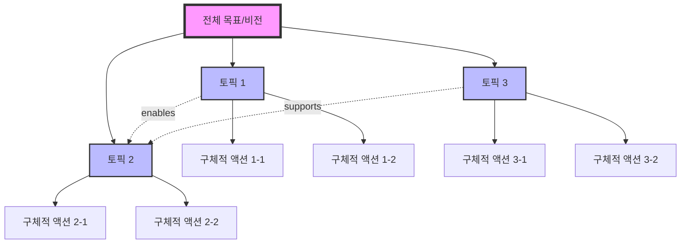

# 생각 정리: [통합 토픽 제목]

> **생성일**: YYYY-MM-DD
> **토픽 수**: [N개]
> **상태**: 계획 수립 단계
> **주간 시간 예산**: [N시간]

---

## 📋 토픽별 요약

### 1. [토픽 1 제목]
- **목표**: [구체적인 목표 — 유저 원문 표현 보존, 풍부하게 기술]
- **타임라인**: [기한]
- **강점/자원**: [활용 가능한 자원]
- **제약사항**: [주요 제약]
- **첫 액션**: [다음 주부터 시작 가능한 액션]

### 2. [토픽 2 제목]
- **목표**: [구체적인 목표]
- **타임라인**: [기한]
- **강점/자원**: [활용 가능한 자원]
- **제약사항**: [주요 제약]
- **첫 액션**: [다음 주부터 시작 가능한 액션]

### 3. [토픽 3 제목]
- **목표**: [구체적인 목표]
- **타임라인**: [기한]
- **강점/자원**: [활용 가능한 자원]
- **제약사항**: [주요 제약]
- **첫 액션**: [다음 주부터 시작 가능한 액션]

_(...추가 토픽)_

---

## 🧠 개념 관계도

**관계 설명**:
- 실선 화살표 (→): 상위-하위 관계
- 점선 화살표 (-.->): 토픽 간 관계
  - **enables**: A가 B를 가능하게 함
  - **depends**: B가 A에 의존함
  - **supports**: A가 B를 지원함
  - **conflicts**: A와 B가 자원을 경쟁함 (빨간 점선)

---

## 🏗️ 계층 구조

### Level 1: 전체 목표
- [overarching goal 또는 "다중 목표 달성"]

### Level 2: 주요 토픽
- [토픽 1 제목]
- [토픽 2 제목]
- [토픽 3 제목]
- ...

### Level 3: 구체적 액션
- [세부 액션 1] (토픽 1)
- [세부 액션 2] (토픽 1)
- [세부 액션 3] (토픽 2)
- [세부 액션 4] (토픽 2)
- [세부 액션 5] (토픽 3)
- ...

---

## 💡 핵심 인사이트

> "[인사이트 1]"
> — [토픽 간 연결 설명] | [실행 가능한 시사점]

> "[인사이트 2]"
> — [토픽 간 연결 설명] | [실행 가능한 시사점]

---

## ✅ 우선순위별 TODO

### 🔥 Critical (지금 당장 — 1-2주 내)
- [ ] [액션 아이템] — [왜 중요한지] (예상: Xh) _[토픽 N]_
- [ ] [액션 아이템] — [왜 중요한지] (예상: Xh) _[토픽 N]_
- [ ] [액션 아이템] — [왜 중요한지] (예상: Xh) _[토픽 N]_

### ⚡ Important (다음에 — 1-3개월 내)
- [ ] [액션 아이템] — [왜 중요한지] (예상: Xh) _[토픽 N]_
- [ ] [액션 아이템] — [왜 중요한지] (예상: Xh) _[토픽 N]_
- [ ] [액션 아이템] — [왜 중요한지] (예상: Xh) _[토픽 N]_

### 💡 Beneficial (나중에 — 6개월 이후)
- [ ] [액션 아이템] — [왜 중요한지] _[토픽 N]_
- [ ] [액션 아이템] — [왜 중요한지] _[토픽 N]_

---

## 🚧 종합 제약사항

| 제약사항 | 관련 토픽 | 심각도 | 해소 방법 |
|---------|----------|--------|----------|
| [제약 1] | [토픽명] | 높음/중간/낮음 | [해소 방법] |
| [제약 2] | [토픽명] | 높음/중간/낮음 | [해소 방법] |

**공통 제약사항**:
- [여러 토픽에 공통으로 적용되는 제약]

---

## 💪 활용 가능한 자원

| 자원 | 설명 | 활용 토픽 |
|-----|------|----------|
| [자원 1] | [설명] | [토픽명] |
| [자원 2] | [설명] | [토픽명] |

---

## ❓ 미해결 질문

**토픽 1 - [제목]**:
- [추가 조사/결정이 필요한 사항]

**토픽 2 - [제목]**:
- [추가 조사/결정이 필요한 사항]

---

## 📅 다음 단계

1. [첫 번째 Critical TODO] (기한: [언제])
2. [두 번째 Critical TODO] (기한: [언제])
3. [세 번째 Critical TODO] (기한: [언제])
4. [리뷰 주기] 후 진행 상황 리뷰

---

## 📝 참고사항

- 이 문서는 [N]개 토픽을 통합 정리한 계획입니다
- 각 토픽은 독립적으로 진행 가능하나, 관계도를 참고하여 순서를 고려하세요
- 진행하면서 조정 가능하며, 주기적 리뷰 권장 (주 1회 또는 격주 1회)
- TODO 항목을 완료하면 체크 (`- [x]`)하여 진행 상황 추적
- 토픽 간 관계를 고려하여 "enables" 관계가 있는 경우 선행 토픽을 먼저 진행
- 계획 업데이트가 필요하면 "계획 업데이트"를 사용하세요
