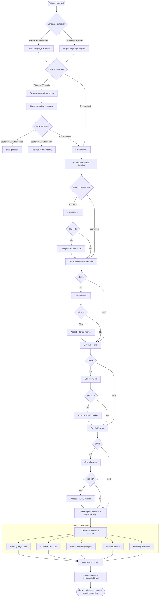

# launch-kit

4-question interview that generates all launch validation content for an indie hacker's product idea — in one markdown file.

## Overview

Indie hackers spend hours figuring out what to write. The code comes fast with AI, but writing landing page copy, community posts, and emails that actually convert takes most of a day. Launch-kit eliminates that friction.

You answer 4 questions. You get 5 complete pieces of copy — ready to paste into Carrd, Indie Hackers, Reddit, and Kit.

**The AHA moment:** Opening `launch-kit.md` and seeing everything ready to copy-paste. No blank page. No guessing at format. Just your specific product story, told 5 different ways.

## Architecture



## Features

- **Language auto-detect**: Korean trigger phrase → Korean output. English → English. Only Korean and English are supported.
- **Smart notes import**: Paste your existing notes inline — answered questions are skipped automatically
- **Partial notes handling**: Partially-extracted answers (under 15 words or score < 3) get a targeted follow-up, not the full question
- **Completeness scoring**: Each answer is scored 1-5. Vague answers get one targeted follow-up, then a [TODO] marker
- **Q2 hint always shown**: The differentiation question is the hardest. A hint example ("Unlike X, my product does Y by Z") is always provided
- **5 content pieces**: Landing page, Indie Hackers, Reddit, 2-email sequence (with preview text), Founding Plan
- **Tone-differentiated**: Each section uses the voice that community or channel expects
- **Korean product name support**: Non-ASCII product names automatically prompt for a Latin file slug
- **Next steps checklist**: Built into the output file — links to tools, posting guides, and `planning-interview`

## Installation

### Option 1: Manual symlink (recommended)

```bash
# From the repo root — create symlinks for skill and command
ln -s "$(pwd)/plugins/launch-kit/skills/launch-kit" ~/.claude/skills/launch-kit
ln -s "$(pwd)/plugins/launch-kit/commands/launch-kit" ~/.claude/commands/launch-kit

# Verify
ls -l ~/.claude/skills/launch-kit
ls -l ~/.claude/commands/launch-kit
```

### Option 2: npm script (if in local monorepo)

```bash
cd ~/Documents/Projects/claude-ai-engineering
npm run link
```

## Usage

### Slash Command

```bash
# Start interview from scratch
/launch-kit

# Pass your idea inline (skips answered questions)
/launch-kit I'm building a tool that generates standup reports from GitHub activity...

# Korean
/launch-kit 개발자 팀의 스탠드업 준비 시간을 줄여주는 도구를 만들고 있어요...
```

### Trigger Phrases

```bash
# English
"launch-kit"
"validate my idea"
"launch my idea"
"landing page copy"

# Korean
"아이디어 검증"
"랜딩페이지 만들어줘"
"검증 키트"
"아이디어 검증해줘"
```

## Examples

### Example 1: From Scratch (English)

**Trigger:** `validate my idea`

**Interview:**
```
Claude: What specific problem does this solve? Describe a real situation...
You: Every Monday, team leads spend 30+ minutes piecing together what their team did —
     checking Slack, Linear, GitHub, asking people. It's embarrassing and wastes everyone's time.

Claude: In one sentence: what makes this different from existing alternatives?
        Hint: "Unlike X, my product does Y by Z."
You: Unlike Notion or Slack, TaskBot automatically pulls activity from GitHub, Linear, and Slack
     and generates a formatted standup report — no one has to write anything.

Claude: Who is your primary user?
You: Engineering team leads at 10-50 person startups. They use GitHub + Linear + Slack.
     Their main pain is context-switching to collect updates before every standup.

Claude: What are the 3 must-have features for your MVP?
You: 1. GitHub activity summary, 2. Linear ticket status, 3. Scheduled Slack delivery.
     v2: AI-written narrative summaries, custom report templates.
```

**Output file:** `./taskbot/launch-kit.md`

**Landing page headline generated:** `Stop Spending 30 Minutes on Monday Standups`

**Indie Hackers title generated:** `Show IH: I built TaskBot because prepping standups was eating 30+ minutes every Monday`

---

### Example 2: With Inline Notes (Korean)

**Trigger:**
```
아이디어 검증: 프리랜서를 위한 인보이스 자동화 도구입니다.
현재 프리랜서들은 Excel이나 Google Sheets로 수동으로 인보이스를 만들고,
클라이언트마다 포맷이 달라서 매번 처음부터 작성해야 합니다.
핵심 기능은 1) 클라이언트별 템플릿 저장 2) 프로젝트 내역 자동 집계
3) PDF 생성 및 이메일 자동 발송입니다.
타겟은 월 3-10개 프로젝트를 진행하는 독립 프리랜서입니다.
```

**What happens:** Claude extracts problem, target, and MVP scope from the inline text. Only asks Q2 (differentiation) since it was missing.

**Output file:** `./freelance-invoice/launch-kit.md`

---

### Example 3: Vague Answers With Follow-ups

**Q1 Answer:** `People need to track their tasks better`

**Score:** 2 (too generic, no specific situation)

**Follow-up:** `Could you be more specific? A concrete scenario or number (e.g., '2 hours wasted', '30% conversion drop') will make the copy much stronger.`

**Q1 Revised:** `Product managers at SaaS companies lose track of which tasks are blocking launch. Every sprint review ends with "wait, who owns that?" and another 45 minutes of archaeology in Jira.`

**Score:** 5. Used directly in headline and Indie Hackers post.

---

## Output Structure

```
{product-slug}/
└── launch-kit.md
    ├── Interview summary (completeness scores per question)
    ├── Section 1: Landing page copy
    │   ├── Headline (outcome-focused, max 10 words)
    │   ├── Subheadline (who + how, 20-30 words)
    │   ├── Feature 1 (benefit-first, 2 sentences)
    │   ├── Feature 2
    │   ├── Feature 3
    │   ├── CTA (button text + supporting text)
    │   └── FAQ (5 objection-handling Q&As)
    ├── Section 2: Indie Hackers post
    │   ├── Title ("Show IH:" or "I built X because...")
    │   └── Body (problem → product → how it works → status → ask)
    ├── Section 3: Reddit r/SideProject post
    │   ├── Title (value-first, under 100 chars)
    │   └── Body (casual, problem hook → product → honest ask)
    ├── Section 4: Email sequence
    │   ├── Email 1: Welcome (immediate on signup)
    │   │   ├── Subject + preview text (under 90 chars, no greeting)
    │   │   └── Body
    │   └── Email 2: Day 3 follow-up (soft nudge + Founding Plan P.S.)
    │       ├── Subject + preview text (under 90 chars, curiosity-based)
    │       └── Body
    ├── Section 5: Founding Plan pre-sale
    │   ├── Headline (50% off + spot count)
    │   ├── Benefits list
    │   ├── Pricing block (regular vs. founding member)
    │   ├── Scarcity statement (honest)
    │   ├── CTA button
    │   └── Objection handler
    └── Next Steps checklist (immediate / this week / after 10 signups / after 20 signups)
```

## Tone Guide by Section

| Section | Voice | Avoid |
|---------|-------|-------|
| Landing page | Clear, benefit-first, specific outcomes | Jargon, "revolutionary", "game-changing" |
| Indie Hackers | Builder-to-builder, honest, metrics | "Excited to announce", corporate language |
| Reddit | Casual, human, value-first | Hard sell, excessive links, hype |
| Email welcome | Personal, direct, curious | "Dear Customer", newsletter tone |
| Email D+3 | Conversational, soft nudge | Pushy urgency, spam patterns |
| Founding Plan | Exclusive but honest, specific price | Fake scarcity, vague benefits |

## Configuration

No configuration file is required. launch-kit works with zero setup.

**Tunable behavior via answers:**
- Language is set by your trigger phrase, not config
- Product name derives from your answers (confirmed before generation)
- Output directory is always `{cwd}/{product-slug}/`

## Connection to planning-interview

```
launch-kit          →  Validate market demand  (before building)
planning-interview  →  Build the right product  (after validation)
```

The launch-kit output file includes a built-in reminder in the Next Steps checklist:
once you have 20+ signups and real user feedback, run `planning-interview` to generate
your PRD, User Journey Map, Technical Specification, and Wireframe Specification.

## Troubleshooting

### Issue: Generated copy feels generic

**Cause:** Vague or short answers to the interview questions. The copy quality is directly proportional to the specificity of your answers.

**Solution:** Look for [TODO] markers in the output file. Each marker includes specific guidance on what detail to add. Then re-run `launch-kit` with more specific answers, or manually edit the sections.

### Issue: Q2 (differentiation) is hard to answer

**Expected:** This is the most common friction point. The hint example is intentional.

**Strategy:** First name what exists today (Google Sheets, Notion, Jira). Then name the one thing users hate about the current solution. Then name what your product does instead. That pattern naturally produces a strong differentiation sentence.

### Issue: Output file not saved

**Check 1:** Does the current directory have write permissions?

**Check 2:** Try the Desktop fallback — launch-kit will try `~/Desktop/{product-slug}/launch-kit.md` if the primary path fails.

**Check 3:** If both fail, the full document is displayed in the chat. Copy it from there.

### Issue: Wrong language in output

**Cause:** Language is detected from the trigger phrase. A trigger with no Korean markers defaults to English.

**Solution:** Use a Korean trigger phrase for Korean output: "아이디어 검증" or "랜딩페이지 만들어줘".

**Note:** Only Korean and English outputs are supported. Other trigger languages will default to English.

### Issue: Product name not recognized from answers

**Expected behavior:** Claude asks you to confirm or provide the product name before generation.

**This is normal** for ideas at the concept stage. Just type your product name when prompted.

### Issue: Korean product name causes a file path error

**Cause:** Korean characters cannot be used directly in file paths after sanitization.

**Solution:** When prompted for a product name that contains Korean, launch-kit will automatically ask you to provide a Latin slug (e.g., `my-product`). Just type the slug when prompted.

## Comparison: launch-kit vs. Other Plugins

| Feature | launch-kit | planning-interview | business-avengers |
|---------|------------|-------------------|-------------------|
| Purpose | Validate idea with copy | Build product spec | Create business plan |
| Interview depth | 4 questions | 4-9 questions per phase | Multi-phase |
| Output | 5 copy pieces in 1 file | PRD + tech spec + wireframes | Business canvas + analysis |
| Time | 5-10 minutes | 20-60 minutes | 30-90 minutes |
| Use when | Before building | After validation | Raising funding or planning |

## Related Plugins

- `planning-interview` — Full PRD generation after idea validation
- `market-research-by-desire` — Market research and desire mapping
- `business-avengers` — Business canvas and competitive analysis
- `spec-interview` — Deep technical spec through interview

## Roadmap

- [ ] Gumroad / LemonSqueezy integration for Founding Plan activation
- [ ] ProductHunt launch post as a 6th content section
- [ ] Twitter/X thread generator from Indie Hackers post
- [ ] Carrd template generator that uses the landing page copy
- [ ] Revision mode: improve existing launch-kit.md with updated answers

## License

MIT License

## Author

**Jay Kim**
- GitHub: [@JayKim88](https://github.com/JayKim88)
- Repository: [claude-ai-engineering](https://github.com/JayKim88/claude-ai-engineering)

---

*4 questions. 5 pieces of copy. Everything you need to validate demand.*