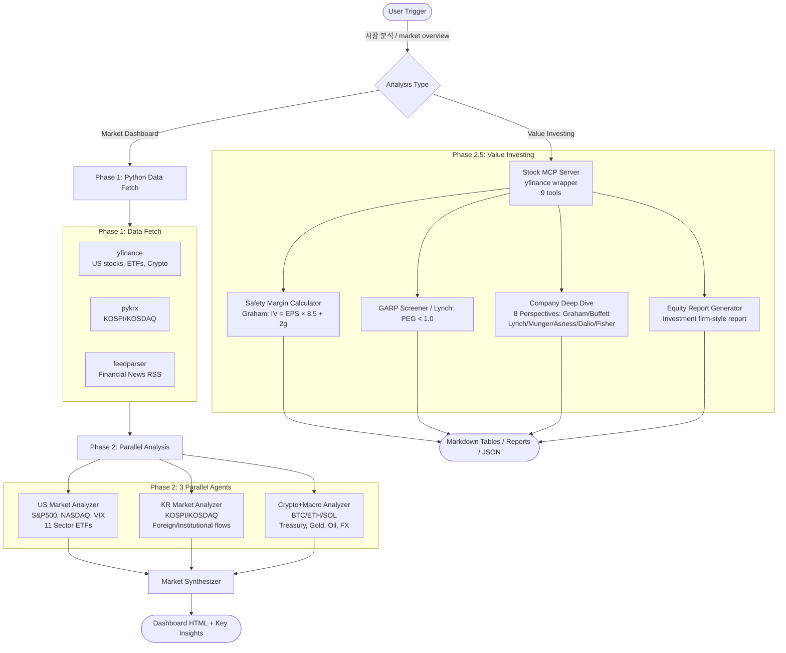

# Market Pulse


Financial market analysis dashboard plugin for Claude Code. Fetches real-time data from free sources and generates comprehensive market analysis using a multi-agent pipeline.

**Version 2.0** adds value investing analysis tools inspired by Graham, Lynch, Buffett, and other investment masters.

📖 **[CHANGELOG](CHANGELOG.md)** | 📚 **[Phase 2.5 Docs](analysis/README.md)** | 🏗️ **[Architecture](docs/ARCHITECTURE.md)**

## Features

### Market Analysis (Phase 1-2)
- **US Market**: S&P 500, NASDAQ, DOW, 11 SPDR Sector ETFs, VIX
- **Korean Market**: KOSPI/KOSDAQ, foreign/institutional flows (외국인/기관 매매동향), top stocks with PER/PBR
- **Global Macro**: Treasury yields, gold, oil, dollar index, USD/KRW
- **Crypto**: BTC, ETH, SOL and more
- **Watchlist**: Personal stock tracking with price alerts
- **News**: Financial news from RSS feeds (CNBC, MarketWatch, 한국경제, 매일경제)

### Value Investing Analysis ⭐ NEW (Phase 2.5)
- **Safety Margin Analysis** (Graham): Calculate intrinsic value and margin of safety
- **GARP Screening** (Lynch): Growth At Reasonable Price, PEG ratio analysis, 6 stock categories
- **Company Deep Dive** (8 Perspectives): Graham, Buffett, Lynch, Munger, Asness, Dalio, Fisher, Synthesis
- **Investment Reports**: Generate professional investment firm-style markdown reports
- **MCP Server**: yfinance-based Model Context Protocol server for stock data

## Quick Start

### Trigger

**Market Analysis with AI Insights** ⭐ Enhanced:
- "시장 분석해줘" / "시장 현황" / "증시 분석"
- "market overview" / "market pulse" / "check the markets"
- **Automatically includes**: Key takeaways, investment strategies, risk analysis, cross-market insights

**Value Investing Analysis** ⭐ NEW:
- "가치투자 분석" / "안전마진 분석" / "저평가 종목 찾아줘"
- "PEG 스크리닝" / "GARP 종목"
- "AAPL 기업 분석해줘" / "MSFT 심층 분석"

### Dependencies

```bash
pip3 install yfinance pykrx pyyaml feedparser
```

Dependencies are auto-installed on first run if missing.

## Configuration

### Watchlist (`config/watchlist.yaml`)

Edit to track your own stocks:

```yaml
us_stocks:
  - symbol: "AAPL"
    name: "Apple"
    alert_above: 250
    alert_below: 180
kr_stocks:
  - ticker: "005930"
    name: "삼성전자"
crypto:
  - symbol: "BTC-USD"
    name: "Bitcoin"
```

### Data Sources (`config/sources.yaml`)

Customize tracked symbols, sector ETFs, news RSS feeds, and scoring keywords.

## Architecture



### Phase 1-2: Market Analysis

- **Phase 1**: Python data fetch (yfinance + pykrx + feedparser)
- **Phase 2**: 3 parallel agents (US Market, KR Market, Crypto+Macro)
- **Phase 3**: Market Synthesizer → Dashboard output

### Phase 2.5: Value Investing Analysis ⭐ NEW

- **MCP Layer**: Stock MCP Server (yfinance wrapper, 9 tools)
- **Safety Margin Calculator** (Graham): IV = EPS × (8.5 + 2g)
- **GARP Screener** (Lynch): PEG < 1.0, 6 stock categories
- **Company Deep Dive**: 8 perspectives (Graham, Buffett, Lynch, Munger, Asness, Dalio, Fisher)
- **Equity Report Generator**: Investment firm-style markdown reports

## Usage Examples

### 1. Market Overview
```
User: "시장 분석해줘"
→ Generates HTML dashboard with US, KR, Crypto, Macro analysis
→ Auto-opens in browser
```

### 2. Safety Margin Analysis (저평가 종목 찾기)
```bash
cd plugins/market-pulse
python3 analysis/value_investing_analyzer.py \
  --tickers "AAPL,MSFT,GOOGL,NVDA,META" \
  --analysis safety_margin
```

**Output**:
```
✅ 안전마진 분석: 3개 저평가 종목 발견

종목     회사명                 현재가       내재가치       안전마진   추천
================================================================================
MSFT     Microsoft Corp     $   404.37 $  2045.76      80.2%  강력 매수
NVDA     NVIDIA Corp        $   190.05 $   574.70      66.9%  강력 매수
GOOGL    Alphabet Inc.      $   310.96 $   764.97      59.4%  강력 매수
```

### 3. GARP Screening (성장주 + 합리적 가격)
```bash
python3 analysis/value_investing_analyzer.py \
  --tickers "AAPL,MSFT,GOOGL,NVDA,META,AMZN,TSLA,CRM,ORCL" \
  --analysis garp
```

**Output**:
```
✅ GARP 스크리닝: 5개 GARP 종목 발견

종목     카테고리      PEG     성장률    ROE      추천
===========================================================
ORCL     고성장주      0.22    90.9%     69.0%    강력 매수
MSFT     고성장주      0.36    59.8%     34.4%    강력 매수
NVDA     고성장주      0.37    66.7%    107.4%    강력 매수
```

### 4. Company Deep Dive (8가지 관점 심층 분석)
```bash
python3 analysis/company_deep_dive.py
# Enter ticker: AAPL
```

**8 Perspectives**:
1. **Graham**: Safety margin 22.8% (HOLD)
2. **Buffett**: Wide moat (100/100)
3. **Lynch**: Fast Grower, PEG 1.62 (expensive)
4. **Munger**: Low risk (15/100), high survivability (85/100)
5. **Asness**: Weak factor scores (27.5/100)
6. **Dalio**: Mid-cycle expansion, cyclical positioning
7. **Fisher**: Innovation 70/100, Management integrity 90/100
8. **Overall**: 69.3/100, "조건부 매수", 1-3 year horizon

### 5. Investment Report Generation ⭐ NEW
```bash
python3 reports/equity_report_generator.py \
  --ticker AAPL \
  --format markdown \
  --output ~/Documents/AAPL_Report.md
```

**Output**: Professional investment firm-style report (키움증권/미래에셋 스타일)

See [analysis/README.md](analysis/README.md) for detailed documentation.

## File Structure

```
plugins/market-pulse/
├── .claude-plugin/
│   └── plugin.json              # Plugin metadata (v2.0.0)
├── skills/
│   └── market-pulse/
│       └── SKILL.md             # Orchestration (v2.0)
├── agents/                       # 3 market analysis agents
│   ├── us-market-analyzer.md
│   ├── kr-market-analyzer.md
│   └── crypto-macro-analyzer.md
├── mcp/                          # ⭐ NEW Phase 2.5
│   ├── stock_mcp_server.py      # MCP server (9 tools)
│   └── stock_client.py          # Python client
├── analysis/                     # ⭐ NEW Phase 2.5
│   ├── intrinsic_value.py       # Safety margin calculator
│   ├── lynch_screener.py        # GARP + PEG screener
│   ├── company_deep_dive.py     # 8-perspective analysis
│   ├── value_investing_analyzer.py  # All-in-one CLI
│   └── README.md                # Phase 2.5 documentation
├── reports/                      # ⭐ NEW Phase 2.6
│   └── equity_report_generator.py   # Investment report generator
├── config/
│   ├── sources.yaml             # Data sources config
│   ├── watchlist.yaml           # Personal watchlist
│   ├── fetch_market.py          # Data fetcher
│   └── generate_html.py         # HTML dashboard
├── data/                         # Generated files
│   ├── market_data.json
│   └── market_dashboard.html
├── docs/
│   └── ARCHITECTURE.md          # System architecture (10 Mermaid diagrams)
└── README.md                    # This file
```

## Data Sources (All Free)

| Library | Purpose |
|---------|---------|
| `yfinance` | US stocks, ETFs, commodities, crypto, treasury yields |
| `pykrx` | Korean KOSPI/KOSDAQ, foreign/institutional trading, fundamentals |
| `feedparser` | Financial news RSS feeds |

## Investment Philosophy (Phase 2.5)

Market-Pulse Phase 2.5 implements strategies from 8 legendary investors:

| Master | Strategy | Implementation |
|--------|----------|----------------|
| **Benjamin Graham** | Safety Margin, Intrinsic Value | `intrinsic_value.py` - IV = EPS × (8.5 + 2g) |
| **Warren Buffett** | Economic Moat, Competitive Advantage | `company_deep_dive.py` - Moat analysis |
| **Peter Lynch** | GARP, 6 Stock Categories | `lynch_screener.py` - PEG screening |
| **Charlie Munger** | Inversion, Risk Analysis | `company_deep_dive.py` - Failure scenarios |
| **Cliff Asness** | Multi-Factor (Value, Quality, Momentum) | `company_deep_dive.py` - Factor scores |
| **Ray Dalio** | Economic Cycles | `company_deep_dive.py` - Cycle positioning |
| **Philip Fisher** | Scuttlebutt (Qualitative) | `company_deep_dive.py` - Management quality |
| **Synthesis** | Multi-Perspective Integration | `company_deep_dive.py` - Overall score |

## Key Metrics

### Safety Margin Interpretation
- **50%+**: 강력 매수 (Strong Buy) - Sufficient margin of safety
- **30-50%**: 매수 (Buy) - Adequate margin
- **10-30%**: 보유 (Hold) - Limited margin
- **-10% to 10%**: 보유 (Hold) - Minimal margin
- **< -10%**: 매도 (Sell) - Overvalued

### PEG Ratio (GARP)
- **< 0.5**: 탁월 (Excellent) - Deeply undervalued
- **< 1.0**: 좋음 (Good) - GARP sweet spot
- **= 1.0**: 보통 (Fair) - Fairly valued
- **> 1.5**: 비싸다 (Expensive)
- **> 2.0**: 과대평가 (Overvalued)

## Disclaimer

This plugin provides market data and analysis for **informational purposes only**. It does not constitute financial advice. Investment decisions should be made based on your own judgment and responsibility.

**Data Limitations**:
- yfinance: 15-20 minute delayed data (free tier)
- PEG ratios: Calculated from yfinance data (may differ from official sources)
- Economic cycles: Simplified model (actual analysis requires GDP, interest rates, etc.)

**Educational Purpose**: Market-Pulse is designed for learning value investing principles and should not be used as the sole basis for investment decisions.


## Version History

| Version | Release Date | Highlights |
|---------|--------------|------------|
| **2.0.0** | 2026-02-12 | **Phase 2.5**: Value investing analysis (Graham, Lynch, Buffett, Munger, Asness, Dalio, Fisher), Investment report generator |
| 1.0.0 | 2026-01-15 | Initial release: Market analysis dashboard (US, KR, Crypto, Macro) |

See [CHANGELOG.md](CHANGELOG.md) for detailed release notes.

## Contributing

Contributions are welcome! Please feel free to submit a Pull Request.

### Development Setup

```bash
# Clone repository
git clone https://github.com/JayKim88/claude-ai-engineering.git
cd claude-ai-engineering/plugins/market-pulse

# Install dependencies
pip3 install -r requirements.txt

# Run tests
python3 -m pytest tests/
```

### Adding New Features

1. Fork the repository
2. Create your feature branch (`git checkout -b feature/AmazingFeature`)
3. Commit your changes (`git commit -m 'Add some AmazingFeature'`)
4. Push to the branch (`git push origin feature/AmazingFeature`)
5. Open a Pull Request

## License

This project is licensed under the MIT License - see the [LICENSE](LICENSE) file for details.

## Acknowledgments

- **Investment Masters**: Benjamin Graham, Warren Buffett, Peter Lynch, Charlie Munger, Cliff Asness, Ray Dalio, Philip Fisher
- **Data Sources**: yfinance, pykrx, feedparser
- **Inspiration**: Financial Times, Bloomberg Terminal, 키움증권 HTS

## Contact

**Jay Kim** - [@JayKim88](https://github.com/JayKim88)

**Project Link**: https://github.com/JayKim88/claude-ai-engineering

---

Made with ❤️ for value investors and market enthusiasts
