# Market-Pulse Architecture

**Version**: 2.0.0
**Last Updated**: 2026-02-12

---

## 📊 시스템 아키텍처

### 전체 프로세스 플로우

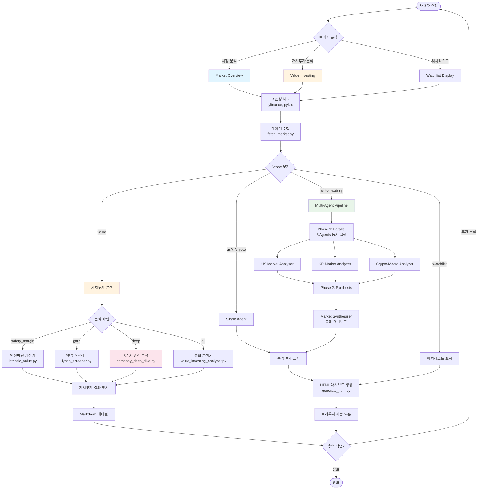

---

## 🏗️ 시스템 컴포넌트

### 1. Data Layer (데이터 계층)

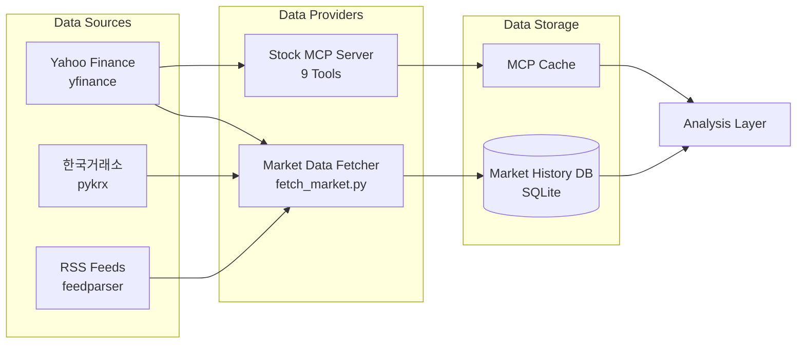

---

### 2. Analysis Layer (분석 계층)

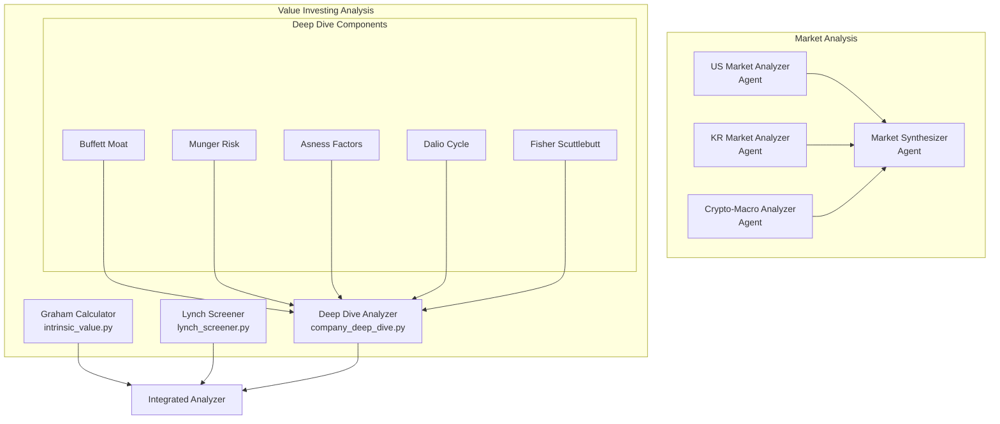

---

### 3. Presentation Layer (표현 계층)

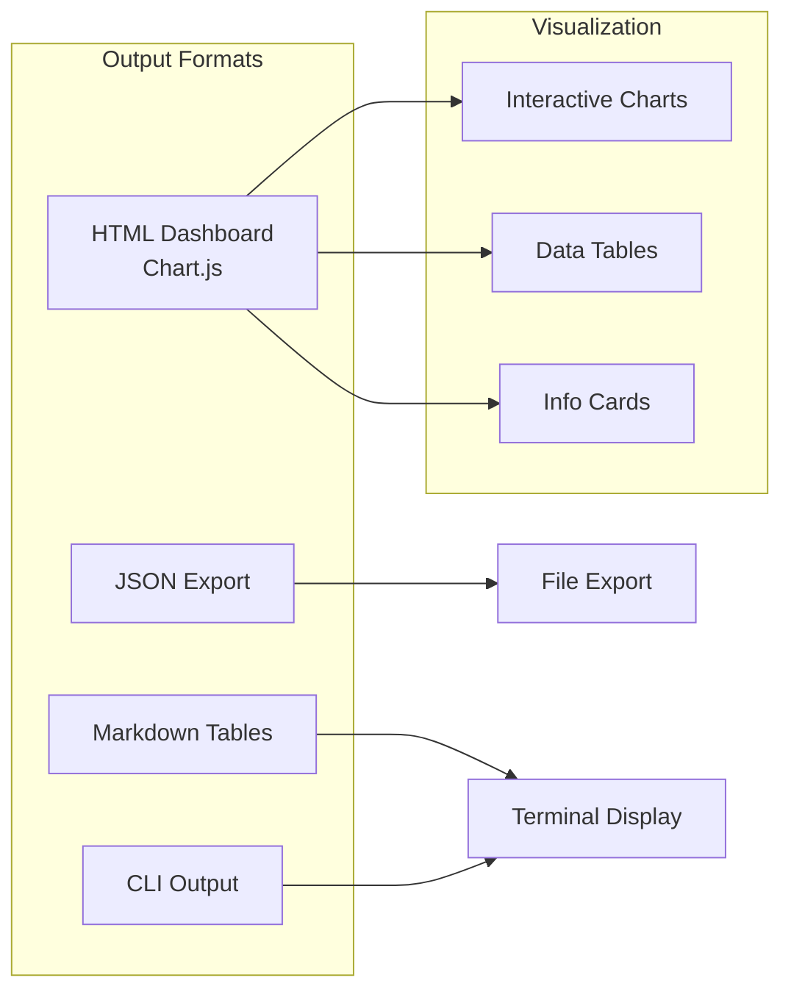

---

## 🔄 Multi-Agent Execution Flow

### Phase 1: Parallel Analysis (병렬 분석)

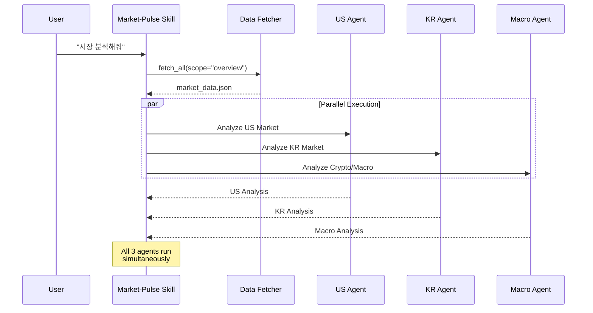

### Phase 2: Synthesis (종합)

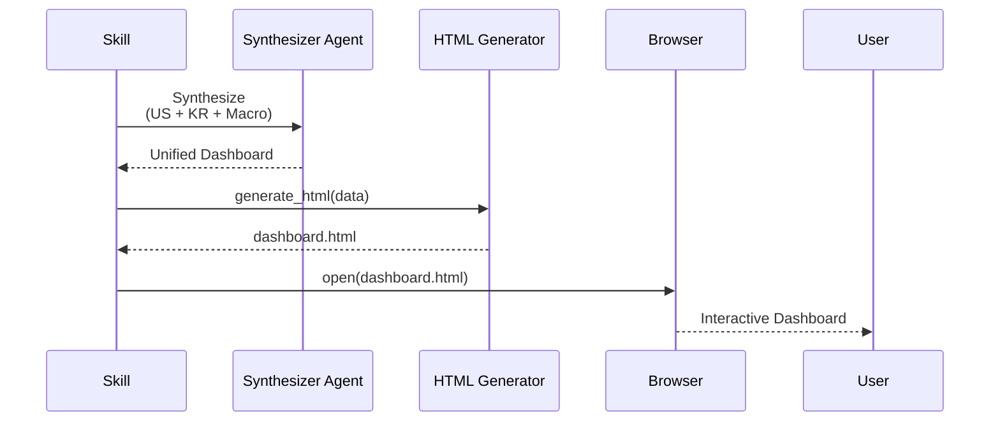

---

## 💎 Value Investing Analysis Flow

### Integrated Analysis Pipeline

```mermaid
flowchart TD
    Start([가치투자 분석 요청]) --> Input[티커 입력<br/>AAPL,MSFT,GOOGL]

    Input --> Type{분석 타입}

    Type -->|Safety Margin| SM[안전마진 계산]
    Type -->|GARP| GARP[PEG 스크리닝]
    Type -->|Deep Dive| DD[심층 분석]
    Type -->|All| ALL[모두 실행]

    SM --> MCP[Stock MCP Server<br/>데이터 수집]
    GARP --> MCP
    DD --> MCP
    ALL --> MCP

    MCP --> SMCalc[Graham Formula<br/>IV = EPS × (8.5 + 2g)]
    MCP --> PEGCalc[PEG Calculation<br/>PER / Growth]
    MCP --> Multi[8-Perspective Analysis]

    SMCalc --> Filter1[Filter: 안전마진 20%+]
    PEGCalc --> Filter2[Filter: PEG < 1.0]
    Multi --> Score[Overall Score 0-100]

    Filter1 --> Output[결과 출력]
    Filter2 --> Output
    Score --> Output

    Output --> Table[Markdown Table]
    Output --> JSON[JSON Export]

    Table --> User([사용자])
    JSON --> User

    style Start fill:#fff4e1
    style MCP fill:#e3f2fd
    style Multi fill:#fce4ec
    style Output fill:#e8f5e9
```

### Deep Dive Multi-Perspective Analysis

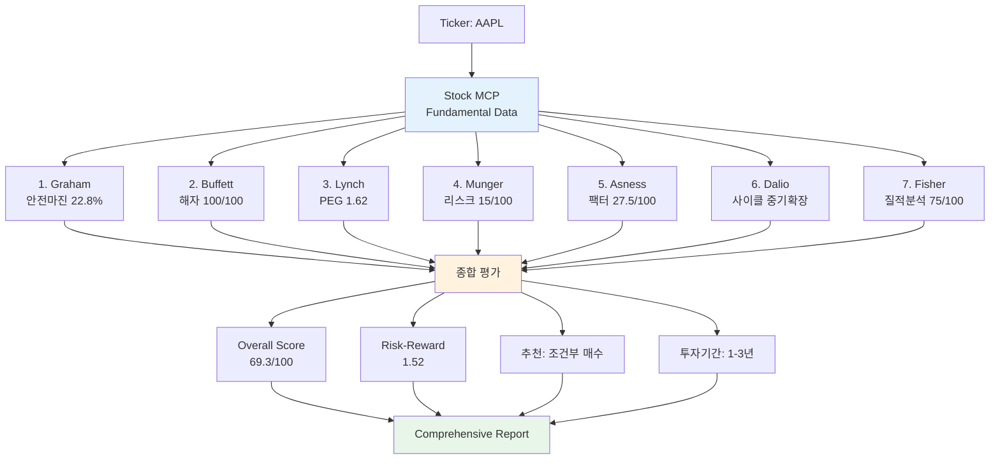

---

## 🗂️ File Structure & Dependencies

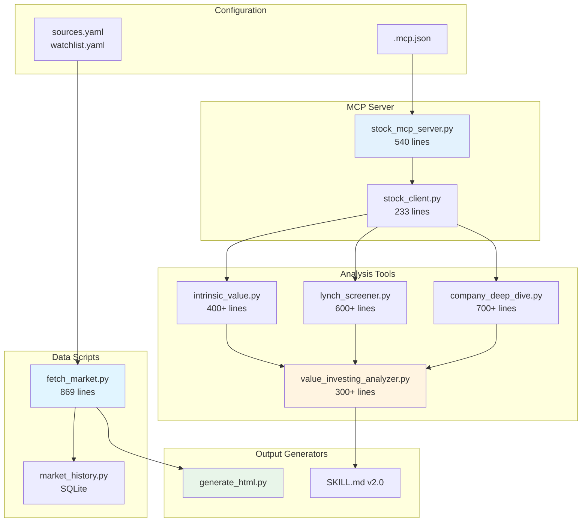

---

## 📈 Data Flow Diagram

### Market Overview Data Flow

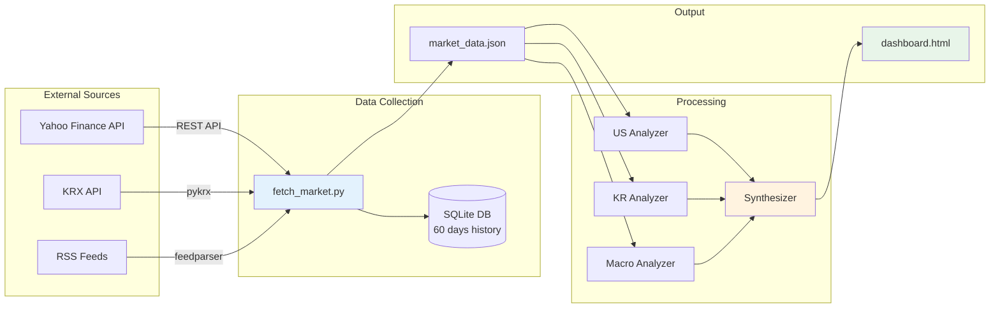

### Value Investing Data Flow

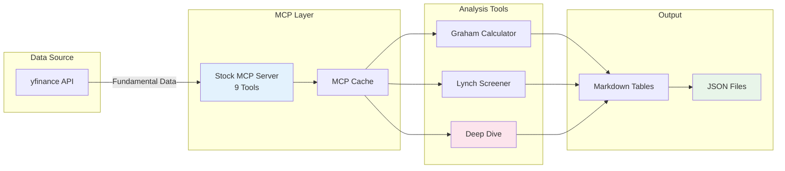

---

## 🎯 Decision Tree: Scope Selection

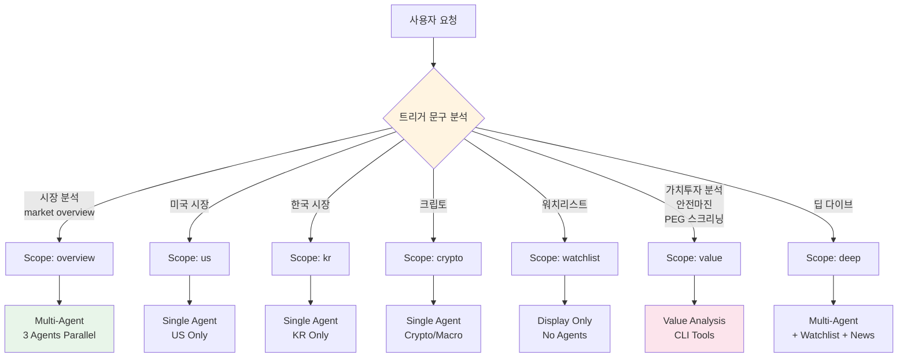

---

## ⚙️ Technology Stack

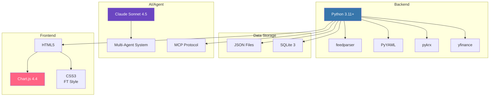

---

## 📊 Performance Metrics

| Component | Execution Time | Notes |
|-----------|----------------|-------|
| Data Fetching | 15-45 seconds | Depends on scope |
| Phase 1 (3 Agents Parallel) | 30-60 seconds | Concurrent execution |
| Phase 2 (Synthesis) | 10-20 seconds | Haiku model |
| HTML Generation | 2-5 seconds | Local processing |
| **Total (Overview)** | **1-2 minutes** | End-to-end |
| Value Analysis (Safety Margin) | 10-20 seconds | Per 10 stocks |
| Value Analysis (GARP) | 10-20 seconds | Per 10 stocks |
| Deep Dive (Single Stock) | 15-30 seconds | 8 perspectives |

---

## 🔐 Security & Data Privacy

- ✅ **No Authentication Required**: Uses free public APIs only
- ✅ **Local Storage**: All data stored locally (SQLite, JSON files)
- ✅ **No External Tracking**: No analytics or telemetry
- ✅ **Open Source**: Fully auditable code
- ⚠️ **API Rate Limits**: Respects yfinance and pykrx rate limits
- ⚠️ **Delayed Data**: 15-20 minute delay (free tier limitation)

---

## 📝 Version History

| Version | Release Date | Key Features |
|---------|--------------|--------------|
| **1.0.0** | 2026-01-15 | MVP: Multi-agent market analysis, HTML dashboard |
| **1.5.0** | 2026-02-01 | Phase 1: SQLite DB, 60-day history, technical indicators |
| **2.0.0** | 2026-02-12 | Phase 2.5: Value investing (Graham, Lynch, 8-perspective) |

---

## 🔮 Roadmap

### Phase 3: Advanced Analytics (Q2 2026)
- [ ] Backtesting engine
- [ ] Portfolio tracking
- [ ] Alert system
- [ ] ML-based predictions

### Phase 4: Monetization (Q3 2026)
- [ ] REST API for external integration
- [ ] Pro tier ($9.99/month)
- [ ] Enterprise features
- [ ] Community marketplace

---

**문서 작성일**: 2026-02-12
**작성자**: Market-Pulse Team
**버전**: 2.0.0
