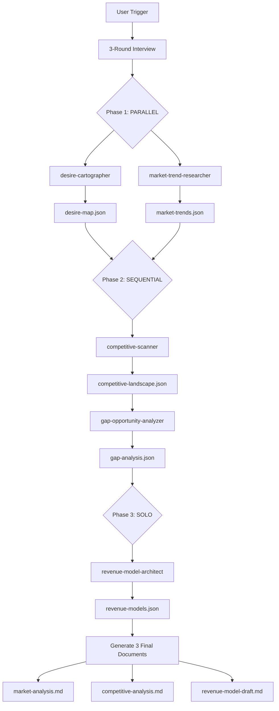

# Market Research by Desire

Reverse-engineer market opportunities from human desires through automated 3-phase multi-agent analysis.

## Overview

Instead of starting from "I have an idea" or "I have technology," this plugin starts from **"인간 욕망"** (human desires) and systematically discovers market opportunities, competitive gaps, and revenue models.

**Core Philosophy:** 욕망 → 시장 구조 → 경쟁 분석 → 수익 모델

## Architecture



## Installation

Part of the `claude-ai-engineering` plugin collection. No separate installation needed if the repo is already linked.

## Usage

### Trigger Phrases

**English:**
- "market research by desire"
- "desire research"
- `/market-research-by-desire`

**Korean:**
- "욕망 기반 시장조사"
- "욕망 리서치"
- "욕망에서 시장 찾기"

### Example Session

```
You: 욕망 기반 시장조사 시작
Claude: [Presents 5 desire categories]
You: 성장과성취
Claude: [Presents sub-categories like 전문성개발, 커리어성장, etc.]
You: 전문성개발
Claude: [Asks context questions: target market, solo-dev preference, etc.]
You: Korea, solo-dev preferred, bootstrap budget, tech industry
Claude: [Launches 5 agents in 3 phases, generates 3 documents in 12-18 min]
```

### Output Location

```
~/.market-research-by-desire/projects/{timestamp-slug}/
├── interview-responses.json
├── artifacts/
│   ├── desire-map.json
│   ├── market-trends.json
│   ├── competitive-landscape.json
│   ├── gap-analysis.json
│   └── revenue-models.json
├── market-analysis.md
├── competitive-analysis.md
├── revenue-model-draft.md
└── README.md
```

## Agents

| Agent | Phase | Role | Model |
|-------|-------|------|-------|
| desire-cartographer | 1 (Parallel) | Map desires → market structure, generate search terms | sonnet |
| market-trend-researcher | 1 (Parallel) | WebSearch for TAM/SAM/SOM, trends, growth drivers | sonnet |
| competitive-scanner | 2 (Sequential) | WebSearch competitors, pricing, features | sonnet |
| gap-opportunity-analyzer | 2 (Sequential) | Synthesize all data → gaps & positioning | sonnet |
| revenue-model-architect | 3 (Solo) | Design 3-5 revenue models with unit economics | sonnet |

## Configuration

Edit `config/settings.yaml`:

```yaml
output:
  language: "ko"  # or "en"
  base_directory: "~/.market-research-by-desire/projects"

web_search:
  max_results_per_query: 20
  enable_web_fetch: true

market_research:
  default_target_market: "Korea"
  som_market_share_y3: 0.030  # 3% market share by year 3

solo_dev:
  disqualify_two_sided_marketplace: true  # Filter out high-ops models
```

## Key Differentiators

1. **Desire-first framework:** 5-category taxonomy (생존과안전, 성장과성취, 연결과소속, 자유와통제, 즐거움과자극)
2. **Desire intersection opportunities:** Unique cross-desire market gaps (e.g., 성취 + 연결 = community learning)
3. **Solo-dev feasibility scoring:** Automatic filtering for solo entrepreneurs
4. **Korean market specialization:** 통계청, KOSIS, Naver/Daum search optimization
5. **3-document deliverable:** Market analysis, competitive analysis, revenue model draft

## Troubleshooting

| Issue | Cause | Solution |
|-------|-------|----------|
| No market data found | Emerging/niche market | Plugin generates estimates using proxy markets |
| Few/no competitors | Blue ocean market | Report includes "market education risk" section |
| WebSearch quota exceeded | Too many queries | Set `enable_web_fetch: false` in config |
| Agent timeout | Complex market | Increase timeout in `config/settings.yaml` |

## Performance

- **Execution time:** 12-18 minutes
- **Cost estimate:** $1-2 USD (varies with WebSearch volume)
- **Output quality:** Sonnet model for all agents ensures high-quality analysis

## Next Steps After Running

1. **Validate market size:** Cross-reference TAM/SAM with additional sources
2. **Interview 20 target users:** Confirm desire intensity and pain points
3. **Build MVP for top gap:** Focus on highest-scoring gap from gap-analysis.json
4. **Test revenue model:** Run pre-sales or landing page experiment
5. **Use Business Avengers plugin:** For full product development pipeline

## Related Skills

- `business-avengers`: Follow-up for MVP planning and execution
- `planning-interview`: For detailed product feature planning
- `ai-digest`: For ongoing market trend monitoring

## License

MIT

## Author

Jay Kim (https://github.com/JayKim88)
