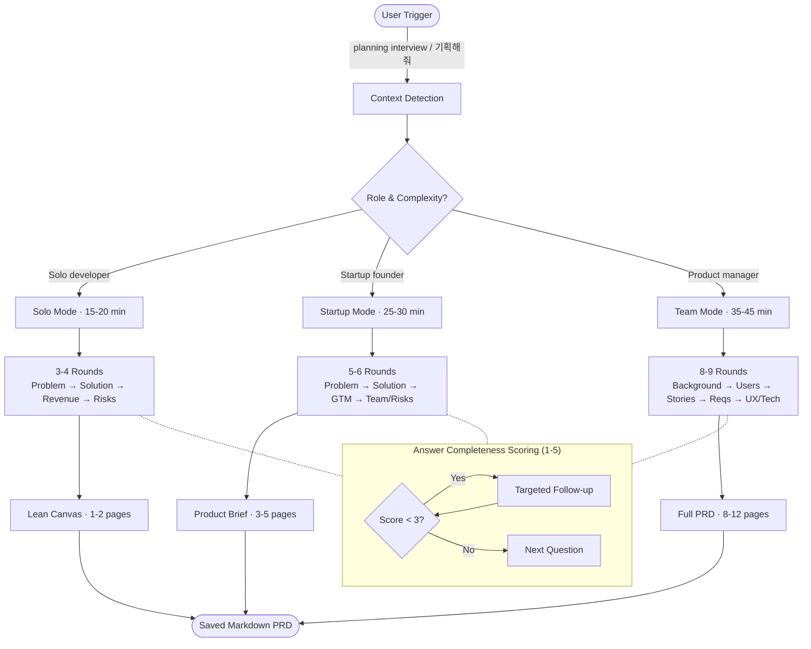

# Planning Interview Plugin

> Transform vague product ideas into comprehensive PRDs through AI-powered, adaptive interviews

## Process Flow



## Overview

The **planning-interview** plugin conducts context-aware product planning interviews to create structured PRDs in 15-45 minutes. It adapts to your role and project complexity with three modes:

- **Solo Mode** (15-20 min): Lean Canvas for indie developers and solo builders
- **Startup Mode** (25-30 min): Product Brief for startup founders and small teams
- **Team Mode** (35-45 min): Full PRD for product managers and established teams

### Key Features

- **Context-Aware**: Automatically detects your role and recommends the right mode
- **Business-Focused**: Emphasizes WHY and WHAT (not HOW) - saves technical details for spec-interview
- **Adaptive Questioning**: Uses 1-5 completeness scoring to drive smart follow-ups
- **Template-Based Output**: Generates professional, structured documents ready to share
- **Session Management**: Save and resume long interviews (Team mode)
- **Bilingual**: Supports English and Korean
- **Smart Helpers**: Optional MoSCoW prioritization, Persona builder, Lean Canvas deep-dive

---

## Installation

### Prerequisites

- Claude Desktop app installed
- Claude agent plugin support enabled

### Quick Setup

1. **Clone repository:**

```bash
git clone https://github.com/your-org/claude-plugins.git
cd claude-plugins/planning-interview
```

2. **Locate Claude plugins directory:**

**macOS / Linux:**
```bash
~/.config/claude-desktop/plugins/
```

**Windows:**
```powershell
%APPDATA%\Claude\plugins\
```

3. **Install plugin (symlink recommended):**

```bash
# macOS / Linux
ln -s /full/path/to/planning-interview ~/.config/claude-desktop/plugins/planning-interview

# Windows (PowerShell as Administrator)
New-Item -ItemType SymbolicLink -Path "$env:APPDATA\Claude\plugins\planning-interview" -Target "C:\path\to\planning-interview"
```

4. **Verify installation:**

```bash
# Check structure
ls ~/.config/claude-desktop/plugins/planning-interview/

# Should show:
# .claude-plugin/plugin.json
# skills/planning-interview/SKILL.md
# templates/ (lean-canvas.md, product-brief.md, full-prd.md)
# examples/
```

5. **Restart Claude Desktop** (Quit completely, not just close window)

6. **Test plugin:**

In Claude, type: `planning interview`

You should see context detection questions.

---

## Quick Start

### Basic Usage

Simply say one of the trigger phrases:

**English:**
- "planning interview"
- "help me plan a product"
- "create a PRD for [your idea]"

**Korean:**
- "기획해줘"
- "제품 기획 도와줘"

### Quick Mode (Skip Context Detection)

If you know which mode you want:

- "planning interview for B2B SaaS" → Startup mode
- "Lean Canvas for mobile app" → Solo mode
- "Full PRD for enterprise feature" → Team mode

---

## Modes Comparison

| Feature | Solo Mode | Startup Mode | Team Mode |
|---------|-----------|--------------|-----------|
| **Duration** | 15-20 min | 25-30 min | 35-45 min |
| **Output** | Lean Canvas (1-2 pages) | Product Brief (3-5 pages) | Full PRD (8-12 pages) |
| **Sections** | 10 sections | 12 sections | 13 sections |
| **Interview Rounds** | 3-4 rounds | 5-6 rounds | 8-9 rounds |
| **Target User** | Solo developer, indie builder | Startup founder, small team | PM, product team, enterprise |
| **Use Cases** | MVP validation, side projects | Fundraising, GTM strategy | Stakeholder alignment, roadmapping |
| **Helpers** | Lean Canvas builder | MoSCoW, Persona builder | All helpers + detailed requirements |

---

## What You'll Get

### Solo Mode: Lean Canvas

**10 Sections:**
1. Problem (top 3 problems)
2. Customer Segments (target users, early adopters)
3. Unique Value Proposition
4. Solution (top 3 features, MVP scope)
5. Channels (path to customers)
6. Revenue Streams
7. Cost Structure
8. Key Metrics
9. Unfair Advantage
10. Assumptions & Risks

**Example:** See `examples/solo-example.md` (TaskFlow CLI tool)

### Startup Mode: Product Brief

**12 Sections:** Executive Summary, Problem & Opportunity, Solution Overview, Target Market & Users, Competitive Landscape, Product Strategy, Go-to-Market Strategy, Success Metrics, Team & Resources, Timeline & Milestones, Risks & Mitigation, Appendix

### Team Mode: Full PRD

**13 Sections:** Executive Summary, Background & Context, Problem Statement, Goals & Objectives, Target Users & Market, User Personas, User Stories & Jobs-to-be-Done, Requirements & Prioritization (MoSCoW), User Experience & Design, Technical Considerations, Success Metrics & KPIs, Rollout Plan & Timeline, Risks/Assumptions/Dependencies

---

## Differentiation vs spec-interview

Use **planning-interview** BEFORE **spec-interview** in your workflow:

| Aspect | planning-interview | spec-interview |
|--------|-------------------|----------------|
| **Focus** | Business value, market fit | Technical implementation |
| **Questions** | WHY build? WHO needs it? WHAT value? | HOW to build? WHAT architecture? WHERE deploy? |
| **Output** | PRD (business requirements) | Technical Specification |
| **Users** | Founders, PMs, business stakeholders | Developers, architects, engineers |
| **Stage** | Before development (planning) | After planning (implementation) |

**Workflow:**
1. Use `planning-interview` → Generate Product Brief with market validation
2. Review with stakeholders → Get buy-in on WHY and WHAT
3. Use `spec-interview` → Create Technical Spec with architecture details
4. Hand off to engineering → Build with clear business context + technical blueprint

---

## Advanced Features

### Answer Completeness Scoring (1-5 Scale)

Inspired by Alpha's pragmatic approach, the plugin scores each answer:

- **5**: Detailed with concrete examples and metrics
- **4**: Good specificity, minor gaps
- **3**: Acceptable but could be more specific
- **2**: Too vague or generic
- **1**: Very short or circular

If score < 3, Claude asks a targeted follow-up from the same category.

**Example:**
```
You: "It makes things easier for users."
Score: 2 (vague, no specifics)

Claude: "Can you provide a concrete example? What specific scenario illustrates this?"

You: "Developers waste 2-3 hours/day searching across 5 tools for API docs. This consolidates them."
Score: 5 (specific metrics, concrete example)
```

### Session Save & Resume (Team Mode)

For long interviews (35-45 min), Claude offers auto-save every 3 rounds:

```
Claude: We're 40% through the interview. Want to take a break?
- Continue now (we'll finish in ~25 min)
- Save and resume later
```

If you choose "Save":
- Progress saved to `planning-interview-draft-{project}-{timestamp}.md`
- Resume anytime with: "continue planning interview"

### Optional Helpers

**MoSCoW Prioritization** (All modes)

Classify features as Must/Should/Could/Won't have. Takes 5 min, creates clear prioritization section in PRD.

**Persona Builder** (Startup & Team modes)

Create detailed user personas with structured fields: Name/Role, Demographics, Goals, Pain Points, Current Tools, Quote. Adds 3-5 min per persona.

**Lean Canvas Builder** (Solo mode)

Deep-dive into all 10 Lean Canvas sections with guided questions. Adds 5-10 min.

---

## Tips for Best Results

### 1. Be Specific

- Vague: "It's a productivity tool."
- Good: "It's a task management CLI for developers who work across 3+ projects simultaneously."

### 2. Include Metrics

- Vague: "Users will be happier."
- Good: "Reduce time spent on task switching from 15 min/day to < 2 min/day."

### 3. Describe Real Pain Points

- Vague: "Current tools are bad."
- Good: "Current tools require 5-7 clicks to create a task, don't support keyboard shortcuts. Power users spend 30% more time managing tasks than completing them."

### 4. Quantify Outcomes

- Vague: "We'll know it works if users like it."
- Good: "Success = 1000+ monthly active users with 40%+ weekly retention within 6 months."

---

## Troubleshooting

### Plugin Not Loading

1. Check path: `ls ~/.config/claude-desktop/plugins/planning-interview/`
2. Verify plugin.json: `cat ~/.config/claude-desktop/plugins/planning-interview/.claude-plugin/plugin.json`
3. Check permissions: `chmod -R 755 ~/.config/claude-desktop/plugins/planning-interview/`
4. Restart Claude Desktop completely

### Trigger Phrase Not Working

Try exact phrases:
- "planning interview" (not "start planning interview")
- "기획해줘" (not "기획 해줘" with space)

Or use Quick Mode:
- "PRD for [your idea]"
- "Lean Canvas for [domain]"

### Interview Questions Seem Off-Topic

This plugin focuses on **business planning** (WHY, WHAT), not **technical implementation** (HOW).

Use `planning-interview` to answer:
- What problem does this solve?
- Who needs it?
- What's the market opportunity?
- How will we measure success?

Use `spec-interview` to answer:
- What's the API design?
- What's the data model?
- What tech stack?
- How do we deploy?

---

## Customization

See `CLAUDE.md` for detailed guide on:

- Adding new question categories
- Modifying templates
- Adjusting round counts per mode
- Tuning vague answer detection heuristics
- Adding new language support

---

## Examples

### Solo Mode Example

**Input:** Indie developer building CLI tool for task management

**Output:** `lean-canvas-taskflow-cli-20260215.md` (1-2 pages)
- 10 sections covering problem, solution, users, metrics
- Focus on MVP validation and early adopters

See full example: `examples/solo-example.md`

---

## FAQ

**Q: How is this different from just chatting with Claude about my product idea?**

A: This plugin provides structured, repeatable interviews with proven frameworks (Lean Canvas, PRD templates). It ensures you cover all critical business questions and outputs a professional document ready to share, not just chat history.

**Q: Can I use this for multiple products?**

A: Yes! Each interview is independent. PRDs are saved with unique filenames based on project name and date.

**Q: What if I don't know the answer to a question?**

A: Claude will mark it as `[TODO: Add details]` in the final PRD. You can fill it in later or use the TODO as a reminder to do research.

**Q: Can I edit the PRD after it's generated?**

A: Absolutely! The PRD is a markdown file. Edit it in any text editor. It's designed as a starting point, not a final document.

**Q: How do I add my company's specific PRD format?**

A: See `CLAUDE.md` → "Template Customization". You can create custom templates with your company's section structure.

---

## License

MIT License - see LICENSE file

---

## Support

- **Issues**: https://github.com/your-org/claude-plugins/issues
- **Discussions**: https://github.com/your-org/claude-plugins/discussions
- **Docs**: Full developer guide in `CLAUDE.md`

---

## Changelog

### v1.0.0 (2026-02-15)

- Initial fused release (Alpha Pragmatist + Beta Architect)
- 3 modes (Solo, Startup, Team)
- 3 templates (Lean Canvas, Product Brief, Full PRD)
- Answer completeness scoring (1-5 scale)
- Bilingual support (English, Korean)
- Session save/resume for Team mode
- Optional helpers (MoSCoW, Persona Builder)
- Comprehensive examples and documentation

---

**Generated with planning-interview v1.0.0 - Fused Implementation**