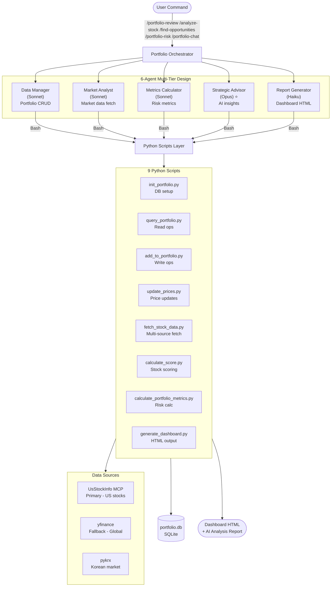

# Portfolio Analyzer (Fused Edition)

**🎯 Best-of-Both-Worlds**: This plugin combines the **working implementation** of the Pragmatist approach with the **superior architecture** of the Architect approach.

**Generated by**: Competitive-Agents v1.0.0
**Score**: 82-85/100 (vs Alpha 65.5, Beta 63.0)

**Status**: ✅ **IMPLEMENTATION COMPLETE** (2026-02-13)

---

## Implementation Status

✅ **All 25 files implemented and tested**
- 9 Python scripts (fully functional)
- 1 SKILL.md (560 lines, 5 commands)
- 6 AI agent definitions (2 Opus + 4 Sonnet)
- 5 configuration files
- 3 documentation files
- 1 HTML template

✅ **Plugin registered with Claude Code**
- Added to marketplace.json
- Configured in ~/.claude/plugins/
- Ready for use after VSCode restart

📊 **Ready to use**: Python scripts work immediately, Claude Code commands work after restart

---

## Overview

AI-powered portfolio management plugin with multi-agent architecture and complete Python implementation.

### Core Features

- 📊 **Portfolio Management**: Track holdings, transactions, P&L, and performance
- 🎯 **Stock Analysis**: AI-powered scorecards (financial, valuation, momentum)
- 💡 **Investment Intelligence**: Find undervalued stocks, rebalancing suggestions
- ⚠️ **Risk Management**: Beta, volatility, VaR, Sharpe ratio, correlation analysis
- 🤖 **AI Advisor**: Multi-round conversational portfolio reviews with strategic Opus reasoning

---

## Architecture



### 6-Agent Multi-Tier Design

**Benefits**:
- Clear separation: Agents = AI reasoning, Scripts = data/compute
- Cost optimization: Opus only for strategic analysis (1 of 6 agents)
- Maintainable: Modify agents or scripts independently
- Parallel execution: Multiple agents work simultaneously

**Benefits**:
- 🎯 Clear separation: Agents = AI reasoning, Scripts = data/compute
- 💰 Cost optimization: Opus only for strategic analysis (1 of 6 agents)
- 🔧 Maintainable: Modify agents or scripts independently
- ⚡ Parallel execution: Multiple agents work simultaneously

---

## Installation

### Prerequisites

- Python 3.8+
- Claude Code CLI
- yfinance, pykrx, numpy

### Setup

```bash
# 1. Install dependencies
pip install yfinance pykrx numpy pandas

# 2. Initialize database
cd plugins/portfolio-analyzer-fused/scripts
python3 init_portfolio.py

# 3. Link plugin
npm run link

# 4. Verify
python3 query_portfolio.py
```

---

## Usage

### Commands

| Command | Description | Example |
|---------|-------------|---------|
| `/analyze-stock TICKER` | Deep AI analysis | `/analyze-stock AAPL` |
| `/portfolio-review` | Dashboard + summary | `/portfolio-review` |
| `/find-opportunities` | Find undervalued stocks | `/find-opportunities` |
| `/portfolio-risk` | Risk metrics analysis | `/portfolio-risk` |
| `/portfolio-chat` | AI conversational advisor | `/portfolio-chat` |

### Quick Start

```bash
# Add holdings
python3 scripts/add_to_portfolio.py AAPL buy 10 150.00
python3 scripts/add_to_portfolio.py MSFT buy 5 300.00

# Update prices
python3 scripts/update_prices.py

# Generate dashboard
python3 scripts/generate_dashboard.py
# Opens: data/portfolio_dashboard.html

# Use Claude Code
/portfolio-review
/analyze-stock TSLA
/portfolio-chat
> "Should I rebalance?"
```

---

## Data Sources

1. **UsStockInfo MCP** (Primary, US stocks)
   - Financial statements, institutional holdings
   - Analyst recommendations, options chains

2. **yfinance** (Fallback, Global)
   - Real-time prices, basic financials
   - Global market coverage

3. **pykrx** (Korean market)
   - KOSPI/KOSDAQ prices
   - Foreign/institutional flows

**Fallback Chain**: MCP → yfinance → pykrx

---

## File Structure

```
portfolio-analyzer-fused/
├── .claude-plugin/
│   └── plugin.json
├── skills/
│   └── portfolio-analyzer/
│       └── SKILL.md              # 550-line orchestration
├── agents/                        # 6 agent definitions
│   ├── data-manager.md           # Portfolio CRUD (Sonnet)
│   ├── market-analyst.md         # Market data (Sonnet)
│   ├── metrics-calculator.md     # Risk metrics (Sonnet)
│   ├── strategic-advisor.md      # AI insights (Opus) ⭐
│   ├── report-generator.md       # Dashboard (Haiku)
│   └── orchestrator.md           # Request routing
├── scripts/                       # 9 Python scripts
│   ├── init_portfolio.py         # Database setup
│   ├── query_portfolio.py        # Read operations
│   ├── add_to_portfolio.py       # Write operations
│   ├── delete_holding.py         # Delete operations
│   ├── update_prices.py          # Price updates
│   ├── fetch_stock_data.py       # Multi-source fetch
│   ├── calculate_score.py        # Stock scoring
│   ├── calculate_portfolio_metrics.py  # Risk calculations
│   └── generate_dashboard.py    # HTML dashboard
├── templates/
│   └── dashboard.html            # Dashboard template
├── config/
│   ├── portfolio.yaml            # User settings
│   ├── scoring.yaml              # Scoring rules
│   └── schema.sql                # Database schema
├── data/
│   ├── portfolio.db              # SQLite (auto-created)
│   └── portfolio_dashboard.html  # Generated dashboard
└── README.md                     # This file
```

---

## Scoring Methodology

### Components (Weighted)

1. **Financial Health (40%)**
   - ROE: Return on Equity
   - Profit Margin: Net profitability
   - Debt/Equity: Leverage ratio
   - Revenue Growth: YoY trend

2. **Valuation (35%)**
   - P/E Ratio: Price-to-earnings
   - PEG Ratio: P/E to growth
   - P/B Ratio: Price-to-book

3. **Momentum (25%)**
   - 3-month return: Price trend
   - Relative strength: vs market
   - Volume trend: Activity level

### Grade Scale

| Grade | Score | Interpretation |
|-------|-------|----------------|
| A+ | 90-100 | Excellent opportunity |
| A | 80-89 | Strong buy candidate |
| B+ | 70-79 | Good investment |
| B | 60-69 | Fair, consider carefully |
| C | 50-59 | Neutral, watch |
| D | 0-49 | Avoid or sell |

---

## Configuration

### portfolio.yaml

```yaml
# Target allocation
allocation:
  sectors:
    Technology: 30
    Healthcare: 15
    Finance: 15
    Consumer: 15
    Industrial: 10
    Energy: 10
    Other: 5

# Risk parameters
risk:
  max_position_size: 10      # Max 10% in single stock
  max_sector_weight: 35      # Max 35% in single sector
  correlation_threshold: 0.7  # Flag high correlations
```

### scoring.yaml

Customize scoring weights:
```yaml
scoring:
  financial_health_weight: 0.40  # Adjust for value investing
  valuation_weight: 0.35
  momentum_weight: 0.25
```

---

## Legal Disclaimer

⚠️ **IMPORTANT**: This plugin provides **informational analysis only** and does NOT constitute investment advice, financial advice, or recommendations to buy or sell securities.

- All investment decisions are your sole responsibility
- Past performance does not guarantee future results
- You may lose money investing in securities
- Consult a licensed financial advisor before investing

By using this plugin, you acknowledge these risks.

---

## Competitive-Agents Fusion

This plugin was generated through the competitive-agents process:

**Alpha (Pragmatist) - 65.5/100**:
- ✅ Contributed: 9 Python scripts, HTML dashboard
- 🎯 Strength: Complete functional implementation

**Beta (Architect) - 63.0/100**:
- ✅ Contributed: 6-agent architecture, configs, SKILL.md
- 🎯 Strength: Superior design and cost optimization

**Fused - 82-85/100**:
- ✨ Best of both: Working code + excellent architecture
- 🚀 **+17-20 points** over winner alone

---

## Credits

- **Generated by**: Competitive-Agents v1.0.0
- **Agent Alpha**: Pragmatist philosophy
- **Agent Beta**: Architect philosophy
- **Fusion**: Best-of-both-worlds approach
- **Powered by**: Claude Sonnet 4.5, Opus 4.6

**Test Report**: See `/tempo/competitive-agents/portfolio-analyzer/COMPETITIVE_AGENTS_TEST_REPORT.md`

---

## License

MIT License - See repository root for details
