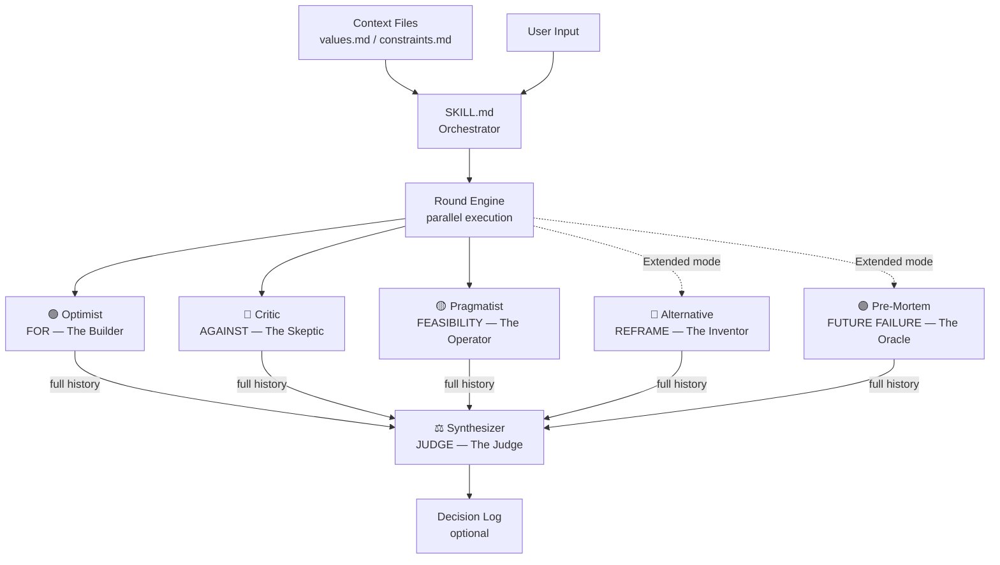
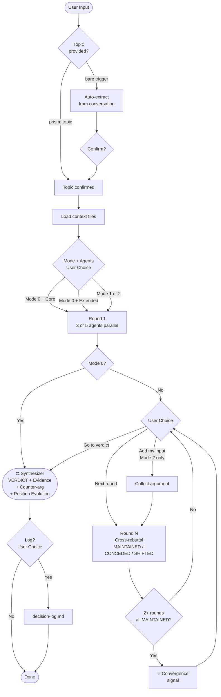

# prism-debate

하나의 명제를 여러 시각으로 굴절시켜 맹점을 찾고 판결을 도출하는 멀티에이전트 토론 엔진.
Part of the 5-Layer AI Quality Improvement System.

---

## Purpose

Claude에게 질문하면 답변은 나옵니다. 하지만 그 답변은 **하나의 시각**입니다.
prism-debate는 동일한 명제를 서로 다른 세계관을 가진 에이전트들이 **싸우면서** 분석하게 합니다.
라운드를 거치며 논거가 진화하고, Synthesizer가 증거 품질 기반으로 최종 판결을 내립니다.

**이런 상황에 씁니다:**

| 상황 | 구체적 사례 |
|------|-----------|
| 결정 전 맹점 찾기 | "GraphQL로 마이그레이션하기로 했는데 — 놓치고 있는 게 있나?" |
| 이미 얻은 답을 압박 | "Claude가 'Python 지금 배워라'고 했는데 — 정말?" |
| 이분법에서 탈출 | "monolith vs microservices — 제3의 선택지가 있지 않을까?" |
| 실패 시나리오 선제 탐색 | "이 아키텍처 방향으로 1년 후 무슨 일이 생길까?" |
| 주장/가설 검증 | "LLM이 소프트웨어 엔지니어를 대체한다 — 이 주장이 맞는가?" |

**쓰지 않는 상황:**
- 단순 코드 작업이나 사실 조회 → 일반 질문으로 충분
- 아직 결정 포인트에 도달하지 않은 브레인스토밍
- "그냥 어떻게 생각해?"처럼 탐색 중인 상태 → 토론할 명제가 아직 없음

---

## How It Works

### Evidence Quality Hierarchy

모든 에이전트는 주장에 레이블을 붙입니다. Synthesizer는 레이블 품질로 논거를 가중합니다.

| Label | 의미 | 판결 반영 |
|-------|------|---------|
| `[FACT]` | 검증 가능, 출처 추적 가능 | 가장 높음 |
| `[ESTIMATE]` | 근거 있는 추론 | 높음 |
| `[OPINION]` | 가치 판단 | 중간 |
| `[UNCERTAIN]` | 진짜 모르는 것 | 조건적 |

> ⚠️ `[RECOMMEND]` 또는 `[REJECT]` 판결은 최소 3개의 `[FACT]` 또는 `[ESTIMATE]` 포인트 없이는 불가능합니다.

### Position Tracking (Round N)

Round 2부터 각 에이전트는 반드시 이전 라운드 논거를 직접 인용하고 포지션 레이블을 표기합니다.

| Label | 의미 |
|-------|------|
| `[MAINTAINED]` | 동일 포지션 유지, 새 논거 추가 (단순 반복 금지) |
| `[PARTIALLY_CONCEDED]` | 세부 포인트 X는 인정, 더 강력한 각도 Y로 반격 |
| `[SHIFTED]` | 포지션 대폭 변경 — 강한 반증이 있을 때만 사용 |

### Verdict Types

| Verdict | 의미 | 발동 조건 |
|---------|------|---------|
| `[RECOMMEND]` | 진행을 지지하는 증거 우세 | min 3 FACT/ESTIMATE |
| `[REJECT]` | 반대하는 증거 우세 | min 3 FACT/ESTIMATE |
| `[CONDITIONAL]` | 특정 미지수 해소에 따라 달라짐 | 핵심 UNCERTAIN 존재 |
| `[UNCERTAIN]` | 증거가 진정으로 균형 잡혀 있어 결론 불가 | — |

---

## System Architecture



---

## UX Flow



---

## Modes

| 모드 | 이름 | 설명 | 적합한 경우 |
|------|------|------|-----------|
| **빠른 판결** | Mode 0 | 1 라운드 → 즉시 판결 (~2분) | 빠른 스트레스 테스트, 이미 답을 갖고 있는데 압박해보고 싶을 때 |
| **자율 토론** | Mode 1 | 에이전트 tiki-taka, 사용자가 종료 결정 | 주제를 충분히 탐구하고 싶을 때 |
| **참여형 토론** | Mode 2 | 매 라운드 사용자도 논거 투입 | 내 논거를 에이전트와 함께 검증하고 싶을 때 |

---

## Agents

### Core (항상 실행)

| 에이전트 | 역할 | 세계관 |
|---------|------|------|
| 🟢 **Optimist** — The Builder | FOR: 가장 강한 찬성 논거 | "변화는 항상 가능하다. 현상 유지가 진짜 리스크다" |
| 🔴 **Critic** — The Skeptic | AGAINST: 실패 모드, 위험, 반증 | "대부분은 실패한다. 입증 부담은 명제 쪽에 있다" |
| 🟡 **Pragmatist** — The Operator | FEASIBILITY: 비용, 제약, 핵심 미지수 | "자원과 시간은 항상 당신 생각보다 부족하다" |

### Extended (선택)

| 에이전트 | 역할 | 세계관 |
|---------|------|------|
| 🔵 **Alternative** — The Inventor | REFRAME: 명제 밖 대안 2-3개 | "지금 묻고 있는 질문이 아마 틀렸을 것이다. 항상 세 번째 선택지가 있다" |
| 🟣 **Pre-Mortem** — The Oracle | FUTURE FAILURE: 실패 역방향 분석 | "이 패턴이 어디로 향하는지 나는 이미 봤다. 결말은 좋지 않다" |

### Judge

| 에이전트 | 역할 | 세계관 |
|---------|------|------|
| ⚖️ **Synthesizer** — The Judge | 전체 라운드 히스토리 종합 → 판결 | "좋은 판결은 옳은 것을 말하는 것이 아니다. 틀릴 수 있는 것을 정직하게 인정하는 것이다" |

> **Core vs Extended:** Core 3개로 대부분의 케이스에 충분합니다. Extended는 고위험 결정, 복잡한 전략 선택, 프레임 자체를 의심해야 할 때 사용하세요.

---

## Context Integration

`~/.claude/context/` 파일이 있으면 모든 에이전트가 자동으로 읽습니다.

| 파일 | 역할 | 에이전트 활용 |
|------|------|------------|
| `values.md` | 개인/팀 목표, 우선순위, 알려진 편향 | Optimist가 목표에 맞는 논거 강화; Critic이 가치 충돌 지적 |
| `constraints.md` | 고정 제약 (예산, 타임라인, 팀 역량) | Pragmatist가 제약 위반 여부 직접 체크 |
| `decision-log.md` | 과거 결정 + 예측 기록 | Synthesizer가 유사 과거 결정 참조 가능 |

**Decision Log 예측 품질 기준:** Falsifiable + Time-bounded (30-90일) + 명확하게 맞/틀 판단 가능

---

## Output Reference

### Evidence Output (Round 1)
```
**[Agent Name] Assessment:**
- [FACT] {구체적 주장 — 출처 있음}
- [ESTIMATE] {합리적 추론}
- [UNCERTAIN] {핵심 미지수 — "이것이 해소되면 판결이 바뀔 수 있다"}
```

### Position Output (Round N)
```
**[Agent Name] Round {N}:**
[MAINTAINED / PARTIALLY_CONCEDED / SHIFTED]
- [LABEL] {이전 라운드 논거 직접 인용 + 반박}
- [LABEL] {신규 논거}
```

### Synthesis Output
```
Verdict: [RECOMMEND / REJECT / CONDITIONAL / UNCERTAIN]

Evidence (min 3):
- [LABEL] {판결 지지 포인트}

Strongest Counter-Argument:
{판결에 반하는 가장 강력한 논거 — strawman 금지}

Preconditions:
This verdict holds IF:
- {검증 가능한 조건}

Position Evolution: ← 다중 라운드 시 필수
- Optimist: MAINTAINED / shifted on X in Round 2
- Converged on: {모든 에이전트가 동의한 포인트}
- Remained contested: {끝까지 논쟁된 포인트}

Decision Log Suggestion:
- Prediction: {측정 가능한 결과}
- Review: +30d / +90d / milestone
```

---

## Quick Start

```
# 명시적 입력
"prism-debate: Python을 지금 배워야 하나?"
"prism: monolith vs microservices for our scale"

# 단축 트리거
"prism"
"/prism"

# 한국어 트리거
"토론해줘"
"검증해줘: 이 아키텍처가 맞는 선택인가"

# 컨텍스트 자동 추출 (대화 중에 그냥 입력)
"prism-debate"
→ 최근 대화에서 핵심 명제 자동 추출 → 확인
```

---

## Setup (Optional but Recommended)

```bash
mkdir -p ~/.claude/context
cp plugins/prism-debate/templates/values.md ~/.claude/context/values.md
cp plugins/prism-debate/templates/constraints.md ~/.claude/context/constraints.md
cp plugins/prism-debate/templates/decision-log.md ~/.claude/context/decision-log.md
```

내용을 실제 가치관과 제약으로 채워두면 에이전트들이 맥락을 반영합니다.

---

## When to Use / When Not to Use

✅ 결정, 주장, 가설 — 명제로 표현 가능한 모든 것
✅ 이미 한 가지 답을 얻었는데 압박해보고 싶을 때
✅ "첫 번째 답이 너무 낙관적인 것 같다"는 느낌이 들 때
✅ 프레임 자체가 맞는지 의심될 때 → Extended mode
✅ 고위험/비가역적 결정 전 → Extended mode

⛔ 단순 코드 작업, 사실 조회
⛔ 아직 결정 포인트에 도달하지 않은 브레인스토밍
⛔ 시간이 매우 촉박한 상황

**Duration (Claude Max — no extra API cost):**
- Mode 0 Core: ~2 min | Mode 0 Extended: ~2.5 min
- 추가 라운드당: +1 min (Core) / +1.5 min (Extended)

---

## The 5-Layer System

| Layer | What | Where |
|-------|------|-------|
| 1. Input Quality | Context files | `~/.claude/context/*.md` |
| 2. Process Quality | Multi-round adversarial debate | **This plugin** |
| 3. Output Quality | Claim labeling `[FACT/ESTIMATE/OPINION/UNCERTAIN]` | `~/.claude/CLAUDE.md` (always-on) |
| 4. Validation | decision-log.md prediction tracking | `~/.claude/context/decision-log.md` |
| 5. Usage Quality | Question routing | `~/.claude/CLAUDE.md` (always-on) |
