# Project Insight Plugin

Comprehensive project analysis using a multi-agent pipeline to evaluate code quality, structure, and documentation.

## Features

- **Multi-Agent Analysis**: 4 specialized agents working in parallel and sequential phases
- **Tech Stack Detection**: Identify languages, frameworks, dependencies, and tools
- **Structure Analysis**: Evaluate project organization, architecture patterns, and naming conventions
- **Documentation Review**: Assess README quality, missing sections, and improvement opportunities
- **Actionable Recommendations**: Prioritized action items (Critical/Important/Beneficial)
- **Quick Wins**: Low-effort, high-impact improvements you can make today
- **Health Scoring**: Overall project health score out of 10

## Installation

### From Marketplace (Recommended)

```bash
/plugin marketplace add JayKim88/claude-ai-engineering
/plugin install project-insight
```

### Via npx

```bash
# Install project-insight plugin only
npx github:JayKim88/claude-ai-engineering project-insight

# Or install all plugins
npx github:JayKim88/claude-ai-engineering
```

### Local Development

```bash
cd ~/Documents/Projects/claude-ai-engineering
npm run link
```

## Requirements

- Claude Code CLI
- Bash shell (macOS/Linux)
- Node.js (for Node projects analysis)

## Usage

### Command

```bash
/insight
```

### Trigger Phrases

Use any of these phrases in a conversation:

- "analyze this project"
- "project insight"
- "evaluate the codebase"
- "what can we improve?"
- "project health check"
- "give me insights on this project"

### Example Session

```
User: "analyze this project"

Claude: I'll analyze your project using a multi-agent pipeline.

[Phase 1: Parallel Analysis]
🔵 Tech Stack Analyzer - Analyzing dependencies...
🟢 Structure Analyzer - Evaluating architecture...
🟣 README Analyzer - Assessing documentation...

[Phase 2: Synthesis]
🟡 Insight Synthesizer - Consolidating findings...

[Returns comprehensive report]
```

## Multi-Agent Architecture

```mermaid
flowchart TD
    A([User Trigger]) -->|"analyze project / project insight"| B[Phase 1: Parallel Analysis]

    subgraph Phase1["Phase 1: Parallel Analysis"]
        direction LR
        C1["🔵 Tech Stack Analyzer<br/>• Languages & versions<br/>• Frameworks & libraries<br/>• Dependency health"]
        C2["🟢 Structure Analyzer<br/>• Directory organization<br/>• File naming consistency<br/>• Separation of concerns"]
        C3["🟣 README Analyzer<br/>• Completeness check<br/>• Documentation quality<br/>• Missing sections"]
    end

    B --> C1 & C2 & C3

    C1 & C2 & C3 --> D[Phase 2: Synthesis]

    subgraph Phase2["Phase 2: Synthesis"]
        E["🟡 Insight Synthesizer<br/>• Deduplicate findings<br/>• Prioritize by impact<br/>• Identify quick wins<br/>• Cross-cutting patterns"]
    end

    D --> E
    E --> F[Generate Insight Report]
    F --> G([Dashboard: Health Score + Prioritized Recommendations])
```



### Phase 1: Parallel Analysis (3 agents)

- **🔵 Tech Stack Analyzer**: Languages, frameworks, dependencies
- **🟢 Structure Analyzer**: Organization, patterns, metrics
- **🟣 README Analyzer**: Completeness, quality, missing info

### Phase 2: Synthesis (1 agent)

- **🟡 Insight Synthesizer**: Deduplicates, prioritizes, identifies quick wins

## Agent Responsibilities

### 1. Tech Stack Analyzer 🔵

**Identifies:**
- Programming languages and versions
- Frameworks and libraries
- Build tools and package managers
- Development dependencies
- Deprecated or outdated packages

**Output:**
- Technology profile
- Version information
- Dependency health check
- Security concerns

### 2. Structure Analyzer 🟢

**Evaluates:**
- Directory organization patterns
- File naming consistency
- Nesting depth and complexity
- Separation of concerns
- Test organization

**Output:**
- Organization pattern (MVC, Clean Architecture, etc.)
- Structural metrics
- Strengths and weaknesses
- Improvement suggestions

### 3. README Analyzer 🟣

**Assesses:**
- README completeness (essential sections)
- Documentation quality
- Code example clarity
- Onboarding experience
- Missing information

**Output:**
- Documentation quality score (X/10)
- Existing sections review
- Missing sections list
- Quick documentation wins

### 4. Insight Synthesizer 🟡

**Consolidates:**
- Removes duplicate findings
- Prioritizes by impact
- Identifies quick wins (< 1 hour tasks)
- Detects cross-cutting patterns
- Creates actionable roadmap

**Output:**
- Executive summary
- Prioritized action items
- Quick wins checklist
- Overall health score

## Output Report Format

```markdown
# Project Insight Report

## Executive Summary
[2-3 sentence overview of project health]

## Project Profile
- Type: Library / Application / Tool
- Primary Language: TypeScript
- Main Framework: React
- Maturity: Growing

## Key Findings

### 🎯 Strengths
1. Well-organized directory structure with clear separation of concerns
2. Comprehensive test coverage (85%)
3. Modern tech stack with active maintenance

### ⚠️ Areas for Improvement
1. README missing installation instructions - blocks new contributors
2. Outdated dependencies (React 16.x → 18.x) - security and features
3. Deep nesting in components/ (6 levels) - hard to navigate

### 🚨 Critical Issues
- No license file - legal ambiguity for users

## Prioritized Recommendations

### 🔥 Critical (Do Now)
1. [ ] Add LICENSE file (MIT recommended)
2. [ ] Add installation section to README

### 📋 Important (This Week)
1. [ ] Update React to v18
2. [ ] Flatten components/ directory structure
3. [ ] Add contributing guidelines

### 💡 Beneficial (When Time Permits)
1. [ ] Add code examples to README
2. [ ] Set up automated dependency updates
3. [ ] Add badges (build status, coverage)

## Quick Wins (< 1 hour each)
- [ ] Create LICENSE file
- [ ] Add .gitignore entries for IDE files
- [ ] Update package.json description
- [ ] Add keywords to package.json for npm discovery

## Long-term Considerations
- Consider migrating to monorepo as project grows
- Plan for internationalization if targeting global users

## Patterns Detected
- Strong testing culture but documentation lags behind
- Technical foundation is solid, needs better external communication

---

**Overall Health Score**: 7/10
**Recommendation**: Improve documentation and update dependencies
```

## Performance

- **Phase 1**: ~30-60 seconds (parallel execution)
- **Phase 2**: ~10-20 seconds (synthesis)
- **Total**: ~1-2 minutes for typical project

Larger projects (10k+ files) may take longer.

## Tips

1. **Run from project root** for complete analysis
2. **Ensure README exists** for documentation analysis
3. **Use before refactoring** to identify high-impact areas
4. **Quarterly health checks** to track improvements
5. **Share with team** to align on priorities

## Advanced Usage

### Target Specific Directory

```
User: "analyze the packages/core directory"

Claude: [Analyzes only packages/core]
```

### Quick Analysis

```
User: "quick analysis, skip documentation"

Claude: [Runs only tech stack and structure analyzers]
```

### Follow-up Actions

After receiving the report:

```
User: "Create GitHub issues for critical items"
→ Creates issues from critical recommendations

User: "Document this analysis"
→ Saves insights using learning-summary plugin

User: "Explain the structure analysis in detail"
→ Deep dive into specific findings
```

## Supported Project Types

- **Node.js** - package.json, npm/yarn/pnpm
- **Python** - requirements.txt, Pipfile, pyproject.toml
- **Rust** - Cargo.toml
- **Go** - go.mod
- **Java** - pom.xml, build.gradle
- **Ruby** - Gemfile

## Integration with Other Tools

### With learning-summary

```
User: "analyze project and document insights"
→ Runs project-insight, then saves to learning notes
```

### With session-wrap

```
User: "/wrap"
→ Session summary includes project-insight findings
```

## Troubleshooting

**Issue**: "No package.json found"
- **Solution**: Ensure you're in project root, or specify language explicitly

**Issue**: "Analysis timeout"
- **Solution**: Large codebase - run from specific subdirectory

**Issue**: "Permission denied"
- **Solution**: Check directory permissions

## Future Enhancements

- [ ] Test coverage analysis agent
- [ ] Security vulnerability scanning
- [ ] Performance metrics analysis
- [ ] Comparison with similar projects
- [ ] Export reports to JSON/PDF
- [ ] GitHub integration for issue creation

## Contributing

Found a bug or have a feature request? Open an issue at:
https://github.com/JayKim88/claude-ai-engineering/issues

## License

MIT License - See LICENSE file for details

## Author

**Jay Kim**
- GitHub: [@JayKim88](https://github.com/JayKim88)

## Acknowledgments

- Inspired by [session-wrap](https://github.com/team-attention/plugins-for-claude-natives) multi-agent patterns
- Architecture follows [Anthropic's composable patterns](https://www.anthropic.com/news/claude-code-multi-agent-patterns)
