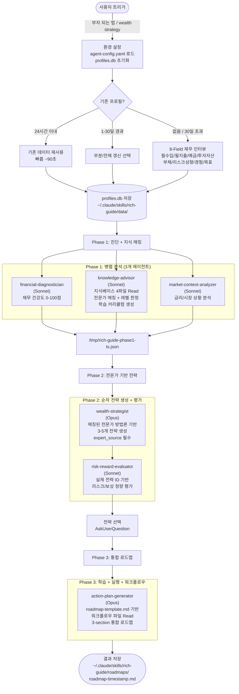

# Rich Guide

**AI 다중 에이전트 기반 개인화 부자 전략 시스템 v3.0**

재테크/투자/부업 정보의 파편화 문제를 해결하는 Claude Code 플러그인.
7개 전문 AI 에이전트가 전문가 방법론 지식 베이스를 기반으로 사용자의 재무 상태를 진단하고,
레벨에 맞는 학습 커리큘럼과 실행 계획, 워크플로우를 통합한 맞춤형 로드맵을 생성합니다.

---

## 핵심 문제 해결

재테크 초보자가 겪는 "선택 마비" 문제:

- 유튜브/블로그에 정보가 넘치지만 신뢰도 판단이 어려움
- 개인 상황에 맞는 전략을 찾기 힘듦
- 어디서 시작해야 할지 모름

Rich Guide의 해답: AI 재무 상담사가 현재 상황을 분석하고, 흩어진 정보를 정리하여, 실행 가능한 첫 걸음을 제시합니다.

---

## 아키텍처



---

## 설치

```bash
cd ~/Documents/Projects/claude-ai-engineering
npm run link
```

DB는 첫 실행 시 자동으로 초기화됩니다. 수동 초기화가 필요하면:

```bash
python3 plugins/rich-guide/config/init_db.py
```

---

## 사용법

Rich Guide는 **파이프라인 모드**와 **대화형 모드** 두 가지로 실행할 수 있습니다.

### 모드 1: 파이프라인 (`/rich-guide`)

종합 재무 진단 → 7-agent 파이프라인 → 맞춤형 로드맵 파일 생성

```
# 트리거
부자 되는 법 / 재테크 가이드 / 재테크 시작 / /rich-guide
rich guide / wealth strategy
```

### 모드 2: 대화형 (`/rich-chat`)

지식 베이스 기반 무제한 Q&A — 투자, 절세, 부업, 빚 관리 등 자유 상담

```
# 트리거
재테크 상담 / 투자 상담 / 부자 상담 / 돈 상담 / /rich-chat
rich chat / wealth chat
```

두 모드는 **독립 실행 가능**하며, 프로필 DB를 공유합니다.
파이프라인으로 로드맵을 먼저 생성한 후, 대화형으로 후속 상담을 진행할 수 있습니다.

### 예시 1: 재테크 초보자 첫 실행

```
사용자: "부자 되는 법"

시스템: 재무 상태 분석을 시작합니다...

[8개 질문 인터뷰]
  월수입: 400만원
  월지출: 280만원
  예금: 1,500만원
  투자자산: 없음
  부채: 없음
  리스크 성향: 중위험
  경험: 예적금만
  목표: 자산 증식

Phase 1: 진단 + 지식 매칭 시작 (3개 에이전트 병렬 실행)...
  재무 진단 완료 (건강점수: 68점)
  지식 매칭 완료 (레벨: 입문, 전문가 4명 매칭)
  시장 분석 완료

Phase 2-A: 전문가 기반 전략 생성 중 (wealth-strategist)...
  4개 전략 생성됨

Phase 2-B: 리스크/보상 평가 중 (risk-reward-evaluator)...
  실제 전략 ID 기반 평가 완료

[전략 선택]
1. ISA + S&P500 ETF 적립식 (중위험 | 장기 | 연 7-10%) [존 리]
2. 연금저축펀드 세액공제 극대화 (저위험 | 장기 | 세금 절약) [벤저민 그레이엄]
3. 직장인 프리랜서 부업 시작 (중위험 | 중기 | 월 +30만원)
4. 고금리 파킹통장 + 단기채권 (저위험 | 단기 | 연 4-5%) [레이 달리오]

사용자: "1번 선택"

Phase 3: 학습+실행+워크플로우 통합 로드맵 생성 중...
  3-section 로드맵 생성 완료

결과:
  사용자 레벨: 입문
  재무 건강도: 68점 (B등급)
  선택 전략: ISA + S&P500 ETF 적립식 (존 리 방법론)

  학습 계획 요약:
    1. 복리의 원리 이해 (30분)
    2. ETF 기초 학습 (1시간)
    3. ISA 계좌 이해 (30분)

  로드맵 파일: ~/.claude/skills/rich-guide/roadmaps/roadmap-{timestamp}.md
```

### 예시 2: 24시간 이내 빠른 재실행

```
사용자: "재테크 가이드"

시스템: 기존 재무 데이터(2026-02-17 작성)를 사용할까요?
  - 기존 데이터 사용 (빠름, 약 90초)
  - 새로 입력 (정확, 약 5분)

사용자: 기존 데이터 사용

[인터뷰 없이 Phase 1부터 즉시 시작]
→ 약 90초 후 전략 목록 출력
```

### 예시 3: 저위험 사용자 (안전 추구형)

```
사용자: "wealth strategy"

[인터뷰에서 리스크 성향: 저위험 선택]

생성 전략:
1. 고금리 파킹통장 + 단기채권 ETF (저위험 | 단기 | 연 4-5%)
2. ISA 예금 비과세 활용 (저위험 | 중기 | 세금 절약)
3. 연금저축 IRP 세액공제 최대화 (저위험 | 장기 | 세금 절약)
```

### 예시 4: 대화형 상담 (`/rich-chat`)

```
사용자: "재테크 상담"

[지식 베이스 8파일 로딩 중...]

부자 멘토: 안녕하세요! 부자 멘토입니다.
자산 증식 목표로 재테크를 진행 중이시군요.
무엇이든 물어보세요.

사용자: "월 30만원으로 뭘 시작할 수 있어요?"

부자 멘토: 월 30만원이면 충분히 시작할 수 있습니다!
존 리는 "매월 꾸준히 투자하는 것이 중요하다"고 강조했는데요.

추천 순서:
1. ISA 계좌 개설 → 월 30만원 S&P500 ETF 자동 적립
2. 연 200만원 비과세 혜택 활용 (30만원 × 12 = 360만원 중 200만원)

72법칙으로 계산하면, 연 8% 수익률 기준 9년이면 원금이 2배가 됩니다.
월 30만원 × 9년 = 투자원금 3,240만원 → 약 6,000만원.

ISA 계좌를 아직 안 만드셨다면, 어떤 증권사가 좋을지도 알려드릴까요?

사용자: "빚이 좀 있는데 투자를 먼저 해도 될까요?"

부자 멘토: 좋은 질문입니다. 핵심은 빚의 금리입니다.
money-fundamentals의 빚 관리 원칙에 따르면...
[대화 계속]
```

---

## 주요 기능

### FR-1: 8-Field 재무 인터뷰

월수입, 월지출, 예금, 투자자산, 부채, 리스크성향, 경험, 목표 8가지 정보 수집.
"잘 모르겠어요" 답변 시 한국 직장인 평균 기반 기본값 자동 적용.
경험 필드로 사용자 레벨(입문/중급/고급) 판정.

### FR-2: SQLite 로컬 프로필 저장 (4테이블)

`~/.claude/skills/rich-guide/data/profiles.db`에 버전별로 저장.
4개 테이블: profiles, agent_results, learning_progress, session_history.
24시간 이내: 재사용 제안. 1-30일: 부분/전체 갱신 선택 가능. 30일 초과: 새 인터뷰.
DB 파일 권한 `600` (소유자만 읽기/쓰기).

### FR-3: 7-에이전트 파이프라인

| 에이전트 | 모델 | Phase | 역할 |
|---------|------|-------|------|
| financial-diagnostician | Sonnet | 1 (병렬) | 재무 건강도 0-100점 산출 |
| knowledge-advisor | Sonnet | 1 (병렬) | 지식베이스 매칭 + 레벨 판정 + 학습 커리큘럼 |
| market-context-analyzer | Sonnet | 1 (병렬) | 현재 금리/시장 상황 분석 |
| wealth-strategist | Opus | 2A (순차) | 전문가 방법론 기반 개인화 전략 3-5개 생성 |
| risk-reward-evaluator | Sonnet | 2B (순차) | 실제 전략 ID 기반 리스크/보상 정량 평가 |
| action-plan-generator | Opus | 3 (순차) | 학습+실행+워크플로우 통합 로드맵 생성 |

### FR-4: 전략 다양성 보장

리스크(저/중/고) x 시간(1년/3년/10년) x 분야(투자/부업/커리어/절약) 조합.
사용자 리스크 성향에 따른 자동 전략 비중 조정.

### FR-5: 전문가 지식 베이스 + 정보 큐레이션

4개 큐레이션된 지식 베이스 파일:
- `investment-masters.md`: 투자 대가 8명 (그레이엄, 버핏, 멍거, 린치, 피셔, 달리오, 소로스, 존 리)
- `entrepreneurs.md`: 자수성가 인물 8명 (한국 4 + 글로벌 4)
- `side-hustles.md`: 부업 10카테고리
- `money-fundamentals.md`: 핵심 원리 5개 (복리, 인플레, 자산배분, 세금, 행동경제)

knowledge-advisor가 사용자 레벨+목표에 맞는 전문가 방법론 3-5개 매칭.
WebSearch로 최신 재테크 정보 보충. 화이트리스트 외 출처는 "미검증" 라벨.

### FR-6: 3-Section 통합 로드맵

템플릿(`templates/roadmap-template.md`) + 워크플로우(4종) 기반:
1. **학습 계획**: 전문가 커리큘럼 순서대로 배울 내용
2. **실행 계획**: 월별 목표 → 주간 체크리스트 분해
3. **워크플로우**: 상황별 단계적 가이드 (첫 투자 / 빚 탈출 / 부업 시작 / 자산 증식)

### FR-7: 기존 플러그인 연동

portfolio-copilot DB 및 market-pulse 분석 파일 직접 읽기.
미설치 시 경고 메시지 + 기본값으로 계속 진행.

### FR-8: 3-Layer 검증

- Layer 1: 모든 출력에 AI 면책 조항 포함
- Layer 2: 모든 추천에 출처 URL 명시
- Layer 3: 최종 출력에 전문가 상담 권유 링크

---

## 설정

`config/agent-config.yaml` 편집으로 커스터마이징 (orchestrator가 자동 로드):

```yaml
# 타임아웃 조정 (인터넷이 느린 환경)
timeouts:
  info_curator: 120       # 기본 90초 → 120초
  wealth_strategist: 180  # 기본 120초 → 더 상세한 전략 원할 때

# 모델 변경 (비용 절약 시)
models:
  wealth_strategist: "claude-sonnet-4-5-20250929"  # opus → sonnet

# 인터뷰 기본값 변경
interview:
  defaults:
    monthly_income: 400  # 400만원으로 변경
```

---

## 트러블슈팅

### "데이터베이스 초기화 실패"

```bash
# Python 3 설치 확인
python3 --version

# 수동으로 DB 초기화
python3 plugins/rich-guide/config/init_db.py

# 디렉토리 권한 확인
mkdir -p ~/.claude/skills/rich-guide/data
chmod 700 ~/.claude/skills/rich-guide/data
```

### "에이전트 타임아웃" 오류

```yaml
# config/agent-config.yaml 수정
timeouts:
  wealth_strategist: 180
  action_plan_generator: 180
  knowledge_advisor: 180
```

### "market-pulse / portfolio-copilot 데이터 없음"

플러그인 미설치 시 기본 전략으로 자동 진행됩니다.
더 정확한 분석을 원하면:

```
/market-pulse
/portfolio-copilot
```

### "로드맵 파일을 찾을 수 없음"

```bash
# 저장 경로 확인
ls ~/.claude/skills/rich-guide/roadmaps/

# 권한 확인
chmod 755 ~/.claude/skills/rich-guide/roadmaps
```

---

## 성능

| 단계 | 소요 시간 |
|------|----------|
| 환경 설정 + Config 로드 | 2-5초 |
| 재무 인터뷰 (8필드) | 2-3분 (응답 시간 포함) |
| Phase 1 병렬 (3개: 진단+지식+시장) | 60-120초 |
| Phase 2A 순차 (wealth-strategist) | 60-120초 |
| Phase 2B 순차 (risk-reward-evaluator) | 30-60초 |
| Phase 3 순차 (3-section 로드맵) | 60-120초 |
| **전체 (첫 실행)** | **5-7분** |
| **전체 (캐시 재실행)** | **2-3분** |

**예상 비용:** 약 $2.50-3.00/회 (Sonnet x4 + Opus x2)

---

## 데이터 프라이버시

- 모든 재무 데이터는 `~/.claude/skills/rich-guide/data/profiles.db`에만 저장
- 외부 서버로 재무 정보 전송 없음
- WebSearch 시 개인 재무 금액 정보가 아닌 일반 키워드만 전송
- DB 파일 권한: `600` (소유자만 읽기/쓰기)
- 로그에 금액 정보 기록하지 않음
- 세션 종료 후 `/tmp/rich-guide-*-{ts}.json` 임시 파일 자동 정리

---

## 연관 플러그인

| 플러그인 | 관계 | 설명 |
|---------|------|------|
| market-pulse | 데이터 소스 (선택) | 시장 데이터 제공 |
| portfolio-copilot | 데이터 소스 (선택) | 포트폴리오 현황 제공 |
| career-compass | 보완 플러그인 | 커리어 수입 성장 전략 |

---

## 에이전트 모델 선택 근거

| 에이전트 | 모델 | 근거 |
|---------|------|------|
| financial-diagnostician | Sonnet | 재무 수치 분석, 패턴 인식 |
| knowledge-advisor | Sonnet | 지식베이스 4파일 Read + 전문가 매칭 + 레벨 판정에 분석력 필요 |
| market-context-analyzer | Sonnet | 경제 지표 해석, 복합 분석 |
| wealth-strategist | Opus | 창의적 전문가 기반 전략 생성이 핵심 가치 |
| risk-reward-evaluator | Sonnet | 정량 평가, 분석력 중요 |
| action-plan-generator | Opus | 3-section 통합 로드맵 생성이 최종 사용자 가치 |

---

## 라이선스

MIT License

## 저자

Jay Kim (https://github.com/JayKim88)

---

재테크를 시작하는 첫 걸음, Rich Guide가 함께합니다.

```
부자 되는 법
```
