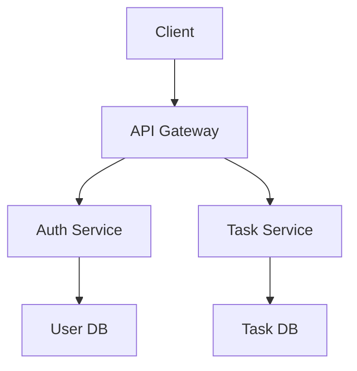

# Spec Interview Plugin - Development Guide

Development and maintenance guide for the spec-interview plugin.

## Directory Structure

```
spec-interview/
├── .claude-plugin/
│   └── plugin.json           # Plugin metadata and version
├── skills/
│   └── spec-interview/
│       └── SKILL.md          # Skill execution algorithm
├── README.md                 # User documentation
└── CLAUDE.md                 # Development guide (you are here)
```

## Development Workflow

### Local Development Setup

```bash
cd ~/Documents/Projects/claude-ai-engineering
npm run link

# Verify symlink
ls -l ~/.claude/skills/spec-interview
```

### Making Changes

1. Edit files in monorepo: `plugins/spec-interview/`
2. Changes reflect immediately via symlink
3. Test in Claude Code with trigger phrases
4. Commit when satisfied

## Architecture

### Simple Skill Pattern

This plugin uses the **Simple Skill** pattern (not multi-agent):

```
User Input ("Interview me about X")
    ↓
Parse Topic & Context
    ↓
Generate Question Set 1 (2-4 questions)
    ↓
[AskUserQuestion Tool]
    ↓
Analyze Responses & Track Coverage
    ↓
Generate Question Set 2 (2-4 questions)
    ↓
[AskUserQuestion Tool]
    ↓
Repeat until completion criteria met
    ↓
Generate Comprehensive Spec Document
    ↓
Save to File (Write Tool)
    ↓
Confirm to User
```

**Why simple skill?**
- Conversational flow (not parallel processing)
- Single execution thread (interview is sequential)
- No need for agent coordination
- AskUserQuestion handles interactive Q&A

### Key Design Decisions

**1. Question Quality over Quantity**
- Ask 2-4 questions per round (not overwhelming)
- Each question must be non-obvious
- Options must present real trade-offs

**2. Adaptive Depth**
- Simple features: 3-5 rounds
- Complex projects: 5-8 rounds
- Stop when diminishing returns

**3. Category Rotation**
- Don't ask 10 technical questions in a row
- Rotate through 6 categories
- Ensures comprehensive coverage

**4. Track Coverage Internally**
- Mental checklist of what's covered
- Identify gaps and drill deeper
- Flag critical missing areas

## Execution Flow Details

### Step 1: Parse Initial Request

**Goal**: Extract topic, context, and focus areas

**Input examples**:
```
"Interview me about building a task management app"
→ Topic: task management app
→ Context: building from scratch
→ Focus: None (general)

"Help me spec out authentication, focus on security"
→ Topic: authentication
→ Context: None
→ Focus: security
```

**Output**: Brief acknowledgment confirming topic

### Step 2-4: Interview Loop

**Round 1**: High-level understanding
- Core functionality
- Main use cases
- Primary users
- Basic architecture thoughts

**Round 2**: Technical depth
- Implementation approach
- Tech stack decisions
- Integration points
- Scalability considerations

**Round 3**: Edge cases & errors
- Concurrent access scenarios
- Network failure handling
- Invalid input cases
- Error recovery

**Round 4+**: Specialized areas
- Security & privacy
- Performance requirements
- Testing strategy
- Deployment & monitoring

**Loop termination**:
```python
if coverage_sufficient and no_major_gaps:
    generate_spec()
elif user_wants_to_stop:
    generate_spec()
elif round_count > 8:
    ask_user_if_continue()
```

### Step 5: Completion Detection

**Coverage checklist**:
- ✅ Core functionality defined
- ✅ Critical edge cases discussed
- ✅ Major technical decisions made
- ✅ Key risks identified
- ✅ Non-obvious insights gathered

**Don't over-interview**:
- If user is repeating answers
- If questions become trivial
- If user says "I think we're done"

### Step 6-9: Spec Generation

**Template customization**:
1. Skip empty sections
2. Use user's language and examples
3. Preserve exact quotes for critical requirements
4. Highlight concerns user mentioned
5. Include all trade-offs discussed

**File naming**:
- Slug format: `[topic]-spec.md`
- Examples: `task-management-spec.md`, `auth-system-spec.md`
- Save to current directory by default

## Testing

### Manual Testing Checklist

**Basic functionality:**
- [ ] Trigger phrase "interview me about X" works
- [ ] AskUserQuestion displays properly
- [ ] Questions are non-obvious and insightful
- [ ] Options present real trade-offs
- [ ] Follow-up questions reference previous answers

**Interview flow:**
- [ ] Covers multiple categories (not stuck in one)
- [ ] Drills deeper on vague answers
- [ ] Stops after 3-5 rounds for simple features
- [ ] Continues 5-8 rounds for complex projects
- [ ] Can handle "I don't know" responses

**Spec generation:**
- [ ] Spec includes all discussed topics
- [ ] Filename is descriptive
- [ ] Document structure matches template
- [ ] Only includes relevant sections
- [ ] Preserves user's own words

**Edge cases:**
- [ ] User interrupts interview ("let's stop here")
- [ ] User gives contradictory answers
- [ ] User says "I don't know" repeatedly
- [ ] Very simple topic (1-2 rounds sufficient)
- [ ] Very complex topic (needs 8+ rounds)

### Test Scenarios

**Scenario 1: Simple Feature**
```
User: "Interview me about adding a dark mode"

Expected:
- 2 rounds of questions
- 5-7 total questions
- Covers toggle, persistence, images
- Generates 3-5 page spec
- Completes in <5 minutes
```

**Scenario 2: Complex Project**
```
User: "I want to build a SaaS platform, interview me"

Expected:
- 6-8 rounds of questions
- 15-20 total questions
- Covers architecture, security, scaling, billing, etc.
- Generates 15-20 page spec
- Completes in 15-20 minutes
```

**Scenario 3: Focused Interview**
```
User: "Interview me about API design, focus on security"

Expected:
- 4-5 rounds
- Heavy emphasis on auth, rate limiting, encryption
- Lighter on other aspects
- Security-focused spec
```

## Versioning

### When to Update Version

Update `.claude-plugin/plugin.json` version before committing:

```json
{
  "version": "1.0.1"  // <- Increment this
}
```

### Semantic Versioning

- **MAJOR** (1.0.0 → 2.0.0): Breaking changes
  - Change spec template significantly
  - Remove trigger phrases
  - Change interview algorithm fundamentally

- **MINOR** (1.0.0 → 1.1.0): New features
  - Add new question categories
  - Add visual diagram support
  - Add collaborative interview mode

- **PATCH** (1.0.0 → 1.0.1): Bug fixes
  - Improve question quality
  - Fix spec generation formatting
  - Documentation updates

## Common Issues

### Issue: Questions are too obvious

**Diagnosis:**
```
Questions like:
- "Should this be secure?"
- "Do you want good UX?"
- "Should we use best practices?"
```

**Cause**: Not following question quality rules in SKILL.md

**Solution**: Review "Question Quality Rules" section and "Interview Best Practices"

### Issue: Interview too long (10+ rounds)

**Diagnosis:**
User getting fatigued, questions becoming trivial

**Cause**: Not detecting diminishing returns

**Solution**:
```python
if round_count >= 8:
    ask_user: "We've covered a lot. Should I:
    A) Wrap up now and generate the spec
    B) Continue with a few more specific questions
    C) Focus on a particular area you want to explore more"
```

### Issue: Spec missing critical information

**Diagnosis:**
Generated spec has gaps despite thorough interview

**Cause**: Not preserving all insights, or skipping sections

**Solution**:
- Use internal checklist during interview
- Don't skip template sections that had answers
- Preserve user's exact words for requirements

### Issue: Questions don't drill deeper

**Diagnosis:**
All questions are surface-level, no follow-ups

**Cause**: Not analyzing previous responses

**Solution**:
Follow Step 3 algorithm: analyze responses, identify gaps, challenge vague answers

### Issue: Options are obvious good/bad

**Diagnosis:**
```
Option A: Fast, secure, scalable (obviously good)
Option B: Slow, insecure, doesn't scale (obviously bad)
```

**Cause**: Not presenting real trade-offs

**Solution**:
```
Good Options:
Option A: Server-side rendering (SEO, slower interactivity)
Option B: Client-side rendering (faster, SEO challenges)
Option C: Hybrid (best of both, more complexity)
```

## Performance Considerations

### Interview Timing

- **Simple feature**: 3-5 rounds, ~5 minutes
- **Medium complexity**: 4-6 rounds, ~10 minutes
- **Complex project**: 6-8 rounds, ~15-20 minutes

**Optimization**: Stop early if coverage is sufficient

### Spec Generation

- **Analysis**: ~5 seconds
- **Template population**: ~10 seconds
- **File write**: <1 second
- **Total**: ~15-20 seconds

**Fast enough** for user to wait. No need for background processing.

## Future Enhancements

### Planned Features

1. **Visual Diagrams**
   - Generate architecture diagrams
   - User flow visualizations
   - Data model ERDs
   - Use mermaid.js syntax in markdown

2. **Collaborative Interviews**
   - Multi-stakeholder mode
   - Tag answers by person
   - Highlight disagreements
   - Generate consensus decisions

3. **Spec Templates**
   - Pre-built templates for common patterns
   - CRUD app template
   - Real-time app template
   - Auth system template
   - API service template

4. **Resume Interview**
   - Read partial spec
   - Identify what was covered
   - Continue from where left off
   - Update existing sections

5. **Integration with Task Tools**
   - Auto-generate Linear/Jira tickets
   - Break spec into implementable tasks
   - Estimate effort for each task

### Implementation Notes

**Visual diagrams**:
```markdown
## Architecture Diagram


```

**Collaborative mode**:
- Track who answered each question
- Flag contradictions: "(User A said X, User B said Y)"
- Generate "Decision Log" section

**Spec templates**:
```python
if topic_matches("CRUD app"):
    use_template("crud-app-spec-template.md")
    customize_with_interview_answers()
```

## Contributing

### Pull Request Checklist

- [ ] Update version in plugin.json
- [ ] Test with multiple topics (simple and complex)
- [ ] Verify question quality (non-obvious)
- [ ] Test spec generation completeness
- [ ] Update README.md if user-facing changes
- [ ] Update CLAUDE.md with technical notes

### Code Style

**SKILL.md:**
- Clear step-by-step algorithm
- Include examples for each step
- Document decision logic
- Provide quality rules

**Questions:**
- Must be non-obvious
- Must present real trade-offs
- Must adapt to previous answers

**Specs:**
- Use markdown formatting
- Include code blocks with syntax highlighting
- Preserve user's language
- Skip empty sections

## Related Documentation

- **AskUserQuestion tool**: Claude Code documentation
- **Question design**: See SKILL.md "Interview Best Practices"
- **Spec template**: See SKILL.md Step 6

## Support

For issues or questions:
- GitHub Issues: https://github.com/JayKim88/claude-ai-engineering/issues
- Discussions: https://github.com/JayKim88/claude-ai-engineering/discussions

---

**Development Tips:**

1. **Test with real projects**: Use actual projects you want to build
2. **Refine question quality**: Questions make or break this skill
3. **Balance depth and speed**: Know when to stop interviewing
4. **Preserve insights**: Don't lose valuable information in spec generation
5. **Iterate on template**: The spec template will evolve based on user feedback

**Philosophy:**

This plugin inverts the traditional AI interaction model. Instead of:
- User tells AI what to do → AI executes

We have:
- AI asks user thoughtful questions → User reveals requirements → AI synthesizes

This works because:
- Most people don't know what questions to ask themselves
- Speaking through questions surfaces hidden assumptions
- Interactive Q&A is more engaging than writing requirements
- AI can ask questions humans wouldn't think to ask

**Inspired by**: Danny Postma's insight about using AskUserQuestion proactively, and the observation that "AI interviewing humans" is underutilized in the Claude Code ecosystem.
