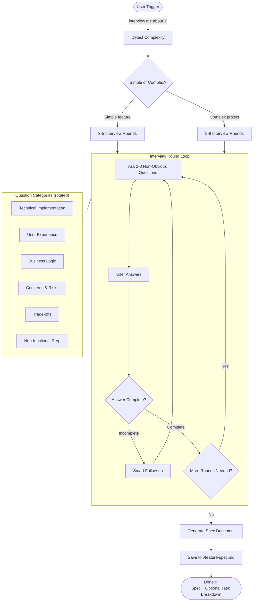

# Spec Interview Plugin

AI-driven requirements gathering through in-depth interviews. Transform vague ideas into comprehensive technical specifications through interactive Q&A.

## Features

- **In-Depth Questioning**: AI asks non-obvious questions to uncover hidden requirements
- **Smart Follow-ups**: Analyzes your answers and drills deeper on critical areas
- **Real Trade-offs**: Presents actual technical trade-offs, not obvious good/bad choices
- **Comprehensive Specs**: Generates detailed technical specifications with all insights captured
- **Multiple Rounds**: Continues interviewing until all critical aspects are covered
- **Adaptive Depth**: Simple features get 3-5 rounds, complex projects get 5-8 rounds

## Process Flow



## Why This Approach Works

**Traditional approach:**
- You write requirements
- AI follows them
- You realize you forgot something important

**Spec Interview approach:**
- AI asks you questions you didn't think of
- Forces you to think through edge cases
- Results in more complete specifications

## Installation

### From Marketplace (Recommended)

```bash
/plugin marketplace add JayKim88/claude-ai-engineering
/plugin install spec-interview
```

### Via npx

```bash
npx github:JayKim88/claude-ai-engineering spec-interview
```

### Local Development

```bash
cd ~/Documents/Projects/claude-ai-engineering
npm run link
```

## Requirements

- Claude Code CLI (latest version recommended)
- No configuration needed - works out of the box

## Usage

### Trigger Phrases

**English:**
- "interview me"
- "interview me about [topic]"
- "help me spec this out"
- "gather requirements"
- "ask me questions about [topic]"
- "I want to build [X], ask me questions"

**Korean:**
- "인터뷰해줘"
- "[주제]에 대해 질문해줘"
- "요구사항 정리해줘"
- "스펙 작성 도와줘"

### Example 1: Simple Feature

```
User: "Interview me about adding a dark mode feature"

Claude: I'll help you spec out the dark mode feature. Let me ask some questions to understand your requirements better.

[Round 1 - 3 questions about toggle mechanism, persistence, system preferences]
[Round 2 - 2 questions about images and third-party content]

✅ Specification saved to: ./dark-mode-spec.md

📋 Captured:
- 5 functional requirements
- Toggle mechanism: Settings page + keyboard shortcut
- Persistence: localStorage with system preference fallback
- Image handling strategy for dark backgrounds
- Third-party embed considerations

Want me to create a task breakdown from this spec?
```

### Example 2: Complex Project

```
User: "I want to build a real-time collaboration tool, interview me"

Claude: I'll conduct a thorough interview to gather all requirements for your real-time collaboration tool.

[Round 1 - Core functionality and main use cases]
[Round 2 - Real-time sync approach and conflict resolution]
[Round 3 - Permissions, security, data privacy]
[Round 4 - Scalability and performance under load]
[Round 5 - Edge cases, offline mode, error recovery]
[Round 6 - Testing, deployment, monitoring]

✅ Specification saved to: ./collaboration-tool-spec.md

📋 Captured:
- 18 functional requirements
- Architecture: WebSocket + CRDT for conflict resolution
- Security: E2E encryption + role-based access control
- 12 key user flows with edge cases
- Performance targets: <100ms latency, 10K concurrent users
- 4 implementation phases defined

🎯 Next Steps:
1. Review and validate this specification
2. Break down into implementable tasks
3. Set up initial architecture
```

## Question Categories

The interview rotates through these categories to ensure comprehensive coverage:

1. **Technical Implementation**: Architecture, tech stack, integrations, scalability
2. **User Experience**: User flows, interactions, edge cases, error states
3. **Business Logic**: Rules, constraints, validations, permissions
4. **Concerns & Risks**: Security, privacy, compliance, data handling
5. **Trade-offs**: Performance vs features, complexity vs simplicity
6. **Non-functional Requirements**: Monitoring, logging, testing, deployment

## Question Quality

The plugin is designed to ask **non-obvious** questions:

**Bad Questions (avoided):**
- "Should this be secure?" (always yes)
- "Do you want good performance?" (too vague)
- "Should we use best practices?" (meaningless)

**Good Questions (asked):**
- "When two users edit the same item simultaneously, should the last write win, or should we detect conflicts?"
- "If the external API is down, should we queue requests or fail immediately with an error?"
- "Would you prioritize a more flexible architecture that takes longer to build, or a simpler implementation that ships faster but is harder to extend later?"

## Output Format

Generated specifications include:

1. **Overview**: Purpose and scope
2. **Requirements**: Functional and non-functional requirements
3. **Technical Design**: Architecture, tech stack, components, data models
4. **User Experience**: User flows and UI/UX considerations
5. **Implementation Details**: Phases and technical decisions
6. **Edge Cases**: Error handling and edge case scenarios
7. **Security & Privacy**: Security considerations and compliance
8. **Testing Strategy**: Test coverage and scenarios
9. **Risks & Mitigations**: Risk assessment
10. **Open Questions**: Unresolved items
11. **Success Metrics**: Key metrics and monitoring
12. **References**: Related documents and interview notes

## Tips

1. **Be honest about uncertainty**: Say "I don't know" - the AI will help educate you on options
2. **Think through trade-offs**: The AI presents real trade-offs, not easy answers
3. **Ask for clarification**: If a question is unclear, ask the AI to rephrase
4. **Reference previous answers**: The AI remembers your earlier responses
5. **Stop when ready**: You can end the interview when you feel requirements are clear
6. **Request focus**: Say "focus on security" or "focus on UX" to emphasize certain areas

## Advanced Usage

### Focused Interview

```
User: "Interview me about API rate limiting, focus on security"

Claude: [Asks questions specifically about security aspects of rate limiting]
```

### Batch Interview

```
User: "Interview me about: 1) user authentication, 2) file uploads, 3) notifications"

Claude: [Interviews each feature separately, notes dependencies]
```

### Resume Interview

```
User: "Continue the interview about task management"

Claude: [Reads the partial spec and continues from where it left off]
```

## When to Use

✅ **Use this skill when:**
- Building something new but haven't fully thought through requirements
- Complex feature that needs thorough planning
- Want to discover edge cases you haven't considered
- Prefer interactive Q&A over writing docs yourself
- Working on a team and want comprehensive documentation

❌ **Skip when:**
- You've already written detailed requirements (just review instead)
- Very simple, well-defined task (overkill)
- Want to start coding immediately (respect that preference)

## Troubleshooting

**Issue**: Questions are too high-level
- **Solution**: Tell the AI to "go deeper" or "ask more technical questions"

**Issue**: Interview is taking too long
- **Solution**: Say "I think we have enough, let's wrap up" - the AI will generate the spec

**Issue**: AI asks about something you haven't decided
- **Solution**: Say "I don't know" - the AI will present options and trade-offs

**Issue**: Spec is missing something important
- **Solution**: Read the spec and say "add a section about X" - the AI can update it

## Future Enhancements

- [ ] Support for visual diagram generation (architecture, user flows)
- [ ] Integration with task management tools (Linear, Jira)
- [ ] Collaborative interviews (multiple stakeholders)
- [ ] Spec templates for common patterns (CRUD, auth, real-time, etc.)
- [ ] Automatic spec updates based on implementation changes

## Related Plugins

- **learning-summary**: Document the interview process itself
- **project-insight**: Analyze existing codebase before planning new features

## Contributing

Found a bug or have a feature request? Open an issue at:
https://github.com/JayKim88/claude-ai-engineering/issues

## License

MIT License - See LICENSE file for details

## Author

**Jay Kim**
- GitHub: [@JayKim88](https://github.com/JayKim88)

---

**Inspired by**: Danny Postma's insight that "AI asking questions" is more effective than "user telling AI what to do" for requirements gathering.
