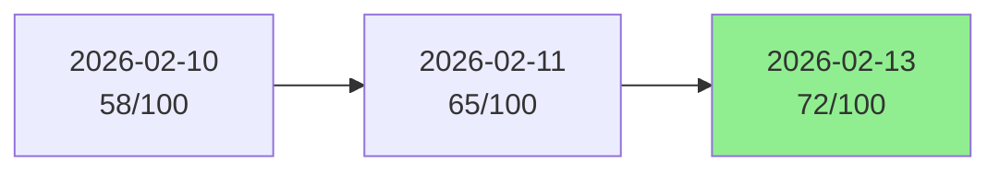

# Spec Validator Plugin - Development Guide

Development and maintenance guide for the spec-validator plugin.

---

## Directory Structure

```
spec-validator/
├── .claude-plugin/
│   └── plugin.json              # Plugin metadata and version
├── skills/
│   └── spec-validator/
│       ├── SKILL.md             # Skill execution algorithm
│       └── config.yaml          # Default configuration
├── templates/
│   ├── checklist-template.yaml  # Annotated checklist example
│   ├── validation-report-template.md  # Report structure
│   └── fix-guide.md             # How to fix common issues
├── docs/
│   ├── ARCHITECTURE.md          # System design (future)
│   └── INTEGRATION.md           # Integration guide (future)
├── README.md                    # User documentation
└── CLAUDE.md                    # Development guide (you are here)
```

---

## Development Workflow

### Local Development Setup

```bash
cd ~/Documents/Projects/claude-ai-engineering
npm run link

# Verify symlink
ls -l ~/.claude/skills/spec-validator
```

### Making Changes

1. Edit files in monorepo: `plugins/spec-validator/`
2. Changes reflect immediately via symlink
3. Test in Claude Code with trigger phrases
4. Commit when satisfied

---

## Architecture

### Simple Skill Pattern

This plugin uses the **Simple Skill** pattern (not multi-agent):

```
User Input ("Validate my-spec.md")
    ↓
Parse Input (spec path, checklist path, mode)
    ↓
Load & Parse Specification (multi-pattern extraction)
    ↓
Load Implementation Checklist (YAML)
    ↓
Compare Spec vs Checklist (gap analysis)
    ↓
Calculate 4-Dimension Score (40+25+20+15 = 100)
    ↓
Generate Validation Report (markdown)
    ↓
Save Report & Update History
    ↓
Present Summary & Offer Follow-up Actions
```

**Why simple skill?**
- Sequential workflow (parse → compare → score → report)
- No parallel processing needed
- Deterministic scoring algorithm
- Single execution thread

### Key Design Decisions

**1. Multi-Pattern Spec Parsing**

Support multiple requirement formats:
- Headers: `#### FR-1: Title`
- Tables: `| FR-1 | Title | Priority |`
- Bold lists: `- **FR-1**: Title`
- Inline: `As described in FR-1...`

**Rationale**: Specs from different sources use different formats.

**2. YAML Checklist Format**

Use YAML instead of JSON/markdown.

**Rationale**:
- Human-readable and editable
- Comments supported
- Standard format for config files
- Easy to parse and validate

**3. 4-Dimension Scoring**

Split 100 points across 4 dimensions instead of single score.

**Rationale**:
- More actionable feedback (know which dimension needs work)
- Different projects prioritize different dimensions
- Configurable weights for customization

**4. Priority-Weighted FR Scoring**

High/Medium/Low priority FRs get 3x/2x/1x weight.

**Rationale**:
- Not all requirements are equal
- Completing high-priority items should boost score more
- Reflects real-world development prioritization

**5. Validation History Tracking**

Store history in checklist file itself.

**Rationale**:
- Single source of truth
- No separate database needed
- Easy to version control
- Shows improvement trend

---

## Execution Flow Details

### Step 1: Parse Input

**Goal**: Extract spec path, checklist path, and validation mode.

**Detection logic**:
```python
# Spec path detection
if message.contains(".md"):
    spec_path = extract_path(message)
else:
    ask_user_for_path()

# Checklist path detection
if message.contains(".yaml"):
    checklist_path = extract_path(message)
else:
    checklist_path = "./.spec-checklist.yaml"  # Default

# Mode detection
if "quick" in message:
    mode = "quick"
elif "requirements" in message:
    mode = "requirements_only"
else:
    ask_user_to_choose_mode()
```

### Step 2: Multi-Pattern Spec Parsing

**Pattern 1: Markdown Headers**
```markdown
#### FR-1: User Authentication
```
Regex: `r'^#{1,6}\s+(FR-\d+):\s*(.+)'`

**Pattern 2: Table Rows**
```markdown
| FR-1 | User Authentication | High |
```
Regex: `r'\|\s*(FR-\d+)\s*\|\s*([^|]+)\|\s*([^|]+)'`

**Pattern 3: Bold List Items**
```markdown
- **FR-1**: User Authentication (High priority)
```
Regex: `r'[-*]\s+\*\*(FR-\d+)\*\*:\s*(.+)'`

**Deduplication**: Keep first occurrence of each ID.

**Priority extraction**:
1. Same line: `(High priority)`
2. Next 3 lines: `**Priority**: High`
3. Table column: `| High |`
4. Default: `Medium`

### Step 3: Checklist Validation

**Required fields**:
```python
REQUIRED_FIELDS = {
    "spec_name": str,
    "functional_requirements": list,
    "non_functional_requirements": list,
}

VALID_STATUSES = ["completed", "in_progress", "not_started", "blocked"]
VALID_PRIORITIES = ["High", "Medium", "Low"]
```

**Validation errors**:
- Missing required fields → Error
- Invalid status values → Warning, default to "not_started"
- Invalid priority values → Warning, default to "Medium"
- Empty FR/NFR arrays → Error

### Step 4: Comparison Algorithm

**Gap detection**:
```python
spec_ids = {fr["id"] for fr in spec_frs}
checklist_ids = {fr["id"] for fr in checklist_frs}

missing_from_checklist = spec_ids - checklist_ids     # Critical issues
extra_in_checklist = checklist_ids - spec_ids         # Scope creep
in_both = spec_ids & checklist_ids                    # Compare details
```

**Data model comparison**:
```python
for model in spec_models:
    checklist_model = find_by_name(checklist_models, model["name"])

    spec_fields = {f["name"] for f in model["fields"]}
    impl_fields = set(checklist_model["fields_implemented"])

    fidelity = len(spec_fields & impl_fields) / len(spec_fields)
```

### Step 5: Scoring Formulas

**Dimension 1: Implementation Completeness (40 pts)**

```python
# FR Score (24 pts, priority-weighted)
total_weight = sum(PRIORITY_WEIGHTS[fr["priority"]] for fr in all_frs)
completed_weight = sum(
    PRIORITY_WEIGHTS[fr["priority"]] * completion_factor(fr["status"])
    for fr in all_frs
)
fr_score = (completed_weight / total_weight) * 24

# completion_factor: completed=1.0, in_progress=0.5, not_started=0.0

# NFR Score (6 pts, simple percentage)
nfr_score = (completed_nfrs / total_nfrs) * 6

# Models Score (5 pts, field fidelity)
avg_fidelity = sum(model["fidelity"] for model in models) / len(models)
model_completion = len(models) / (len(models) + len(missing_models))
models_score = (avg_fidelity * model_completion) * 5

# API Score (5 pts, endpoint completion)
api_score = (completed_endpoints / total_endpoints) * 5

# Total Dimension 1
d1_score = fr_score + nfr_score + models_score + api_score
```

**Dimension 2: Implementation Quality (25 pts)**

```python
# Test Coverage (12 pts, weighted average)
weighted_cov = (
    unit_cov * 0.4 +
    integration_cov * 0.3 +
    e2e_cov * 0.3
)
test_score = (weighted_cov / 100) * 12

# Edge Cases (8 pts, threshold-based)
edge_completion = completed_edges / total_edges
if edge_completion >= 1.0:
    edge_score = 8.0
elif edge_completion >= 0.8:
    edge_score = 6.5
elif edge_completion >= 0.6:
    edge_score = 5.0
elif edge_completion >= 0.4:
    edge_score = 3.0
else:
    edge_score = 1.0

# Transparency (5 pts, notes quality)
items_with_notes = count_items_with_notes(all_items)
note_rate = items_with_notes / len(all_items)
transparency_score = map_rate_to_score(note_rate)  # 5/4/3/2/1

# Total Dimension 2
d2_score = test_score + edge_score + transparency_score
```

**Dimension 3: Spec Adherence (20 pts)**

```python
# Requirement Completeness (10 pts, penalty-based)
score = 10.0
for missing_fr in missing_high_priority_frs:
    score -= 2.0
for missing_fr in missing_medium_low_frs:
    score -= 1.0
for missing_nfr in missing_nfrs:
    score -= 1.0
req_completeness = max(0.0, score)

# Model Fidelity (5 pts)
model_fidelity = (avg_fidelity * model_coverage) * 5

# API Fidelity (5 pts)
api_fidelity = (api_coverage) * 5

# Total Dimension 3
d3_score = req_completeness + model_fidelity + api_fidelity
```

**Dimension 4: Progress Transparency (15 pts)**

```python
# Status Tracking (5 pts)
valid_status_rate = items_with_valid_status / total_items
status_score = valid_status_rate * 5

# Documentation Quality (5 pts)
# Penalties for missing notes on in-progress/blocked items
# Bonuses for comprehensive notes on completed items
doc_score = calculate_doc_quality()  # Complex logic in SKILL.md

# Blocker Management (3 pts)
# Penalties if blocked items don't have blockers documented
blocker_score = calculate_blocker_mgmt()

# Checklist Hygiene (2 pts)
# Penalties for scope creep items
hygiene_score = 2.0 - (scope_creep_count * 0.3)

# Total Dimension 4
d4_score = status_score + doc_score + blocker_score + hygiene_score
```

**Overall Score**:
```python
overall = d1_score + d2_score + d3_score + d4_score  # 0-100

grade = calculate_grade(overall)
```

**Mode adjustments**:
```python
if mode == "quick":
    # Only D1 + D3 (max 60), scale to 100
    overall = (d1_score + d3_score) / 60 * 100
elif mode == "requirements_only":
    # Only FR + NFR (max 30), scale to 100
    overall = (fr_score + nfr_score) / 30 * 100
```

### Step 6: Report Generation

**Issue categorization**:
```python
CRITICAL = [
    "missing_high_priority_fr",
    "missing_data_model",
    "missing_high_traffic_api",
]

IMPORTANT = [
    "test_coverage_below_80",
    "edge_cases_below_80",
    "missing_medium_priority_fr",
]

MINOR = [
    "missing_implementation_notes",
    "missing_low_priority_fr",
    "priority_mismatch",
]
```

**Report sections**:
1. Summary (2-3 sentences)
2. Overall score and grade
3. Dimension scores table
4. Requirements status tables
5. Issues by severity (with recommendations)
6. What's working well
7. Scope creep detection
8. Next steps checklist
9. Validation history
10. Recommendations (short/medium/long-term)

### Step 7: History Tracking

**History entry structure**:
```yaml
validation_history:
  - date: "2026-02-13"
    score: 72
    grade: "B-"
    change: 7          # vs previous validation
    mode: "full"
    dimension_scores:
      completeness: 32
      quality: 18
      adherence: 15
      transparency: 7
    report_file: "my-feature-validation-2026-02-13.md"
```

**Trend calculation**:
```python
if len(history) < 2:
    trend = "🆕 First validation"
else:
    change = current_score - previous_score
    if change > 5:
        trend = f"↗️ Improving (+{change} points)"
    elif change < -5:
        trend = f"↘️ Declining ({change} points)"
    else:
        trend = f"→ Stable ({change:+d} points)"
```

### Step 8: Follow-up Actions

**Options offered**:
1. View Full Report
2. Generate Fix Checklist
3. Update Checklist Template (add missing items)
4. Show Validation History
5. Done

**Implementation**:
```python
if choice == "View Full Report":
    Read(report_path)
    display_to_user()

elif choice == "Generate Fix Checklist":
    fixes = []
    for issue in critical_issues:
        fixes.append({
            "priority": "P0",
            "task": issue["recommendation"],
            "impact": issue["points"]
        })
    # Generate task list markdown

elif choice == "Update Checklist Template":
    for missing_fr in missing_frs:
        add_to_checklist(missing_fr)
    Write(checklist_path, updated_checklist)
```

---

## Configuration System

### Loading Configuration

```python
import yaml
from pathlib import Path

def load_config():
    config_path = Path(__file__).parent / "config.yaml"
    with open(config_path) as f:
        return yaml.safe_load(f)

config = load_config()

# Access values
fr_weight = config["scoring"]["dimension_1"]["functional_requirements"]
priority_weights = config["priority_weights"]
```

### Overriding Configuration

Users can create project-specific config:

```bash
# Project root
.spec-validator-config.yaml  # Overrides default config
```

Load order:
1. Default: `skills/spec-validator/config.yaml`
2. Project: `.spec-validator-config.yaml` (if exists)
3. Merge: Project config overrides default

---

## Testing

### Manual Testing Checklist

**Basic functionality**:
- [ ] Trigger phrase "validate spec implementation" works
- [ ] Parses spec file with FRs, NFRs, models, endpoints
- [ ] Reads checklist YAML successfully
- [ ] Compares spec vs checklist correctly
- [ ] Calculates scores accurately
- [ ] Generates complete validation report
- [ ] Updates validation history in checklist

**Multi-pattern parsing**:
- [ ] Detects FR-X in headers
- [ ] Detects FR-X in tables
- [ ] Detects FR-X in bold lists
- [ ] Extracts priority correctly
- [ ] Deduplicates correctly

**Scoring accuracy**:
- [ ] Priority-weighted FR scoring works
- [ ] Test coverage weighted average correct
- [ ] Edge case threshold scoring correct
- [ ] All 4 dimensions sum to 100

**Edge cases**:
- [ ] Checklist file doesn't exist → offers template
- [ ] Invalid YAML → shows error with line number
- [ ] No requirements in spec → error message
- [ ] Empty checklist → generates template
- [ ] Spec changed significantly → warning

### Test Scenarios

**Scenario 1: First Validation (No Checklist)**
```
Input: "Validate task-management-spec.md"
Expected:
- Reads spec successfully
- Checklist not found
- Offers to generate template
- User accepts
- Template generated with all items from spec
- Exit with message
```

**Scenario 2: In-Progress Validation**
```
Input: "Validate task-management-spec.md"
Setup: 4/10 FRs completed, test coverage 35%
Expected:
- Score: ~40/100 (D)
- Critical issues: 3 (missing high-priority FRs)
- Report shows top priority fixes
- History updated
```

**Scenario 3: Ready to Ship**
```
Input: "Validate task-management-spec.md, full mode"
Setup: All FRs completed, 88% test coverage
Expected:
- Score: 92/100 (A)
- No critical issues
- Minor issues only
- Congratulatory message
```

**Scenario 4: Quick Mode**
```
Input: "Quick validation of auth-spec.md"
Expected:
- Only calculates D1 + D3
- Skips test coverage, edge cases, transparency
- Completes in ~10 seconds
- Score scaled to 100
```

---

## Performance Considerations

### Parsing Performance

**Spec parsing**: O(n) where n = number of lines
- Header pattern: 1 regex per line
- Table detection: State machine
- Deduplication: O(n) with hash set

**Optimization**: Cache parsed spec if unchanged (future).

### Scoring Performance

**All scoring**: O(n) where n = number of items
- Simple loops and aggregations
- No nested iterations

**Total validation time**:
- Small spec (<50 items): ~5 seconds
- Medium spec (50-200 items): ~15 seconds
- Large spec (>200 items): ~30 seconds

**Fast enough** for synchronous operation. No need for background processing.

---

## Common Issues

### Issue: Scores don't match expectations

**Diagnosis**: Misunderstanding scoring formulas

**Debug steps**:
1. Check dimension breakdown in report
2. Verify priority weights in config
3. Check completion factors (in-progress = 0.5)
4. Review penalty/bonus logic

**Solution**: See SKILL.md Step 5 for detailed formulas.

### Issue: Missing requirements not detected

**Diagnosis**: Spec uses non-standard format

**Debug steps**:
1. Check if FRs use `FR-X` pattern
2. Try different patterns (header/table/list)
3. Check for typos in requirement IDs

**Solution**: Update spec to use standard format.

### Issue: Priority mismatch warnings

**Diagnosis**: Spec and checklist have different priorities

**Solution**:
1. Decide which is correct (usually spec)
2. Update the incorrect one
3. Re-generate checklist from spec if many mismatches

### Issue: Validation history not updating

**Diagnosis**: Checklist file not writable or YAML parse error

**Debug steps**:
1. Check file permissions
2. Validate YAML syntax
3. Check for unicode/encoding issues

**Solution**: Fix permissions or YAML errors.

---

## Future Enhancements

### Planned Features (v1.1)

**1. Visual Score Dashboard**
```markdown
## Score Trend


```

**2. Auto-Fix Suggestions**

Generate code snippets for missing implementations:
```typescript
// Missing FR-5: Payment Processing
// Suggested implementation:

interface Payment {
  id: string;
  amount: number;
  currency: string;
  status: 'pending' | 'completed' | 'failed';
  userId: string;
}

async function processPayment(payment: Payment): Promise<void> {
  // TODO: Implement payment processing
}
```

**3. Spec Diff Detection**

Detect when spec has changed:
```diff
+ FR-11: New requirement added
- FR-4: Removed from spec
~ FR-2: Priority changed (Medium → High)
```

**4. CI/CD Integration**

```yaml
# .github/workflows/validate.yml
- name: Validate Spec
  run: |
    score=$(claude-code "validate spec, quick mode" | extract_score)
    if [ $score -lt 90 ]; then
      echo "::error::Spec validation failed (score: $score)"
      exit 1
    fi
```

**5. Team Dashboard**

Aggregate validation across multiple specs:
```markdown
## Team Validation Dashboard

| Spec | Owner | Score | Trend | Last Validated |
|------|-------|-------|-------|----------------|
| auth-spec.md | Alice | 92 (A) | ↗️ +5 | 2h ago |
| payment-spec.md | Bob | 78 (B) | → +0 | 1d ago |
| dashboard-spec.md | Charlie | 65 (C+) | ↗️ +12 | 3h ago |

**Team Average**: 78/100 (B)
```

### Implementation Notes

**Visual dashboards**: Use mermaid.js for charts in markdown

**Auto-fix suggestions**: Use templates based on requirement type

**Spec diff**: Git-like diffing algorithm comparing requirement lists

**CI/CD**: Exit code 0 (pass) or 1 (fail) based on score threshold

**Team dashboard**: Aggregate multiple validation reports

---

## Versioning

### When to Update Version

Update `.claude-plugin/plugin.json` version before committing:

```json
{
  "version": "1.0.1"  // <- Increment this
}
```

### Semantic Versioning

- **MAJOR** (1.0.0 → 2.0.0): Breaking changes
  - Change scoring formula significantly
  - Change checklist structure (breaking)
  - Remove trigger phrases

- **MINOR** (1.0.0 → 1.1.0): New features
  - Add new validation mode
  - Add new scoring dimension
  - Add visual dashboards

- **PATCH** (1.0.0 → 1.0.1): Bug fixes
  - Fix scoring calculation bug
  - Fix parsing edge case
  - Documentation updates

---

## Contributing

### Pull Request Checklist

- [ ] Update version in plugin.json
- [ ] Test with multiple specs (simple, medium, complex)
- [ ] Verify scoring calculations
- [ ] Test all validation modes
- [ ] Update README.md if user-facing changes
- [ ] Update CLAUDE.md with technical notes
- [ ] Add entry to CHANGELOG.md

### Code Style

**SKILL.md**:
- Clear step-by-step algorithm
- Include pseudocode for complex logic
- Provide examples for each step
- Comprehensive error handling table

**Configuration**:
- All magic numbers in config.yaml
- Comments explaining each option
- Sensible defaults

**Reports**:
- Use markdown formatting
- Include actionable recommendations
- Show both problems and wins

---

## Related Documentation

- **SKILL.md**: Detailed execution algorithm
- **README.md**: User-facing documentation
- **config.yaml**: All configurable parameters
- **templates/**: Examples and guides

---

## Support

For issues or questions:
- GitHub Issues: https://github.com/JayKim88/claude-ai-engineering/issues
- See `templates/fix-guide.md` for common problems
- Check SKILL.md for algorithm details

---

**Development Philosophy**:

This plugin follows the Architect philosophy:
- **Completeness over minimalism**: Full feature set from v1.0
- **Exceptional error handling**: Graceful degradation
- **Comprehensive documentation**: SKILL.md + README + CLAUDE.md + templates
- **Configurable behavior**: Everything in config.yaml
- **Actionable feedback**: Not just scores, but recommendations

**Inspired by**: The need for accountability in spec-driven development. Specs are useless if not implemented. This plugin makes implementation progress visible and measurable.

---

**Last Updated**: 2026-02-13
**Version**: 1.0.0
