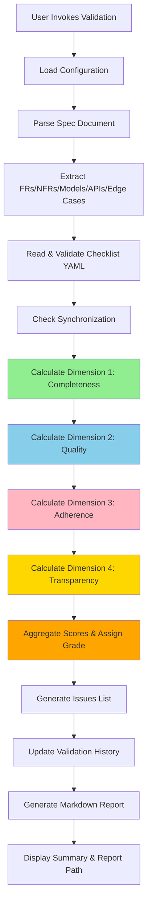

# Spec Validator Plugin

> Validate implementation code against specification documents using YAML-based checklists and 4-dimension scoring.

[](https://opensource.org/licenses/MIT)
[](https://github.com/JayKim88/claude-ai-engineering)

## Overview

The **spec-validator** plugin is a comprehensive validation tool for spec-driven development workflows. It compares specification documents against implementation progress tracked in a YAML checklist, calculates multi-dimensional scores, and generates actionable validation reports.

**Perfect for**:
- Verifying implementation completeness before releases
- Tracking sprint progress against requirements
- Ensuring specs and code stay synchronized
- Identifying missing tests, documentation, or edge case handling
- Maintaining validation history and score trends

**Key Innovation**: Uses YAML-based checklist system for explicit, version-controlled progress tracking with 4-dimension scoring (100-point scale) that evaluates not just completeness but also quality, adherence, and transparency.

---

## Table of Contents

- [Features](#features)
- [Architecture](#architecture)
- [Installation](#installation)
- [Quick Start](#quick-start)
- [Usage](#usage)
- [Scoring System](#scoring-system)
- [Validation Modes](#validation-modes)
- [Configuration](#configuration)
- [File Formats](#file-formats)
- [Workflow Integration](#workflow-integration)
- [Examples](#examples)
- [Troubleshooting](#troubleshooting)
- [Related Plugins](#related-plugins)
- [Future Enhancements](#future-enhancements)
- [Contributing](#contributing)
- [License](#license)

---

## Features

### Core Capabilities

- **Multi-Pattern Spec Parsing**: Automatically extracts FRs, NFRs, data models, API endpoints, and edge cases from specification documents
- **YAML Checklist Tracking**: Structured progress tracking with status, test coverage, implementation notes, and blockers
- **4-Dimension Scoring**: 100-point scale evaluating Completeness (40), Quality (25), Adherence (20), and Transparency (15)
- **Priority-Weighted Scoring**: High/medium/low priority FRs weighted 3x/2x/1x for accurate criticality assessment
- **Validation History**: Track score trends over time with automatic history appending
- **Actionable Reports**: Comprehensive Markdown reports with Critical/Important/Minor issues and specific fix guidance
- **3 Validation Modes**: Full (30s), Quick (10s), Requirements-Only (15s) for different use cases
- **Synchronization Detection**: Identifies orphaned items and missing requirements between spec and checklist

### Advanced Features

- **Multi-Source Parsing**: Handles headers, tables, lists, and inline requirement formats
- **Edge Case Coverage Analysis**: Validates that documented edge cases are handled in implementation
- **Test Coverage Tracking**: Separate tracking for unit, integration, and e2e tests per requirement
- **Blocker Documentation**: Enforces documentation of blockers with specific unblocking actions
- **Grade Assignment**: Letter grades (A-F) with clear thresholds (90+ = Ready to ship)
- **Trend Visualization**: ASCII charts showing score progression over validation history
- **Configuration Flexibility**: Extensive YAML config for weights, thresholds, and parsing patterns
- **Template System**: Pre-built templates for validation reports, checklists, and fix guides

---

## Architecture

### Design Philosophy

**Simple Skill** (not multi-agent): Sequential validation workflow that executes deterministically through 12 well-defined steps.

**Rationale**: Validation is a linear process (parse → validate → score → report). No parallelization needed, single spec, single checklist, deterministic comparison.

### Architecture Diagram



### Execution Flow

1. **Initialization**: Gather spec path, checklist path, validation mode
2. **Configuration**: Load scoring weights and validation rules from `config.yaml`
3. **Spec Parsing**: Extract all requirements using regex patterns
4. **Checklist Validation**: Verify YAML structure and synchronization
5. **Dimension Scoring** (4 parallel calculations):
   - Completeness: FR/NFR/Models/APIs progress
   - Quality: Test coverage, edge cases, notes
   - Adherence: Sync accuracy, priority matching
   - Transparency: Status hygiene, blocker docs, history
6. **Aggregation**: Combine dimension scores, assign letter grade
7. **Issue Generation**: Categorize findings into Critical/Important/Minor
8. **History Update**: Append validation entry to checklist
9. **Report Generation**: Populate template with all findings
10. **Output**: Display summary and save report to file

### Key Components

| Component | Purpose | Location |
|-----------|---------|----------|
| **SKILL.md** | 12-step execution algorithm | `skills/spec-validator/SKILL.md` |
| **config.yaml** | Scoring weights, patterns, thresholds | `skills/spec-validator/config.yaml` |
| **validation-report-template.md** | Report structure | `templates/validation-report-template.md` |
| **checklist-template.yaml** | Checklist structure | `templates/checklist-template.yaml` |
| **fix-guide.md** | Issue resolution guide | `templates/fix-guide.md` |
| **validate.md** | Slash command definition | `commands/validate/validate.md` |

---

## Installation

### Prerequisites

- Claude CLI with plugin support
- Node.js and npm (for plugin linking)
- Git repository for version-controlled checklist tracking

### Install Steps

1. **Clone or copy the plugin**:
   ```bash
   # Navigate to your plugins directory
cd <YOUR_PLUGIN_DIRECTORY>
   # Copy the spec-validator plugin to your plugins directory
   cp -r <PATH_TO_SPEC_VALIDATOR> .
   ```

2. **Link the plugin**:
   ```bash
   npm run link
   ```

3. **Verify installation**:
   ```bash
   # Check that skill and command are registered
   # Trigger phrase: "validate spec implementation"
   # Slash command: /validate
   ```

4. **Configure (optional)**:
   ```bash
   # Edit scoring weights and thresholds
   vim plugins/spec-validator/skills/spec-validator/config.yaml
   ```

---

## Quick Start

### 1. Create a Specification

Use the **spec-interview** plugin to create a detailed specification document, or manually create one with FRs, NFRs, and technical design.

**Example spec structure**:
```markdown
# Feature Specification

## FR-1: User Authentication (Priority: High)
Users must be able to register and login with email and password.

## NFR-1: Response Time
API responses must complete within 200ms for 95th percentile.

## Technical Design
### User Model
- id: UUID
- email: String
- password_hash: String

## API Endpoints
- POST /api/auth/register
- POST /api/auth/login
```

### 2. Generate Checklist Template

```bash
# Invoke validation without a checklist to generate template
validate spec implementation --spec ./docs/feature-spec.md

# Plugin will detect missing checklist and offer to generate template
# Choose "Yes" to create .spec-checklist.yaml
```

### 3. Implement Features

As you implement features, update the checklist:

```yaml
functional_requirements:
  - id: "FR-1"
    title: "User Authentication"
    priority: "high"
    status: "completed"  # Update this
    test_status: "completed"  # And this
    implementation_notes: "Implemented using JWT tokens. Session expires after 24h."
    completed_date: "2026-02-13"
```

### 4. Run Validation

```bash
# Full validation
/validate

# Quick validation (Completeness + Adherence only)
/validate quick

# Requirements-only (FR/NFR progress only)
/validate requirements-only
```

### 5. Review Report

Open the generated validation report:
- Overall score and grade
- Dimension breakdown
- Critical/Important/Minor issues
- Next steps checklist
- Validation history and trends

### 6. Fix Issues and Re-Validate

1. Address Critical issues first
2. Fix Important issues next
3. Tackle Minor issues if time permits
4. Re-validate after each fix batch
5. Iterate until score >= 90 (Grade A)

### 7. Ship with Confidence

Once you achieve Grade A (90+), you have high confidence that:
- All critical requirements are implemented and tested
- Spec and checklist are synchronized
- Edge cases are handled
- Documentation is complete
- Validation history proves progress

---

## Usage

### Trigger Phrases

**English**:
- "validate spec implementation"
- "check if spec is implemented"
- "verify spec compliance"
- "validate against spec"
- "spec validation report"

**Korean**:
- "스펙 검증"
- "구현 확인"
- "체크리스트 검증"

### Slash Command

```bash
/validate [mode] [--spec PATH] [--checklist PATH] [--output PATH]
```

**Parameters**:
- `mode`: `full` (default), `quick`, or `requirements-only`
- `--spec`: Path to spec document (default: prompt user)
- `--checklist`: Path to YAML checklist (default: `.spec-checklist.yaml` in spec directory)
- `--output`: Path for validation report (default: `{spec_dir}/validation-report-{timestamp}.md`)

**Examples**:

```bash
# Default: Full validation with prompts
/validate

# Quick validation
/validate quick

# Specify all paths
/validate full --spec ./docs/spec.md --checklist ./docs/.spec-checklist.yaml --output ./reports/validation.md

# Requirements-only mode
/validate requirements-only
```

---

## Scoring System

### Dimension Breakdown (100 Points Total)

#### Dimension 1: Implementation Completeness (40 points)

Measures how much of the spec is implemented.

| Category | Max Points | Calculation |
|----------|------------|-------------|
| Functional Requirements | 20 | Priority-weighted: (high×3 + medium×2 + low×1) / total_weighted |
| Non-Functional Requirements | 10 | Completed / Total |
| Data Models | 5 | Models implemented / Models specified |
| API Endpoints | 5 | Endpoints implemented / Endpoints specified |

**Priority Weighting** (for FRs):
- High priority FR: Worth 3x
- Medium priority FR: Worth 2x
- Low priority FR: Worth 1x

**Example Calculation**:
- 2 high-priority FRs completed out of 3 total: (2/3) × 3 = 2
- 4 medium-priority FRs completed out of 5 total: (4/5) × 2 = 1.6
- 3 low-priority FRs completed out of 4 total: (3/4) × 1 = 0.75
- Weighted total: 2 + 1.6 + 0.75 = 4.35 out of 6 weighted FRs
- FR score: (4.35 / 6) × 20 = 14.5 points

#### Dimension 2: Implementation Quality (25 points)

Measures quality indicators beyond just completion.

| Category | Max Points | Calculation |
|----------|------------|-------------|
| Test Coverage | 15 | (Requirements with tests_completed / Total requirements) × 15 |
| Edge Case Coverage | 7 | (Edge cases handled / Total edge cases) × 7 |
| Implementation Notes | 3 | (Items with notes / Total items) × 3 |

**What Counts as "Tested"**:
- `test_status: completed` in checklist
- At least one of unit/integration/e2e tests marked as completed

#### Dimension 3: Spec Adherence (20 points)

Measures synchronization between spec and checklist.

| Category | Max Points | Calculation |
|----------|------------|-------------|
| Synchronization | 12 | (1 - (orphaned + missing) / total_spec_items) × 12 |
| Priority Accuracy | 5 | (Correctly prioritized FRs / Total FRs) × 5 |
| Structure Compliance | 3 | 3 if valid YAML structure, 0 if invalid |

**Synchronization Issues**:
- **Orphaned items**: In checklist but not in spec (deducts from sync score)
- **Missing items**: In spec but not in checklist (deducts from sync score)

#### Dimension 4: Progress Transparency (15 points)

Measures tracking hygiene and documentation.

| Category | Max Points | Calculation |
|----------|------------|-------------|
| Status Hygiene | 5 | (Items with valid status / Total items) × 5 |
| Blocker Documentation | 4 | (Blocked items with reasons / Total blocked items) × 4 |
| Implementation Notes | 3 | (Items with meaningful notes / Total items) × 3 |
| Validation History | 3 | 3 if >= 2 validations, 1 if 1 validation, 0 if none |

**Valid Status Values**:
- `completed`, `in_progress`, `not_started`, `blocked`

**Meaningful Notes**:
- Non-empty `implementation_notes` field
- Contains actionable information (technologies used, decisions made, file locations)

### Grade Assignment

| Grade | Score Range | Label | Description |
|-------|-------------|-------|-------------|
| **A** | 90-100 | Ready to ship | High confidence in completeness and quality |
| **B** | 80-89 | Nearly complete | Minor gaps, generally ready for release |
| **C** | 70-79 | Good progress | Significant work done, but notable gaps remain |
| **D** | 60-69 | Needs work | More incomplete than complete |
| **F** | 0-59 | Significant gaps | Major requirements missing or incomplete |

**Release Thresholds**:
- **Production Release**: Score >= 90 (Grade A)
- **Staging Release**: Score >= 80 (Grade B)
- **Development Milestone**: Score >= 70 (Grade C)

---

## Validation Modes

The plugin supports three validation modes optimized for different use cases:

| Mode | Duration | Dimensions | Total Points | Use Case |
|------|----------|------------|--------------|----------|
| **full** | ~30s | All 4 | 100 | Complete pre-release validation |
| **quick** | ~10s | Completeness + Adherence | 60 (rescaled to 100) | Daily standup checks |
| **requirements-only** | ~15s | Completeness only | 40 (rescaled to 100) | Sprint progress tracking |

### Mode Details

#### Full Mode (Default)

**Evaluates**: All 4 dimensions
**Best for**:
- Pre-release validation
- Sprint review preparation
- Comprehensive quality checks
- Validation history tracking

**Output**: Complete validation report with all sections

#### Quick Mode

**Evaluates**: Dimension 1 (Completeness) + Dimension 3 (Adherence)
**Skips**: Quality and Transparency dimensions
**Best for**:
- Daily standup progress checks
- Quick sync verification
- Rapid iteration during development

**Output**: Abbreviated report focusing on implementation progress and sync status

#### Requirements-Only Mode

**Evaluates**: Dimension 1 (Completeness) - FR/NFR focus only
**Skips**: Quality, Adherence, Transparency, Models, APIs
**Best for**:
- Sprint planning and tracking
- Feature completion metrics
- High-level progress reporting

**Output**: Minimal report with FR/NFR status table and completion percentages

---

## Configuration

The plugin is highly configurable via `skills/spec-validator/config.yaml`.

### Key Configuration Sections

#### Dimension Weights

```yaml
dimensions:
  implementation_completeness:
    total_weight: 40
    breakdown:
      functional_requirements: 20
      non_functional_requirements: 10
      data_models: 5
      api_endpoints: 5
```

**Customization**: Adjust weights to emphasize what matters most for your project (e.g., increase NFR weight for infrastructure projects).

#### Priority Weights

```yaml
priority_weights:
  high: 3
  medium: 2
  low: 1
  default: 2
```

**Customization**: Change multipliers to adjust how much high-priority FRs impact scoring.

#### Grade Thresholds

```yaml
grades:
  A:
    min_score: 90
    max_score: 100
    label: "Ready to ship"
```

**Customization**: Adjust thresholds to match your quality standards (e.g., raise A threshold to 95 for critical systems).

#### Issue Severity

```yaml
issue_severity:
  critical:
    - missing_high_priority_fr
    - orphaned_checklist_items
    - synchronization_error
```

**Customization**: Add or remove issue types from severity categories to match your priorities.

#### Spec Parsing Patterns

```yaml
parsing:
  functional_requirements:
    patterns:
      - regex: '##\s+FR-(\d+)[:：]\s*(.+)'
        capture_groups:
          id: 1
          title: 2
```

**Customization**: Add custom regex patterns to match your spec format (e.g., "REQ-1" instead of "FR-1").

### Complete Configuration Reference

See `skills/spec-validator/config.yaml` for all available settings with comments explaining each option.

---

## File Formats

### Specification Document Format

**Supported formats**: Markdown (`.md`)

**Required elements**:
- Functional Requirements (FR-1, FR-2, ...)
- Priority indicators (High/Medium/Low)
- Technical Design section (for data models)

**Example**:

```markdown
# User Authentication Specification

## FR-1: Email/Password Registration (Priority: High)
Users must be able to create accounts using email and password.

## FR-2: Social Login (Priority: Medium)
Users can optionally login via Google or GitHub OAuth.

## NFR-1: Security
Passwords must be hashed using bcrypt with cost factor 12.

## Technical Design

### User Model
- id: UUID (primary key)
- email: String (unique, indexed)
- password_hash: String
- created_at: Timestamp
- updated_at: Timestamp

## API Endpoints

- POST /api/auth/register
- POST /api/auth/login
- POST /api/auth/logout

## Edge Cases

1. Handle duplicate email registration attempts (return 409 Conflict)
2. Handle password reset for unverified emails (require email verification first)
```

### Checklist YAML Format

**Filename**: `.spec-checklist.yaml`
**Location**: Same directory as spec document

**Structure**:

```yaml
metadata:
  spec_file: "./spec.md"
  project_name: "My Project"
  created_date: "2026-02-13"
  last_updated: "2026-02-13"
  checklist_version: "1.0.0"

functional_requirements:
  - id: "FR-1"
    title: "Email/Password Registration"
    priority: "high"
    status: "completed"
    test_status: "completed"
    implementation_notes: "Implemented in auth/register.py using bcrypt"
    blockers: ""
    completed_date: "2026-02-12"
    tests:
      unit: "completed"
      integration: "completed"
      e2e: "in_progress"

non_functional_requirements:
  - id: "NFR-1"
    title: "Security"
    status: "completed"
    test_status: "completed"
    implementation_notes: "Using bcrypt with cost factor 12"
    blockers: ""
    completed_date: "2026-02-12"

data_models:
  - name: "User"
    status: "completed"
    implementation_notes: "Implemented in models/user.py with SQLAlchemy ORM"
    fields_implemented:
      - id
      - email
      - password_hash
      - created_at
      - updated_at
    fields_pending: []

api_endpoints:
  - method: "POST"
    path: "/api/auth/register"
    status: "completed"
    test_status: "completed"
    implementation_notes: "Returns JWT token on success"
    blockers: ""

edge_cases:
  - id: "EC-1"
    description: "Handle duplicate email registration attempts"
    status: "completed"
    test_status: "completed"
    implementation_notes: "Returns 409 Conflict with error message"

validation_history:
  - date: "2026-02-13T10:30:00Z"
    score: 92
    grade: "A"
    dimensions:
      completeness: 38
      quality: 23
      adherence: 19
      transparency: 12
    mode: "full"
    validator_version: "1.0.0"
```

**Required Fields**:
- `metadata`: Project and file tracking
- `functional_requirements`: List of FRs with id, status
- `non_functional_requirements`: List of NFRs with id, status

**Optional Fields**:
- `data_models`: Model tracking
- `api_endpoints`: Endpoint tracking
- `edge_cases`: Edge case tracking
- `validation_history`: Auto-populated by validator

**Status Values**:
- `completed`: Fully implemented and tested
- `in_progress`: Actively being worked on
- `not_started`: Not yet begun
- `blocked`: Cannot proceed due to dependencies

**Test Status Values**:
- `completed`: Fully tested with passing tests
- `in_progress`: Some tests written, coverage incomplete
- `not_started`: No tests written yet

---

## Workflow Integration

### Integration with spec-interview Plugin

1. **Create Spec**: Use `spec-interview` skill to create detailed specification through interactive Q&A
2. **Generate Checklist**: Run `/validate` which detects missing checklist and offers to generate template
3. **Implement Features**: Write code, update checklist as you progress
4. **Validate Periodically**: Run quick validations during sprints, full validations before releases
5. **Fix Issues**: Address Critical/Important issues identified in reports
6. **Re-Validate**: Iterate until score >= 90
7. **Ship**: Release with confidence, knowing spec is fully implemented

### Daily Development Workflow

**Morning**:
```bash
# Quick check on current progress
/validate quick
```

**After Completing Feature**:
```yaml
# Update checklist
status: "completed"
test_status: "completed"
implementation_notes: "Implemented in auth.py"
completed_date: "2026-02-13"
```

**Before Standup**:
```bash
# Generate progress report
/validate requirements-only
```

**Before Sprint Review**:
```bash
# Full validation to identify gaps
/validate full

# Fix critical issues
# Re-validate
/validate full
```

### Release Validation Workflow

**Week Before Release**:
```bash
# Baseline validation
/validate full
# Note score and critical issues
```

**During Release Week**:
```bash
# Daily full validations
/validate full

# Track score improvement
# Fix issues in priority order: Critical → Important → Minor
```

**Release Day**:
```bash
# Final validation
/validate full

# Verify score >= 90 (Grade A)
# Review validation history trend
# Confirm all Critical and Important issues resolved
```

**Post-Release**:
```bash
# Archive validation report
# Update spec with lessons learned
# Reset checklist for next release
```

---

## Examples

### Example 1: First-Time Validation

**Scenario**: You have a spec but no checklist.

```bash
/validate --spec ./docs/feature-spec.md
```

**Plugin Response**:
```
Checklist not found at ./docs/.spec-checklist.yaml

Would you like to:
1) Generate template from spec
2) Specify different path
3) Exit

Choice: 1

Generating checklist template from spec...
✓ Found 5 functional requirements
✓ Found 2 non-functional requirements
✓ Found 1 data model
✓ Found 3 API endpoints

Template saved to: ./docs/.spec-checklist.yaml

Please update the checklist with implementation status and re-run validation.
```

### Example 2: Quick Daily Validation

**Scenario**: Daily standup, want to see progress.

```bash
/validate quick
```

**Console Output**:
```
=== Spec Validation Report (Quick Mode) ===

Overall Score: 72/100 (Grade C - Good progress)
Estimated Duration: 10 seconds

Dimension Scores:
  Implementation Completeness: 28/40 (70%)
  Spec Adherence: 18/20 (90%)

Requirements Status:
  FRs: 7/10 completed (70%)
  NFRs: 3/4 completed (75%)

Critical Issues: 1
  - FR-3 (high priority) not started

Important Issues: 3
  - FR-5 (medium priority) not started
  - FR-8 (medium priority) not started
  - 2 checklist items orphaned (not in spec)

Report saved to: ./docs/validation-report-20260213-143000.md
```

### Example 3: Full Validation Before Release

**Scenario**: Sprint review tomorrow, need comprehensive validation.

```bash
/validate full --spec ./docs/release-spec.md
```

**Console Output**:
```
=== Spec Validation Report (Full Mode) ===

Overall Score: 87/100 (Grade B - Nearly complete)
Previous Score: 75/100 (+12 points, ↗ Improving)

Dimension Scores:
  Implementation Completeness: 36/40 (90%)
  Implementation Quality: 20/25 (80%)
  Spec Adherence: 19/20 (95%)
  Progress Transparency: 12/15 (80%)

Requirements Status:
  FRs: 9/10 completed (90%)
    High Priority: 3/3 (100%)
    Medium Priority: 5/6 (83%)
    Low Priority: 1/1 (100%)
  NFRs: 4/4 completed (100%)
  Models: 2/2 implemented (100%)
  APIs: 8/9 implemented (89%)

Critical Issues: 0
Important Issues: 2
  - FR-5: No tests written (marked completed but test_status is not_started)
  - API POST /api/users/export: Implementation missing

Minor Issues: 5
  - 3 items missing implementation notes
  - 2 completed items missing completion dates

Next Steps:
  1. Write tests for FR-5
  2. Implement API POST /api/users/export
  3. Add implementation notes to 3 items
  4. Add completion dates to 2 items

Report saved to: ./docs/validation-report-20260213-150000.md
Validation history updated in checklist.
```

### Example 4: Validation After Fixes

**Scenario**: Fixed issues, re-validating to check improvement.

```bash
/validate full
```

**Console Output**:
```
=== Spec Validation Report (Full Mode) ===

Overall Score: 93/100 (Grade A - Ready to ship)
Previous Score: 87/100 (+6 points, ↗ Improving)

Congratulations! All critical and important issues have been resolved.

Dimension Scores:
  Implementation Completeness: 39/40 (98%)
  Implementation Quality: 24/25 (96%)
  Spec Adherence: 20/20 (100%)
  Progress Transparency: 10/15 (67%)

Requirements Status:
  FRs: 10/10 completed (100%)
  NFRs: 4/4 completed (100%)
  Models: 2/2 implemented (100%)
  APIs: 9/9 implemented (100%)

Critical Issues: 0
Important Issues: 0
Minor Issues: 3
  - 3 items missing implementation notes (affects transparency score)

Validation History (Last 5):
  2026-02-13 15:30: 93/100 (A) [+6]
  2026-02-13 15:00: 87/100 (B) [+12]
  2026-02-13 10:00: 75/100 (C) [+8]
  2026-02-12 16:00: 67/100 (D) [+15]
  2026-02-12 09:00: 52/100 (F) [baseline]

Trend: ↗ Steadily improving (41 point gain in 2 days)

You're ready to ship! Minor issues can be addressed in next iteration.

Report saved to: ./docs/validation-report-20260213-153000.md
```

---

## Troubleshooting

### Common Issues

#### Issue: "Spec document not found"

**Cause**: Invalid file path or file doesn't exist.

**Solution**:
```bash
# Verify file path
ls -la ./docs/spec.md

# Use absolute path
/validate --spec /full/path/to/spec.md

# Check current directory
pwd
```

#### Issue: "Checklist YAML syntax invalid"

**Cause**: YAML formatting errors (indentation, missing colons, unclosed quotes).

**Solution**:
```bash
# Use YAML validator
yamllint .spec-checklist.yaml

# Common fixes:
# - Use 2-space indentation (not tabs)
# - Add colon after keys: "status:" not "status"
# - Quote values with special characters: "status: \"in-progress\""

# Re-validate after fixing
/validate
```

#### Issue: "Many items out of sync"

**Cause**: Spec changed but checklist wasn't updated, or vice versa.

**Solution**:
```bash
# Regenerate checklist template from current spec
/validate --spec spec.md  # Will offer to regenerate

# Manually merge:
# 1. Copy implementation status from old checklist
# 2. Use structure from new template
# 3. Remove orphaned items
# 4. Add missing items

# Re-validate
/validate
```

#### Issue: "Score seems too low"

**Cause**: Priorities not set, status values invalid, or tests not tracked.

**Solution**:
```yaml
# Check priorities are set in spec
## FR-1: Feature Name (Priority: High)

# Verify status values are valid
status: "completed"  # Not "done" or "finished"

# Ensure test_status is updated
test_status: "completed"  # Not just status

# Add implementation notes
implementation_notes: "Implemented in auth.py"
```

#### Issue: "Validation takes too long"

**Cause**: Very large spec file (10+ MB) or complex parsing.

**Solution**:
```bash
# Use quick mode for faster validation
/validate quick

# Split large specs into modules
# Validate each module separately

# Check config performance settings
performance:
  max_spec_size_mb: 10
  parsing_timeout_seconds: 30
```

### Debug Mode

To enable verbose logging for troubleshooting:

```yaml
# In config.yaml
debug:
  enabled: true
  log_parsing: true
  log_scoring: true
  log_file: "./validation-debug.log"
```

### Getting Help

1. **Check fix guide**: `templates/fix-guide.md` has step-by-step solutions for all issue types
2. **Review validation report**: Specific error messages and suggested fixes
3. **Consult SKILL.md**: Error handling table for all failure scenarios
4. **Check config.yaml**: Verify weights and thresholds are reasonable
5. **Open an issue**: Provide spec, checklist, and error output

---

## Related Plugins

### spec-interview

**Purpose**: Create detailed specifications through interactive Q&A.

**Integration**: Use `spec-interview` to create specs, then `spec-validator` to verify implementation.

**Workflow**: spec-interview (create spec) → spec-validator (generate checklist) → implement → spec-validator (validate)

### project-insight

**Purpose**: Comprehensive project analysis using multi-agent pipeline.

**Integration**: Use `project-insight` for code quality analysis, `spec-validator` for spec compliance.

**Workflow**: spec-validator (verify spec compliance) → project-insight (analyze code quality)

### learning-summary

**Purpose**: Summarize and document key learnings from conversations.

**Integration**: Use `learning-summary` to document insights from validation reports.

**Workflow**: spec-validator (generate report) → learning-summary (document findings and decisions)

---

## Future Enhancements

### Planned Features (v1.1)

- [ ] **Code Validation**: Automatically scan codebase to verify implementations exist (not just rely on checklist)
- [ ] **Auto-Fix**: Automatically fix minor sync issues (add missing items, remove orphaned items)
- [ ] **Git Integration**: Track validations with git commits, show validation score in commit history
- [ ] **CI/CD Integration**: Run validation as part of CI pipeline, fail builds if score < threshold
- [ ] **Visual Dashboard**: Web-based dashboard showing validation trends, burndown charts
- [ ] **Multi-Spec Support**: Validate multiple specs in one run (e.g., frontend + backend + API specs)
- [ ] **Regression Detection**: Alert if score decreases between validations

### Potential Features (v2.0)

- [ ] **AI-Assisted Validation**: Use LLM to scan code and auto-populate checklist status
- [ ] **Test Coverage Analysis**: Integrate with coverage tools (pytest-cov, Istanbul) for actual coverage data
- [ ] **Jira/Linear Integration**: Sync validation status with project management tools
- [ ] **Slack/Discord Notifications**: Send validation reports to team channels
- [ ] **Custom Dimensions**: Allow users to define additional scoring dimensions
- [ ] **Validation Templates**: Pre-built templates for common project types (REST API, React app, etc.)
- [ ] **Compliance Reporting**: Generate audit-ready compliance reports (SOC 2, HIPAA, etc.)

---

## Contributing

### How to Contribute

1. **Fork the repository**
2. **Create a feature branch**: `git checkout -b feature/my-enhancement`
3. **Make changes** following the code style
4. **Test thoroughly** with sample specs and checklists
5. **Update documentation** (README, SKILL.md, config comments)
6. **Submit a pull request** with clear description

### Contribution Guidelines

- Follow the Architect philosophy: completeness over minimalism
- Add extensive error handling for new features
- Update config.yaml with new settings
- Add examples to README
- Update SKILL.md execution algorithm if logic changes
- Add tests for new parsing patterns
- Document all configuration options with comments

### Areas for Contribution

- **Parsing Patterns**: Add support for new spec formats (RST, AsciiDoc, etc.)
- **Integrations**: Build integrations with Jira, Linear, GitHub Projects
- **Templates**: Create templates for different project types
- **Scoring Algorithms**: Propose improvements to dimension scoring
- **Visualizations**: Add charts and graphs to validation reports
- **Performance**: Optimize parsing for very large specs

---

## License

MIT License

Copyright (c) 2026 Jay Kim

Permission is hereby granted, free of charge, to any person obtaining a copy
of this software and associated documentation files (the "Software"), to deal
in the Software without restriction, including without limitation the rights
to use, copy, modify, merge, publish, distribute, sublicense, and/or sell
copies of the Software, and to permit persons to whom the Software is
furnished to do so, subject to the following conditions:

The above copyright notice and this permission notice shall be included in all
copies or substantial portions of the Software.

THE SOFTWARE IS PROVIDED "AS IS", WITHOUT WARRANTY OF ANY KIND, EXPRESS OR
IMPLIED, INCLUDING BUT NOT LIMITED TO THE WARRANTIES OF MERCHANTABILITY,
FITNESS FOR A PARTICULAR PURPOSE AND NONINFRINGEMENT. IN NO EVENT SHALL THE
AUTHORS OR COPYRIGHT HOLDERS BE LIABLE FOR ANY CLAIM, DAMAGES OR OTHER
LIABILITY, WHETHER IN AN ACTION OF CONTRACT, TORT OR OTHERWISE, ARISING FROM,
OUT OF OR IN CONNECTION WITH THE SOFTWARE OR THE USE OR OTHER DEALINGS IN THE
SOFTWARE.

---

## Changelog

### v1.0.0 (2026-02-13)

**Initial Release**

- 4-dimension scoring system (Completeness, Quality, Adherence, Transparency)
- Priority-weighted FR scoring
- Multi-pattern spec parsing
- YAML-based checklist system
- 3 validation modes (full, quick, requirements-only)
- Validation history tracking
- Comprehensive Markdown reports
- Issue categorization (Critical/Important/Minor)
- Fix guide with step-by-step solutions
- Extensive configuration via YAML
- Template system for reports and checklists
- Slash command support (/validate)

---

**Plugin Version**: 1.0.0
**Last Updated**: 2026-02-13
**Author**: Jay Kim
**Repository**: https://github.com/JayKim88/claude-ai-engineering
