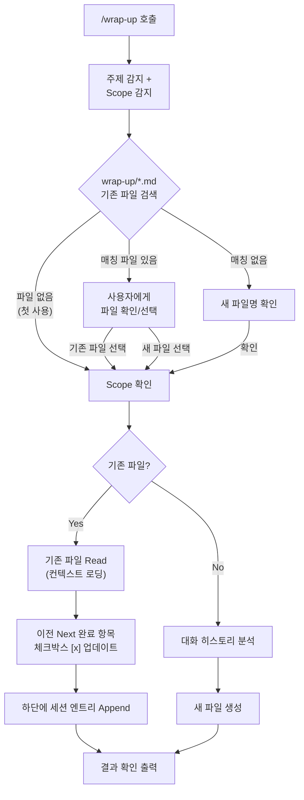

# Wrap Up

Session work history and todo tracker for Claude Code.

## What It Does

Records what was done in the current session and what needs to be done next, saving to a **per-topic** markdown file that accumulates across sessions.

- Automatically detects topic and scope from conversation
- Matches existing wrap-up files and asks user to confirm
- Tracks continuity: previous Next items → current Done with `[x]` updates

## Usage

```
/wrap-up
```

## Output

Creates/updates `wrap-up/{topic-name}.md` in your project root:

```markdown
# auth - Wrap Up

> **Project**: `/Users/jaykim/Documents/Projects/my-app`
> **Scope**: `src/auth/`

## Session: 2026-02-23 14:00

> **Context**: 사용자 인증 모듈 구현 및 세션 기반 인증 설정

### Done
- feat: user authentication module
- fix: login error message

### Decisions
- Session-based auth over JWT (SSR environment)

### Next
- [ ] OAuth 2.0 social login
- [ ] Password reset feature

---

## Session: 2026-02-23 15:30

> **Context**: OAuth 2.0 소셜 로그인 연동 (Google, GitHub)

### Done
- feat: OAuth 2.0 social login (from previous Next)
- feat: Google, GitHub provider support

### Next
- [ ] Password reset feature
- [ ] Apple login provider
```

## Process



## Features

| Feature | Description |
|---------|-------------|
| **Per-topic file** | One file per topic/feature (e.g., `auth.md`, `api-refactor.md`) |
| **Project + Scope** | Header includes project path and working directory scope |
| **Smart matching** | Detects topic and matches existing wrap-up files |
| **User confirmation** | Confirms target file and scope before writing |
| **Context loading** | Reads existing file to understand prior work and pending items |
| **Checkbox tracking** | Completed previous Next items updated to `[x]` |
| **Session accumulation** | Each invocation appends, never overwrites |
| **Session timestamp** | Every session includes time (e.g., `2026-02-23 14:00`) for traceability |
| **Context line** | 1-line summary per session for quick identification when scanning |
| **Auto-detect language** | Korean or English based on conversation |

## Installation

```bash
bash scripts/link-local.sh
```

## Trigger Phrases

- English: "wrap up", "session summary", "document progress"
- Korean: "작업 정리", "세션 정리", "마무리"
